# Lengua — backlog de ejercicios (capturas)

Documento vivo: cada pantallazo que pases se clasifica aquí (bloque, reto, UI y mecánica).  
**No es implementación aún** — solo catálogo para decidir qué montar.

**Tono de los enunciados Aray:** como la web (niño de ~9 años), no como el cuaderno.  
Ejemplos del estilo actual: «¿Cuál está mal escrita?», «¿Qué falta? Piensa la regla», «¿Cómo se escribe?».

Referencia de modos ortografía ya en app: `missing`, `correct`, `picture`, `intruder`, `complete`, `mix`, `review` ([`src/spelling/types.ts`](../src/spelling/types.ts)).

---

## Leyenda de clasificación

| Campo | Significado |
|--------|-------------|
| **Bloque** | Ortografía · Gramática/sintaxis · Vocabulario · Comprensión · Otro |
| **¿Ortografía?** | Sí / No / Parcial |
| **Reto (modo)** | Nombre del modo en Aray (existente o **NUEVO**) |
| **Enunciado ficha** | Texto escolar original (referencia) |
| **Enunciado Aray** | Prompt corto, tono niño / web |
| **Visual** | Cómo se ve en pantalla |
| **Funcional** | Cómo se juega y se valida |

---

## Idea transversal — Ayuda / «¿qué es esto?»

En fichas escolares suele haber una **cajita de regla** (contrarios, artículos…). En Aray no hay que pegar el texto escolar, pero **sí molaría** una ayuda tocable en modos de concepto (gramática / vocabulario), no tanto en ortografía de letra suelta (ahí ya hay tips de regla).

| Pieza | Cómo |
|--------|------|
| **Botón** | Chip «?» o «Ayuda» junto al prompt |
| **Contenido** | 1 frase niño + 1 ejemplo |
| **Cuándo** | Antes del primer ítem, o al fallar 2 veces, o a demanda |
| **Candidatos** | 15 contrarios · 11/13/16 artículos · 02 una/muchas · 14 género · 03 colectivos |

Ejemplos de copy:
- Contrarios: «Los **contrarios** dicen lo opuesto: *primero* ↔ *último*. También se llaman antónimos.»
- Artículos: «Van **delante** del nombre y van a juego: *la* mesa, *los* niños.»

---

## Idea transversal — Coherencia con la web (1 ítem por turno)

La ficha escolar es una **rejilla** (12 palabras, 4 columnas…). Aray **no** copia esa pantalla.

| Ficha | Aray (como ortografía / mates actuales) |
|-------|----------------------------------------|
| Muchas palabras a la vez | **1 reto en pantalla** |
| Rellenar todo el cuaderno | Ronda de N ítems (p. ej. ~8–12), uno tras otro |
| “Rodea / subraya / escribe” | **Tocar** botones / fichas |
| Varias columnas = un ejercicio | Cada columna/fila → **ítems del banco** (misma mecánica) |

Los nº 01–26 del backlog ya van en esa línea (hueco + botones, emparejar un tablero, etc.). Al implementar: la captura alimenta el **banco**, no el layout.

---

## Ejercicio 01 — Ordena y monta la frase

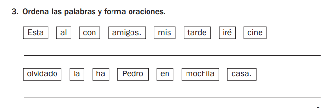

| Campo | Valor |
|--------|--------|
| **Fuente** | Ficha: «3. Ordena las palabras y forma oraciones» |
| **Bloque** | **Gramática / sintaxis** (orden de la oración) |
| **¿Ortografía?** | **No** |
| **Reto (modo)** | **`order-sentence`** — **NUEVO** |
| **Enunciado ficha** | Ordena las palabras y forma oraciones |
| **Enunciado Aray** | **«Monta la frase»** · tip Lumo: «Toca las palabras en orden. Empieza con mayúscula.» |
| **Encaje con actual** | No es Intrusa ni Completa la frase. Parecido lejano a ordenar del diccionario, pero aquí manda el **sentido**, no la A→Z. |
| **Nivel 3.º** | Adecuado |

### Ejemplos de la ficha
1. `Esta` `al` `con` `amigos.` `mis` `tarde` `iré` `cine` → **Esta tarde iré al cine con mis amigos.**
2. `olvidado` `la` `ha` `Pedro` `en` `mochila` `casa.` → **Pedro ha olvidado la mochila en casa.**

### Visual
- Prompt grande: **Monta la frase**.
- Pool de **fichas** (botones) desordenadas.
- Debajo: **fila de respuesta** (huecos / franja) donde van cayendo las palabras tocadas.
- Feedback: «¡Bien!» o «Era: …» con la frase correcta.

### Funcional
1. Banco de oraciones → se barajan las palabras en fichas.
2. Mayúscula y punto pueden ir en la ficha (pista).
3. **Tocar ficha → se añade**; tocar en la respuesta → quitar.
4. Validar secuencia exacta de tokens.
5. Ronda ~6–8 frases. Economía como ortografía/ABC.

### Dónde
Bloque Gramática / estación «Frases» en Lenguas — **no** dentro del mix de ortografía.

---

## Ejercicio 02 — Una o muchas

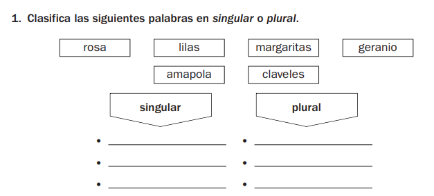

| Campo | Valor |
|--------|--------|
| **Fuente** | Ficha: «1. Clasifica las siguientes palabras en singular o plural.» |
| **Bloque** | **Gramática / morfología** (número: singular ↔ plural) |
| **¿Ortografía?** | **No** (aunque a veces el plural se relaciona con -s/-es; aquí el reto es **clasificar**, no escribir) |
| **Reto (modo)** | **`sort-number`** (o `singular-plural`) — **NUEVO** |
| **Enunciado ficha** | Clasifica las siguientes palabras en singular o plural |
| **Enunciado Aray** | **«¿Una o muchas?»** · tip: «Toca cada palabra y elige el bando.» |
| **Encaje con actual** | No existe. Es un **clasificar en 2 cajas**, no MCQ de 4 opciones como ortografía. |
| **Nivel 3.º** | Adecuado (refuerzo; en muchos centros ya viene de 2.º) |

### Ejemplos de la ficha
Palabras: `rosa`, `lilas`, `margaritas`, `geranio`, `amapola`, `claveles`  
- **Una (singular):** rosa, geranio, amapola  
- **Muchas (plural):** lilas, margaritas, claveles  

### Visual
- Prompt: **¿Una o muchas?**
- Arriba: fichas de palabras (pool).
- Debajo: **dos bandos / cajas** con etiquetas infantiles:
  - **Una** (singular)
  - **Muchas** (plural)
- (En la ficha son flechas + rayas; en Aray: dos columnas o dos “cubos” táctiles, estilo juego.)
- Al acabar el set: botón «Comprobar» o validación al llenar ambos bandos.

### Funcional
1. Generador da un set de N palabras (p. ej. 6) con etiqueta correcta `singular` | `plural`.
2. El niño **toca una palabra** y luego el bando, **o** toca el bando destino y luego la palabra (v1: tocar palabra → aparece menú/dos botones «Una / Muchas»).
3. Validación: cada ficha en el bando correcto.
4. Variante rápida (más “web”): una palabra grande y 2 botones **Una** / **Muchas** (como V/F). Mismo modo, UI más simple; el set de 6 es la versión “tablero”.
5. Ronda: varios sets o 8–10 palabras sueltas en modo rápido.

### Dónde
Misma estación Gramática / «Palabras» que el 01 — **no** ortografía.

### Prioridad sugerida
Alta para Gramática ligera: muy claro, muy jugable con solo botones.

---

## Ejercicio 03 — Empareja el grupo

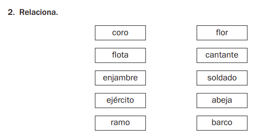

| Campo | Valor |
|--------|--------|
| **Fuente** | Ficha: «2. Relaciona.» (individual ↔ colectivo) |
| **Bloque** | **Vocabulario / gramática** (sustantivos individuales y colectivos) |
| **¿Ortografía?** | **No** |
| **Reto (modo)** | **`match-pairs`** — **NUEVO** en Lenguas (en Mates ya existe Empareja tablas; misma idea de UI) |
| **Enunciado ficha** | Relaciona. |
| **Enunciado Aray** | **«¿Quién va con quién?»** · tip: «Toca un grupo y luego su pieza.» |
| **Encaje con actual** | Como Empareja de tablas, pero con palabras. No es ortografía. |
| **Nivel 3.º** | Adecuado (individual / colectivo) |

### Pares de la ficha
| Grupo (colectivo) | Uno (individual) |
|-------------------|------------------|
| coro | cantante |
| flota | barco |
| enjambre | abeja |
| ejército | soldado |
| ramo | flor |

### Visual
- Prompt: **¿Quién va con quién?**
- Dos columnas de fichas (izquierda = grupos, derecha = piezas), barajadas.
- Al emparejar bien: las dos fichas se marcan / desaparecen con feedback «¡Bien!».
- Opcional: línea o brillo entre el par (como Empareja mates).

### Funcional
1. Banco de pares → se muestran N pares (p. ej. 5) con columnas desordenadas.
2. **Tocar A → tocar B**: si coinciden, acierto; si no, fallo y se resetea la selección.
3. Validación por id de par, no por posición.
4. Ronda: 1 tablero completo = 1 “partida”, o varios tableros cortos.
5. Economía: mismo patrón side-run.

### Dónde
Estación Vocabulario / Gramática en Lenguas — **no** ortografía.

### Prioridad sugerida
Alta — reutiliza el patrón mental de Empareja (ya conocido en la app).

---

## Ejercicio 04 — Une la frase (3 piezas)

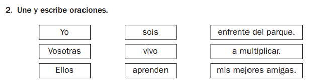

| Campo | Valor |
|--------|--------|
| **Fuente** | Ficha: «2. Une y escribe oraciones.» |
| **Bloque** | **Gramática / sintaxis** (concordancia sujeto–verbo + complemento) |
| **¿Ortografía?** | **No** |
| **Reto (modo)** | **`join-sentence-3`** — **NUEVO** |
| **Enunciado ficha** | Une y escribe oraciones. |
| **Enunciado Aray** | **«Une la frase»** · tip: «Toca las 3 piezas que van juntas. ¡Sin escribir!» |
| **Decisión de producto** | **Solo unir** — no hay campo de escritura ni teclado. La frase se forma al elegir las 3 fichas correctas. |
| **Encaje con actual** | Más rico que Empareja de 2: hay **3 columnas**. No es ortografía ni Completa la frase (MCQ). |
| **Nivel 3.º** | Adecuado (concordancia: yo/vivo, vosotras/sois, ellos/aprenden) |

### Piezas de la ficha (pares lógicos)
| Quién | Qué hace | El resto |
|-------|----------|----------|
| Yo | vivo | enfrente del parque. |
| Vosotras | sois | mis mejores amigas. |
| Ellos | aprenden | a multiplicar. |

### Visual
- Prompt: **Une la frase**.
- **Tres columnas** de fichas (Quién / Qué hace / El resto), barajadas por columna.
- Al ir eligiendo: se muestra arriba o abajo la frase que se está montando (`Yo` + `…` + `…`).
- Al acertar un trío: las 3 fichas se marcan / desaparecen; feedback «¡Frase lista!».
- Sin líneas de escribir, sin teclado.

### Funcional
1. Banco de tríos (sujeto + verbo + complemento) → 3 columnas desordenadas.
2. El niño toca **una ficha por columna** (orden libre: puede empezar por cualquiera).
3. Al tener 3 seleccionadas: si forman un trío válido → acierto; si no → fallo, se limpia la selección.
4. Alternativa v1 aún más simple: tocar en orden columna 1 → 2 → 3 y comprobar al final de cada frase.
5. Ronda: vaciar el tablero (p. ej. 3 frases) o varios tableros cortos.
6. Economía: side-run como el resto.

### Dónde
Estación Gramática / Frases — **no** ortografía. Cercano al 01 (Monta la frase), pero aquí las piezas vienen en **3 bandas fijas**, no un pool único barajado.

### Prioridad sugerida
Alta — muy jugable solo con toques; refuerza concordancia sin escribir.

---

## Ejercicio 05 — Une y pilla el verbo

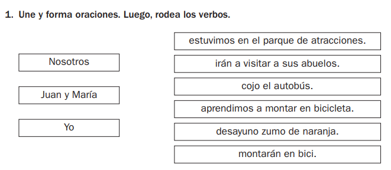

| Campo | Valor |
|--------|--------|
| **Fuente** | Ficha: «1. Une y forma oraciones. Luego, rodea los verbos.» |
| **Bloque** | **Gramática** (sujeto–predicado + reconocer el verbo) |
| **¿Ortografía?** | **No** |
| **Reto (modo)** | **`join-find-verb`** — **NUEVO** (2 pasos en la misma partida) |
| **Enunciado ficha** | Une y forma oraciones. Luego, rodea los verbos. |
| **Enunciado Aray** | **«Une y pilla el verbo»** · tip: «Primero junta las piezas. Luego toca la palabra que es la acción.» |
| **Decisión de producto** | **Sin escribir ni rodear a mano.** “Rodear” = **tocar** la palabra del verbo. |
| **Encaje con actual** | Parecido al 04 (unir), pero solo **2 columnas** y un sujeto puede ir con **varios** predicados. Segundo paso = señalar verbo (nuevo). |
| **Nivel 3.º** | Adecuado |

### Pares de la ficha
| Quién | Puede ir con… |
|-------|----------------|
| Nosotros | estuvimos en el parque de atracciones. · aprendimos a montar en bicicleta. |
| Juan y María | irán a visitar a sus abuelos. · montarán en bici. |
| Yo | cojo el autobús. · desayuno zumo de naranja. |

Verbos a “pillar”: **estuvimos**, **irán**, **cojo**, **aprendimos**, **desayuno**, **montarán**.

### Visual
- Prompt: **Une y pilla el verbo**.
- **Paso 1:** dos columnas (Quién / Qué pasa), fichas; al unir bien se muestra la frase montada.
- **Paso 2:** la frase aparece con palabras tocables; el niño toca el verbo → se marca (anillo / brillo), no hace falta lápiz.
- Barra o chips: «Frases: 2/6» · «Verbos: 1/2» según diseño de ronda.

### Funcional
1. **Paso unir:** tocar sujeto + tocar predicado compatible → acierto (un sujeto admite 2 predicados; no se “gasta” hasta emparejar todos los de la derecha, o se juega una frase por turno).
2. **Paso verbo:** tras cada frase unida (o al final del tablero), las palabras del predicado (o de toda la frase) son botones; solo el token marcado como `verb` es correcto.
3. Fallo al tocar otra palabra (p. ej. “parque”) → feedback «Eso no es la acción» y tip corto.
4. Sin teclado. Ronda = vaciar predicados + pillar todos los verbos.
5. Economía: side-run.

### Dónde
Gramática / Frases, junto al 04. **No** ortografía.

### Prioridad sugerida
Media-alta — dos mecánicas en uno; el paso “pilla el verbo” es oro para 3.º y solo botones.

---

## Ejercicio 06 — Pieza gue / güi

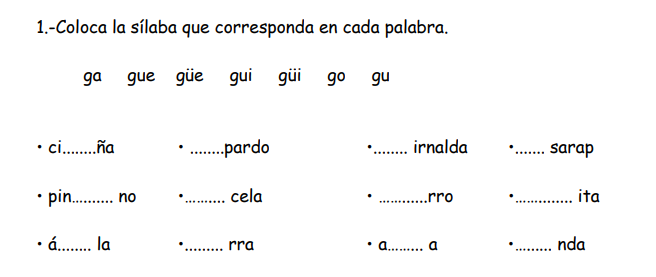

| Campo | Valor |
|--------|--------|
| **Fuente** | Ficha: «1.- Coloca la sílaba que corresponda en cada palabra.» |
| **Bloque** | **Ortografía** (sílabas con **g**: ga, gue, güe, gui, güi, go, gu) |
| **¿Ortografía?** | **Sí** |
| **Reto (modo)** | Variante de **`missing`** (Letra de la regla) **o** modo **`fill-syllable`** — **NUEVO / ampliación** |
| **Regla Aray** | Encaja con **`gu-gue`** (y diéresis güe/güi); emparentado con `g-j` |
| **Enunciado ficha** | Coloca la sílaba que corresponda en cada palabra. |
| **Enunciado Aray** | **«¿Qué pieza falta?»** · tip: «Elige ga, gue, güe… Mira la u con puntitos.» |
| **Encaje con actual** | Muy cerca de **Letra de la regla** (`missing`): hueco en la palabra + opciones. Diferencia: aquí las opciones son **sílabas** (pool fijo arriba), no una sola letra/dígrafo. |
| **Nivel 3.º** | Muy alineado (gue/gui/güe/güi es típico de ciclo medio) |

### Ejemplos de la ficha (banco de sílabas)
Opciones: `ga` · `gue` · `güe` · `gui` · `güi` · `go` · `gu`  
Palabras tipo: cigüeña, guepardo, guirnalda, gusarapo, pingüino, gacela, gorro, guitarra, águila, guerra, agua, guinda…

### Visual
- Prompt: **¿Qué pieza falta?**
- Arriba (opcional): **nube / barra de sílabas** tocables (`ga`, `gue`, `güe`…).
- Centro: una palabra con hueco grande (`ci___ña`, `pin___no`…) o rejilla de varias (en app mejor **1 palabra por turno**, no 12 a la vez).
- Feedback: tip corto («Con diéresis suena güe / güi»).

### Funcional
1. Ítem = palabra objetivo + sílaba correcta + distractores del mismo set (ga/gue/güe…).
2. Niño toca la sílaba (de la barra o de 4 botones MCQ).
3. Validación: string de la sílaba === correcto.
4. Ronda: 8–12 palabras (como ortografía actual).
5. Fallos → Mis fallos / review por regla `gu-gue`.

### Dónde
**Dentro de Ortografía** — ampliar banco `gu-gue` / diéresis y, si hace falta, UI de “pieza” (sílaba) en `missing`.

### Prioridad sugerida
Alta para ortografía — es de los pocos de esta tanda que **sí** refuerzan el bloque que ya tenemos.

---

## Ejercicio 07 — G o gu en el nombre

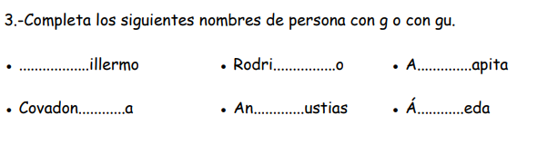

| Campo | Valor |
|--------|--------|
| **Fuente** | Ficha: «3.- Completa los siguientes nombres de persona con g o con gu.» |
| **Bloque** | **Ortografía** (g / gu delante de vocal) |
| **¿Ortografía?** | **Sí** |
| **Reto (modo)** | **`missing`** (Letra de la regla) — **ampliación de banco**, no hace falta modo nuevo |
| **Regla Aray** | **`gu-gue`** (g ante a/o/u · gu ante e/i) |
| **Enunciado ficha** | Completa los siguientes nombres de persona con g o con gu. |
| **Enunciado Aray** | **«¿G o gu?»** · tip: «Antes de e o i hace falta la u.» |
| **Encaje con actual** | Igual que Letra de la regla / Forma correcta: hueco + 2–4 opciones (`g` / `gu`). Más simple que el 06 (sílabas con diéresis). |
| **Nivel 3.º** | Adecuado |

### Ejemplos de la ficha
| Hueco | Completo |
|-------|----------|
| ___illermo | **Gu**illermo |
| Rodri___o | Rodri**g**o |
| A___apita | A**g**apita |
| Covadon___a | Covadon**g**a |
| An___ustias | An**g**ustias |
| Á___eda | Á**gu**eda |

### Visual
- Prompt: **¿G o gu?**
- Una palabra grande con hueco (`___illermo`, `Á___eda`).
- Dos (o cuatro) botones: **g** · **gu** (+ distractores suaves si hace falta: `gü`, `j`).
- Sin teclado: solo tocar.

### Funcional
1. Banco de nombres propios + `hardUnit` = `g` o `gu`.
2. Tocar opción → validar.
3. Misma ronda / review / tips que ortografía actual.
4. Se puede mezclar en `mix` bajo la regla `gu-gue`.

### Dónde
**Ortografía** — ampliar lemas de nombres + regla `gu-gue`.

### Prioridad sugerida
Alta y barata de implementar (casi copy-paste del modo `missing`).

---

## Ejercicio 08 — B o v en el verbo

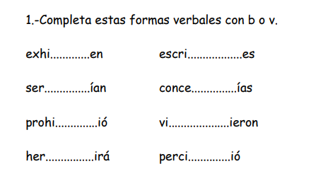

| Campo | Valor |
|--------|--------|
| **Fuente** | Ficha: «1.- Completa estas formas verbales con b o v.» |
| **Bloque** | **Ortografía** (b / v en familias verbales) |
| **¿Ortografía?** | **Sí** |
| **Reto (modo)** | **`missing`** (Letra de la regla) — **ampliación de banco**, no hace falta modo nuevo |
| **Regla Aray** | **`b-v`** (ya existe en la app) |
| **Enunciado ficha** | Completa estas formas verbales con b o v. |
| **Enunciado Aray** | **«¿B o v?»** · tip: «Mira la familia del verbo: escribir, vivir, hervir…» |
| **Encaje con actual** | Igual que Letra de la regla: hueco + botones `b` / `v`. El valor pedagógico es el **banco de conjugaciones** (misma raíz, distinta persona/tiempo). |
| **Nivel 3.º** | Adecuado en idea; algunas formas de la ficha son duras (servirían, concebías, percibió). En Aray: priorizar presentes / pasados simples del ciclo medio. |

### Ejemplos de la ficha
| Hueco | Completo | Familia |
|-------|----------|---------|
| exhi___en | exhi**b**en | exhibir |
| ser___ían | ser**v**irían | servir |
| prohi___ió | prohi**b**ió | prohibir |
| her___irá | her**v**irá | hervir |
| escri___es | escri**b**es | escribir |
| conce___ías | conce**b**ías | concebir |
| vi___ieron | vi**v**ieron | vivir |
| perci___ió | perci**b**ió | percibir |

### Visual
- Prompt: **¿B o v?**
- Una forma verbal grande con hueco (`escri___es`, `vi___ieron`).
- Dos botones: **b** · **v** (solo tocar).
- Opcional tip Lumo con el infinitivo («viene de *escribir*»).

### Funcional
1. Banco de formas conjugadas + `hardUnit` = `b` o `v` + lemma/infinitivo opcional para tip.
2. Tocar opción → validar (mismo pipeline ortografía).
3. Mezclable en `mix` bajo regla `b-v`.
4. Filtrar lemas demasiado formales si el banco actual ya tiene b/v más cotidianas.

### Dónde
**Ortografía** — reforzar / ampliar lemas `b-v` con verbos frecuentes (escribir, vivir, hervir, subir…).

### Prioridad sugerida
Alta y barata — modo ya existe; solo banco + copy del enunciado.

---

## Ejercicio 09 — ¿-bir o -vir?

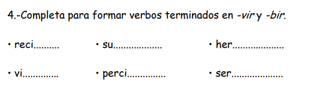

| Campo | Valor |
|--------|--------|
| **Fuente** | Ficha: «4.- Completa para formar verbos terminados en -vir y -bir.» |
| **Bloque** | **Ortografía** (terminaciones **-bir** / **-vir**) |
| **¿Ortografía?** | **Sí** |
| **Reto (modo)** | **`missing`** o **`correct`** — ampliación de banco bajo **`b-v`** |
| **Regla Aray** | **`b-v`** (subfamilia: infinitivos en -bir / -vir) |
| **Enunciado ficha** | Completa para formar verbos terminados en -vir y -bir. |
| **Enunciado Aray** | **«¿-bir o -vir?»** · tip: «Elige el final que cierra el verbo.» |
| **Encaje con actual** | Hermano del 08: mismo par b/v, pero el hueco es el **bloque final** (`bir`/`vir`), no una letra suelta en medio. Muy jugable con 2 botones. |
| **Nivel 3.º** | Adecuado (recibir, subir, vivir, hervir, servir…; percibir opcional / más culto) |

### Ejemplos de la ficha
| Prefijo | Completo |
|---------|----------|
| reci___ | reci**bir** |
| su___ | su**bir** |
| her___ | her**vir** |
| vi___ | vi**vir** |
| perci___ | perci**bir** |
| ser___ | ser**vir** |

### Visual
- Prompt: **¿-bir o -vir?**
- Raíz grande + hueco (`reci___`, `her___`).
- Dos botones: **-bir** · **-vir** (solo tocar).
- Sin teclado.

### Funcional
1. Ítem = raíz + terminación correcta (`bir` | `vir`).
2. Validar string; tip opcional con el infinitivo completo.
3. Misma ronda / review / mix que `b-v`.
4. Relación con 08: mismos lemas; 09 = infinitivo, 08 = forma conjugada.

### Dónde
**Ortografía** — mismo bloque `b-v` que el 08.

### Prioridad sugerida
Alta y barata — casi idéntico al 07/08 en UI.

---

## Ejercicio 10 — ¿M o n? (antes de b / v)

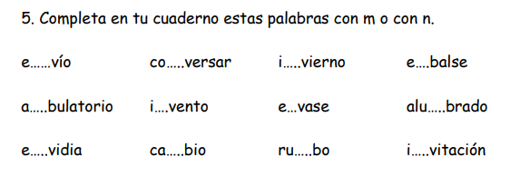

| Campo | Valor |
|--------|--------|
| **Fuente** | Ficha: «5. Completa en tu cuaderno estas palabras con m o con n.» |
| **Bloque** | **Ortografía** (**m** ante b/p · **n** ante v) |
| **¿Ortografía?** | **Sí** |
| **Reto (modo)** | **`missing`** — ampliación / refuerzo de banco |
| **Regla Aray** | **`mb-mp-nv`** (o `mb-mp`): m ante b/p · n ante v |
| **Enunciado ficha** | Completa en tu cuaderno estas palabras con m o con n. |
| **Enunciado Aray** | **«¿M o n?»** · tip: «Antes de b o p → m. Antes de v → n.» |
| **Encaje con actual** | Clásico Letra de la regla: hueco + 2 botones. Muy barato. |
| **Nivel 3.º** | Muy alineado (regla estrella de ciclo medio) |

### Ejemplos de la ficha
| Hueco | Completo |
|-------|----------|
| e___vío | e**n**vío |
| co___versar | co**n**versar |
| i___vierno | i**n**vierno |
| e___balse | e**m**balse |
| a___bulatorio | a**m**bulatorio |
| i___vento | i**n**vento |
| e___vase | e**n**vase |
| alu___brado | alu**m**brado |
| e___vidia | e**n**vidia |
| ca___bio | ca**m**bio |
| ru___bo | ru**m**bo |
| i___vitación | i**n**vitación |

### Visual
- Prompt: **¿M o n?**
- Una palabra grande con hueco (`ca___bio`, `e___vío`).
- Dos botones: **m** · **n**.
- Sin cuaderno ni teclado (la ficha dice “en tu cuaderno”; en Aray solo tocar).

### Funcional
1. Banco con `hardUnit` = `m` | `n` y contexto siguiente (b/v).
2. Validar toque; tip corto según la letra que sigue.
3. Mix / review bajo `mb-mp-nv`.
4. Algunas palabras de la ficha son largas (ambulatorio) → filtrar o dejar para ronda “dura”.

### Dónde
**Ortografía** — reforzar `mb-mp-nv`.

### Prioridad sugerida
Alta y barata — modo listo; solo banco + enunciado.

---

## Ejercicio 11 — El / la / los / las

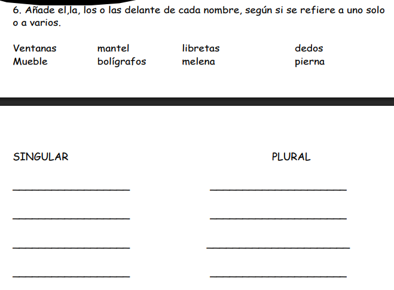

| Campo | Valor |
|--------|--------|
| **Fuente** | Ficha: «6. Añade el, la, los o las delante de cada nombre…» + columnas SINGULAR / PLURAL |
| **Bloque** | **Gramática** (artículos determinados + género/número) |
| **¿Ortografía?** | **No** |
| **Reto (modo)** | **`pick-article`** — **NUEVO** |
| **Enunciado ficha** | Añade el, la, los o las delante de cada nombre, según si se refiere a uno solo o a varios. |
| **Enunciado Aray** | **«¿Qué le pones delante?»** · tip: «Elige el, la, los o las.» |
| **Decisión de producto** | **No copiar los 2 bloques SINGULAR/PLURAL** (eso ya es el 02). Aquí el reto es el **artículo** (género + número a la vez). |
| **Encaje con actual** | No existe. No es ortografía. Distinto del 02 (`sort-number`): allí clasificas Una/Muchas; aquí eliges **1 de 4 fichas** de artículo. |
| **Nivel 3.º** | Adecuado |

### Ejemplos de la ficha
| Nombre | Artículo | Frase |
|--------|----------|-------|
| Ventanas | **las** | las ventanas |
| mantel | **el** | el mantel |
| libretas | **las** | las libretas |
| dedos | **los** | los dedos |
| Mueble | **el** | el mueble |
| bolígrafos | **los** | los bolígrafos |
| melena | **la** | la melena |
| pierna | **la** | la pierna |

### Visual (original Aray — sin columnas)
- Prompt: **¿Qué le pones delante?**
- Centro: **una palabra grande** (`mantel`, `ventanas`…).
- Debajo: **4 botones** fijos — **el** · **la** · **los** · **las**.
- Al acertar: se muestra la pareja montada (`el mantel`) con un flash «¡Encaja!».
- Opcional v2: la palabra “absorbe” el artículo a la izquierda (animación corta), sin rejillas ni rayas de cuaderno.

### Funcional
1. Banco de nombres con `{ article: 'el'|'la'|'los'|'las', gender, number }`.
2. Por turno: 1 nombre + tocar 1 de 4 artículos.
3. Validación: artículo exacto (no basta con singular/plural: `mantel` ≠ `la`).
4. Ronda: 8–10 nombres. Economía side-run.
5. Variante rápida: misma UI; tip tras fallo («Es una / femenino → la»).

### Qué **no** hacer
- No montar dos cajas SINGULAR / PLURAL para arrastrar (duplica el 02 y diluye el foco del artículo).
- No pedir escribir el artículo a mano.

### Dónde
Estación Gramática / «Palabras» — junto al 02, pero modo distinto.

### Prioridad sugerida
Alta — muy jugable solo con toques; complementa «¿Una o muchas?» sin repetir UI.

---

## Ejercicio 12 — ¿M o n? (más banco mb/mp)

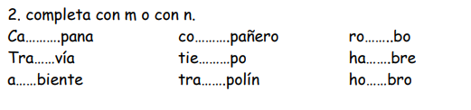

| Campo | Valor |
|--------|--------|
| **Fuente** | Ficha: «2. completa con m o con n.» |
| **Bloque** | **Ortografía** (m ante b/p · n ante v) |
| **¿Ortografía?** | **Sí** |
| **Reto (modo)** | **`missing`** — **mismo que el 10** (no hace falta modo nuevo) |
| **Regla Aray** | **`mb-mp-nv`** |
| **Enunciado ficha** | Completa con m o con n. |
| **Enunciado Aray** | **«¿M o n?»** (igual que el 10) |
| **Encaje con actual** | Es **más lemas** para la misma regla, no un ejercicio distinto. Mucho **mp/mb**; poco **nv** (tranvía). |
| **Nivel 3.º** | Adecuado |

### Ejemplos de la ficha
| Hueco | Completo |
|-------|----------|
| Ca___pana | Ca**m**pana |
| Tra___vía | Tra**n**vía |
| a___biente | a**m**biente |
| co___pañero | co**m**pañero |
| tie___po | tie**m**po |
| tra___polín | tra**m**polín |
| ro___bo | ro**m**bo |
| ha___bre | ha**m**bre |
| ho___bro | ho**m**bro |

### Visual / Funcional
Idénticos al **10**: palabra con hueco + botones **m** / **n**.

### Dónde
**Ortografía** — fusionar lemas con el banco del 10 al implementar.

### Prioridad sugerida
Misma que el 10 (barato: solo banco).

---

## Ejercicio 13 — Artículos (más nombres)

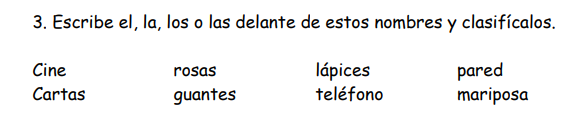

| Campo | Valor |
|--------|--------|
| **Fuente** | Ficha: «3. Escribe el, la, los o las delante de estos nombres y clasifícalos.» |
| **Bloque** | **Gramática** (artículos determinados) |
| **¿Ortografía?** | **No** |
| **Reto (modo)** | **`pick-article`** — **mismo que el 11** (no modo nuevo) |
| **Enunciado ficha** | Escribe el, la, los o las delante de estos nombres y clasifícalos. |
| **Enunciado Aray** | **«¿Qué le pones delante?»** |
| **Decisión de producto** | **Relacionar / tocar**, no escribir ni clasificar en columnas. Misma UI que el 11: nombre grande + 4 botones **el · la · los · las**. |
| **Encaje con actual** | Más lemas para el 11. La “clasificación” de la ficha queda implícita al acertar el artículo (género + número). |
| **Nivel 3.º** | Adecuado |

### Ejemplos de la ficha
| Nombre | Artículo |
|--------|----------|
| Cine | **el** |
| rosas | **las** |
| lápices | **los** |
| pared | **la** |
| Cartas | **las** |
| guantes | **los** |
| teléfono | **el** |
| mariposa | **la** |

### Visual / Funcional
Idénticos al **11**. Sin teclado, sin bloques SINGULAR/PLURAL.

### Dónde
Gramática — fusionar banco con el 11 al implementar.

### Prioridad sugerida
Misma que el 11.

---

## Ejercicio 14 — ¿Él o ella? (cambio de género)

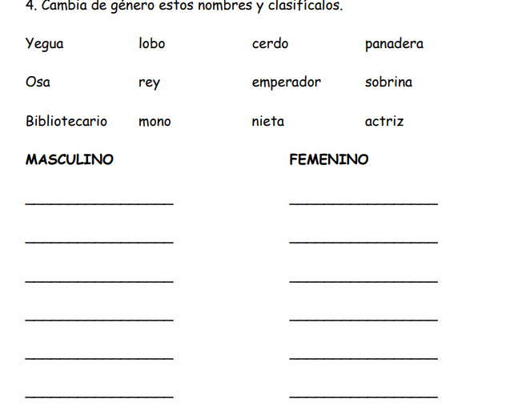

| Campo | Valor |
|--------|--------|
| **Fuente** | Ficha: «4. Cambia de género estos nombres y clasifícalos.» + columnas MASCULINO / FEMENINO |
| **Bloque** | **Gramática / morfología** (género: masculino ↔ femenino) |
| **¿Ortografía?** | **No** |
| **Reto (modo)** | **`sort-gender`** (o `gender-pair`) — **NUEVO** (hermano del 02 `sort-number`) |
| **Enunciado ficha** | Cambia de género estos nombres y clasifícalos. |
| **Enunciado Aray** | **«¿Y el otro?»** · tip: «Elige la pareja y ve a Él o a Ella.» |
| **Decisión de producto** | **Dos bloques táctiles** (como el 02), **sin escribir**. No rayas de cuaderno. |
| **Encaje con actual** | Mismo patrón UI que «¿Una o muchas?», pero el contenido es **pareja de género** (a veces irregular: yegua↔caballo, actor↔actriz). |
| **Nivel 3.º** | Adecuado |

### Ejemplos de la ficha (pares)
| Dado | El otro |
|------|---------|
| Yegua | caballo |
| lobo | loba |
| cerdo | cerda |
| panadera | panadero |
| Osa | oso |
| rey | reina |
| emperador | emperatriz |
| sobrina | sobrino |
| Bibliotecario | bibliotecaria |
| mono | mona |
| nieta | nieto |
| actriz | actor |

### Visual
- Prompt: **¿Y el otro?**
- Arriba: ficha del nombre dado (`Yegua`).
- Centro: **2–3 botones** con candidatos (`caballo` · `yegua` · …).
- Debajo: **dos bloques** — **Él** · **Ella** (o Chico / Chica).
- Al acertar la pareja: la forma elegida **cae sola** al bloque correcto (feedback «¡Al bloque!»).

### Funcional
1. Banco de pares `{ from, to, toGender: 'm'|'f' }`.
2. Niño toca la forma correcta del “otro”; si falla → tip corto.
3. Validación: string del par + el bloque destino debe coincidir con `toGender` (si en v1 el bloque es automático, solo se valida el par).
4. Variante aún más simple (si quieres “solo bloques”): mostrar ya la forma cambiada y clasificar Él/Ella — más fácil, menos fiel a “cambia”.
5. Ronda: 8–10 pares. Economía side-run.

### Qué **no** hacer
- No pedir escribir «caballo» / «reina» a mano.
- No mezclar con el 11 (artículos): aquí no hay el/la/los/las.

### Dónde
Gramática / Palabras — junto al 02 (número) y al 11 (artículos).

### Prioridad sugerida
Alta — reutiliza el patrón de 2 bloques del 02; el valor nuevo es el banco de pares (incl. irregulares).

---

## Ejercicio 15 — Contrarios / antónimos

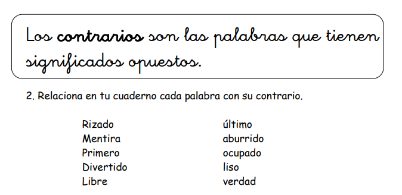

| Campo | Valor |
|--------|--------|
| **Fuente** | Ficha: definición «Los contrarios…» + «2. Relaciona… cada palabra con su contrario.» |
| **Bloque** | **Vocabulario** (relaciones de significado) |
| **¿Ortografía?** | **No** |
| **Reto (modo)** | **`match-pairs`** — mismo patrón que el 03 (Empareja), banco distinto |
| **Enunciado ficha** | Relaciona en tu cuaderno cada palabra con su contrario. |
| **Enunciado Aray** | **«¿Cuál es el contrario?»** · tip opcional: «También se llaman *antónimos*.» |
| **Terminología** | Ver nota abajo. |
| **Nivel 3.º** | Adecuado |

### Nota: ¿contrarios o antónimos?
- **Antónimo** es el término lingüístico / curricular (sinónimos y antónimos aparecen en estándares de Lengua de primaria).
- **Contrario** es la forma **didáctica e infantil** que usan muchas fichas de 1.º–3.º: mismo concepto, menos “palabra de libro”.
- En Aray: prompt principal con **contrario** (tono niño); se puede enseñar **antónimo** en tip o en un chip «Sabías que…».

### Pares de la ficha
| Palabra | Contrario |
|---------|-----------|
| Rizado | liso |
| Mentira | verdad |
| Primero | último |
| Divertido | aburrido |
| Libre | ocupado |

### Visual / Funcional
Como el **03**: dos columnas, tocar A → tocar B. Sin cuaderno.

### Dónde
Vocabulario / Lenguas — junto a colectivos (03). Misma UI `match-pairs`, tags `antonym` vs `collective`.

### Prioridad sugerida
Alta — casi gratis si ya existe Empareja de palabras.

---

## Ejercicio 16 — Artículos (el/la… y un/una…)

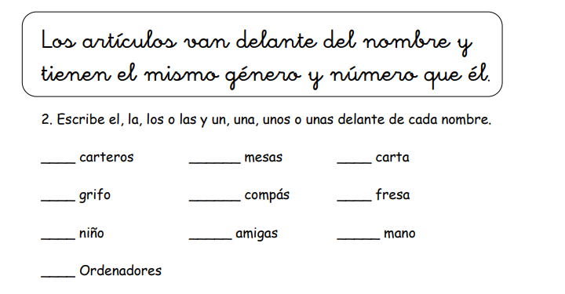

| Campo | Valor |
|--------|--------|
| **Fuente** | Ficha: regla «Los artículos van delante…» + «2. Escribe el, la, los o las y un, una, unos o unas…» |
| **Bloque** | **Gramática** (artículos determinados + indeterminados) |
| **¿Ortografía?** | **No** |
| **Reto (modo)** | Ampliación de **`pick-article`** — 2 familias de botones |
| **Enunciado ficha** | Escribe el, la, los o las y un, una, unos o unas delante de cada nombre. |
| **Enunciado Aray** | **«¿Qué le pones delante?»** · submodo: «El/la…» o «Un/una…» |
| **Ayuda** | Sí — tip: «Van delante del nombre y van a juego (*la* mesa, *unos* carteros).» |
| **Decisión de producto** | **Sin escribir.** No 8 botones a la vez (confunde). Mejor: **dos rondas** o un toggle «el/la…» ↔ «un/una…» con 4 botones. |
| **Encaje con actual** | Extiende el 11/13 (solo determinados). Misma UI; más opciones de banco. |
| **Nivel 3.º** | Adecuado · ojo: *mano* (femenino en -o) → buen ítem + tip |

### Ejemplos de la ficha
| Nombre | Determinado | Indeterminado |
|--------|-------------|----------------|
| carteros | **los** | **unos** |
| grifo | **el** | **un** |
| niño | **el** | **un** |
| Ordenadores | **los** | **unos** |
| mesas | **las** | **unas** |
| compás | **el** | **un** |
| amigas | **las** | **unas** |
| carta | **la** | **una** |
| fresa | **la** | **una** |
| mano | **la** | **una** |

### Visual / Funcional
1. Ayuda «?» con la regla corta.
2. Nombre grande + 4 botones de la familia activa.
3. Validar género/número; feedback con la pareja montada.
4. Fusionar banco con 11/13.

### Dónde
Gramática — mismo modo `pick-article`.

### Prioridad sugerida
Media-alta tras el 11 (primero determinados; luego añadir indeterminados + ayuda).

---

## Ejercicio 17 — ¿R o rr?

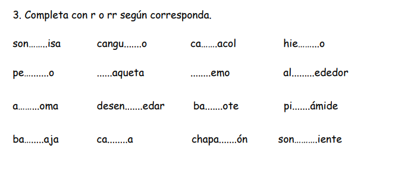

| Campo | Valor |
|--------|--------|
| **Fuente** | Ficha: «3. Completa con r o rr según corresponda.» |
| **Bloque** | **Ortografía** (r / rr) |
| **¿Ortografía?** | **Sí** |
| **Reto (modo)** | **`missing`** — ampliación de banco |
| **Regla Aray** | **`r-rr`** (ya existe) |
| **Enunciado ficha** | Completa con r o rr según corresponda. |
| **Enunciado Aray** | **«¿R o rr?»** · tip: «Entre vocales, el sonido fuerte va con rr.» |
| **Ayuda** | Opcional «?»: «Al empezar o tras n/l/s basta **r**. Entre vocales, sonido fuerte → **rr**.» |
| **Nivel 3.º** | Muy alineado |

### Ejemplos de la ficha
| Hueco | Completo | Notas |
|-------|----------|--------|
| son___isa | son**r**isa | r tras n |
| cangu___o | cangu**r**o | r suave entre vocales |
| ca___acol | ca**r**acol | r suave |
| hie___o | hie**rr**o | rr |
| pe___o | pe**rr**o | rr |
| ___aqueta | **r**aqueta | inicio |
| ___emo | **r**emo | inicio |
| al___ededor | al**r**ededor | r tras l |
| a___oma | a**r**oma | r suave |
| desen___edar | desen**r**edar | r tras n |
| ba___ote | ba**rr**ote | rr |
| pi___ámide | pi**r**ámide | r suave |
| ba___aja | ba**r**aja | r suave |
| ca___a | ca**r**a | r suave |
| chapa___ón | chapa**rr**ón | rr |
| son___iente | son**r**iente | r tras n |

### Visual / Funcional
Palabra con hueco + botones **r** · **rr**. Solo tocar. Mix/review bajo `r-rr`.

### Dónde
**Ortografía** — reforzar banco `r-rr`.

### Prioridad sugerida
Alta y barata (modo listo).

---

## Ejercicio 18 — Adjetivos al sustantivo

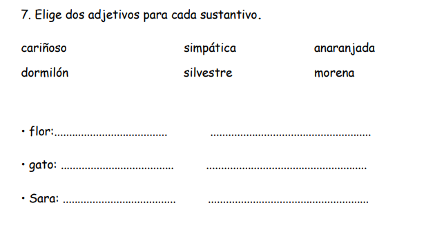

| Campo | Valor |
|--------|--------|
| **Fuente** | Ficha: «7. Elige dos adjetivos para cada sustantivo.» |
| **Bloque** | **Gramática** (concordancia sustantivo–adjetivo: género/número + sentido) |
| **¿Ortografía?** | **No** |
| **Reto (modo)** | **`match-adj-noun`** — **NUEVO** (variante de emparejar / elegir 2) |
| **Enunciado ficha** | Elige dos adjetivos para cada sustantivo. |
| **Enunciado Aray** | **«¿Qué le pega?»** · tip: «Toca 2 palabras que van con la foto.» |
| **Ayuda** | «El adjetivo va a juego con el nombre: *gato cariñoso*, *flor anaranjada*.» |
| **Decisión de producto** | **Relacionar tocando**, no escribir. **Imagen** del sustantivo (flor / gato / Sara). |
| **Nivel 3.º** | Adecuado |

### Banco de la ficha
Adjetivos: `cariñoso` · `dormilón` · `simpática` · `silvestre` · `anaranjada` · `morena`

| Sustantivo | Pareja esperada (aprox.) |
|------------|---------------------------|
| flor | silvestre, anaranjada |
| gato | cariñoso, dormilón |
| Sara | simpática, morena |

### Assets
| Clave | Archivo |
|-------|---------|
| flor | [`refs/18-flor.png`](refs/18-flor.png) |
| gato | [`refs/18-gato.png`](refs/18-gato.png) |
| Sara | [`refs/18-sara.png`](refs/18-sara.png) |

### Visual
- Prompt: **¿Qué le pega?**
- Centro: **foto grande** (flor / gato / Sara) + nombre corto debajo.
- Abajo: **nube de fichas** de adjetivos (barajadas).
- Al tocar 2 válidas: se marcan junto a la foto («¡Le pega!») y pasa al siguiente.

### Funcional
1. Ítem = sustantivo + imagen + set de 2 adjetivos correctos + distractores del pool.
2. Niño toca exactamente 2 (o toca hasta acertar el par).
3. Validar género/número **y** sentido (no solo -o/-a): *morena* no va con *gato* aunque… en la ficha el reparto es semántico.
4. Sin teclado. Ronda: 3 sustantivos = 1 tablero, o varios sets.
5. Economía side-run.

### Dónde
Gramática / Palabras — cerca de artículos y género.

### Prioridad sugerida
Media-alta — muy visual; necesita modo nuevo + banco etiquetado.

---

## Ejercicio 19 — ¿-d o -z?

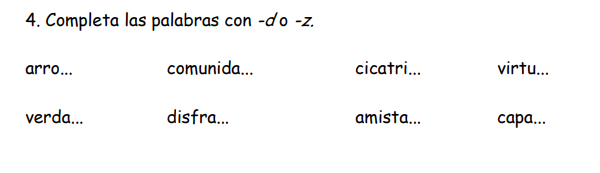

| Campo | Valor |
|--------|--------|
| **Fuente** | Ficha: «4. Completa las palabras con -d o -z.» |
| **Bloque** | **Ortografía** (final en **d** / **z**) |
| **¿Ortografía?** | **Sí** |
| **Reto (modo)** | **`missing`** — ampliación de banco |
| **Regla Aray** | **`d-z`** (ya existe) |
| **Enunciado ficha** | Completa las palabras con -d o -z. |
| **Enunciado Aray** | **«¿-d o -z?»** · tip: «Piensa el plural: *verdad→verdades*, *arroz→arroces*.» |
| **Ayuda** | Opcional: «Si el plural lleva **c** (*arroces*), acaba en **z**. Si lleva **d** (*amistades*), acaba en **d**.» |
| **Nivel 3.º** | Adecuado |

### Ejemplos de la ficha
| Hueco | Completo |
|-------|----------|
| arro___ | arro**z** |
| comunida___ | comunida**d** |
| cicatri___ | cicatri**z** |
| virtu___ | virtu**d** |
| verda___ | verda**d** |
| disfra___ | disfra**z** |
| amista___ | amista**d** |
| capa___ | capa**z** |

### Visual / Funcional
Palabra con hueco + botones **-d** · **-z**. Solo tocar. Mix/review bajo `d-z`.

### Dónde
**Ortografía** — reforzar banco `d-z`.

### Prioridad sugerida
Alta y barata.

---

## Ejercicio 20 — Une la frase (4 piezas)

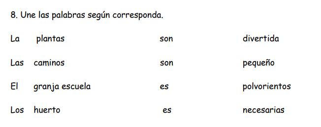

| Campo | Valor |
|--------|--------|
| **Fuente** | Ficha: «8. Une las palabras según corresponda.» |
| **Bloque** | **Gramática / sintaxis** (concordancia: artículo–nombre–verbo–adjetivo) |
| **¿Ortografía?** | **No** |
| **Reto (modo)** | **`join-sentence-4`** — **NUEVO** (hermano del 04 `join-sentence-3`) |
| **Enunciado ficha** | Une las palabras según corresponda. |
| **Enunciado Aray** | **«Une la frase»** · tip: «Toca las 4 piezas que van a juego.» |
| **Ayuda** | «Todo tiene que ir a juego: *las plantas son necesarias*.» |
| **Decisión de producto** | **Solo unir / tocar**, sin líneas a mano ni escribir. |
| **Encaje con actual** | Como el 04 pero **4 columnas** (artículo + nombre + *ser* + adjetivo). |
| **Nivel 3.º** | Adecuado |

### Tríos/cuartetos de la ficha
| Artículo | Nombre | Verbo | Adjetivo |
|----------|--------|-------|----------|
| Las | plantas | son | necesarias |
| Los | caminos | son | polvorientos |
| La | granja escuela | es | divertida |
| El | huerto | es | pequeño |

### Visual
- Prompt: **Une la frase**.
- **4 columnas** de fichas barajadas por columna.
- Al elegir: preview de la frase montada arriba.
- Acierto → flash «¡Frase lista!» y se retiran las 4.

### Funcional
1. Banco de cuartetos con género/número coherente.
2. Tocar una ficha por columna (orden libre) → validar id de cuarteto.
3. Fallo → tip corto («Mira si es uno o muchos / él o ella»).
4. Ronda: vaciar tablero (4 frases). Economía side-run.

### Dónde
Gramática / Frases — junto al 04 y al 05.

### Prioridad sugerida
Media-alta — si el 04 está hecho, ampliar a 4 columnas es barato.

---

## Ejercicio 21 — ¿C, z o qu?

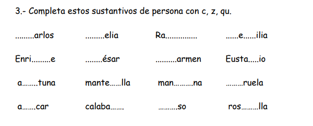

| Campo | Valor |
|--------|--------|
| **Fuente** | Ficha: «3.- Completa estos sustantivos de persona con c, z, qu.» (mezcla nombres + comida) |
| **Bloque** | **Ortografía** (c / z / qu) |
| **¿Ortografía?** | **Sí** |
| **Reto (modo)** | **`missing`** — ampliación de banco |
| **Regla Aray** | **`c-z-qu`** (ya existe) |
| **Enunciado ficha** | Completa estos sustantivos de persona con c, z, qu. |
| **Enunciado Aray** | **«¿C, z o qu?»** · tip: «Antes de e/i el sonido /k/ va con **qu**.» |
| **Ayuda** | Opcional: «*que*, *qui* con u muda. *z* ante a/o/u…» (versión niño, 1 frase). |
| **Nivel 3.º** | Adecuado · en app: **1 hueco por turno** (Cecilia/Eustaquio tienen varios en la ficha) |

### Ejemplos de la ficha
| Completo | Pieza(s) |
|----------|----------|
| Carlos, Celia, Carmen, César, ciruela | **c** |
| Raquel, Enrique, Eustaquio, mantequilla, queso, rosquilla | **qu** |
| manzana, azúcar, calabaza | **z** |
| aceituna | **c** |
| Cecilia | **c** + **c** (dos huecos en ficha) |

### Visual / Funcional
Hueco + botones **c** · **z** · **qu**. Solo tocar. Mix bajo `c-z-qu`.

### Dónde
**Ortografía** — reforzar banco `c-z-qu`.

### Prioridad sugerida
Alta y barata.

---

## Ejercicio 22 — ¿B o v? (verbos, otra ficha)

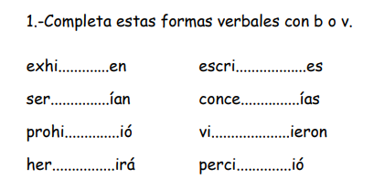

| Campo | Valor |
|--------|--------|
| **Fuente** | Ficha: «1.- Completa estas formas verbales con b o v.» |
| **Bloque** | **Ortografía** (b / v en verbos) |
| **¿Ortografía?** | **Sí** |
| **Reto (modo)** | **`missing`** — **mismo que el 08** |
| **Regla Aray** | **`b-v`** |
| **Enunciado Aray** | **«¿B o v?»** |
| **Encaje** | Misma ficha-tipo que el **08** (casi el mismo set). Al implementar: **un solo banco**. |
| **Nivel 3.º** | Adecuado (priorizar formas frecuentes) |

### Ejemplos
exhiben · servían · prohibió · hervirá · escribes · concebías · vivieron · percibió

### Visual / Funcional / Dónde
Idénticos al **08**. Fusionar lemas.

### Prioridad sugerida
Igual que el 08 (= banco).

---

## Ejercicio 23 — ¿M o n? (más lemas)

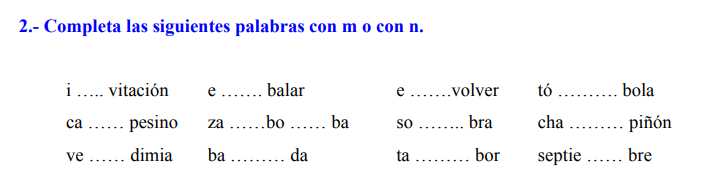

| Campo | Valor |
|--------|--------|
| **Fuente** | Ficha: «2.- Completa las siguientes palabras con m o con n.» |
| **Bloque** | **Ortografía** (m ante b/p · n ante v) |
| **¿Ortografía?** | **Sí** |
| **Reto (modo)** | **`missing`** — **mismo que el 10/12** |
| **Regla Aray** | **`mb-mp-nv`** |
| **Enunciado Aray** | **«¿M o n?»** |
| **Encaje** | Más lemas para el mismo banco (invitación, campesino, embalar, envolver, sombra, tambor, tómbola, champiñón, septiembre, zambomba…). *zambomba* tiene 2 huecos → en app 1 por turno. |
| **Nivel 3.º** | Adecuado |

### Visual / Funcional / Dónde
Idénticos al **10**. Fusionar lemas.

### Prioridad sugerida
Igual que el 10.

---

## Ejercicio 24 — C o z en la frase

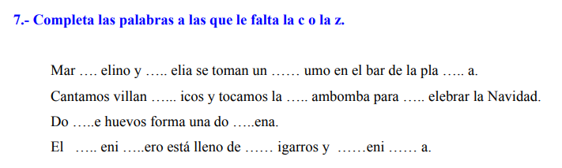

| Campo | Valor |
|--------|--------|
| **Fuente** | Ficha: «7.- Completa las palabras a las que le falta la c o la z.» (en oraciones) |
| **Bloque** | **Ortografía** (c / z) |
| **¿Ortografía?** | **Sí** |
| **Reto (modo)** | **`missing`** con contexto **o** **`complete`** (Completa la frase — ya existe en app) |
| **Regla Aray** | **`c-z-qu`** (subfoco c vs z; sin qu en esta ficha) |
| **Enunciado ficha** | Completa las palabras a las que le falta la c o la z. |
| **Enunciado Aray** | **«¿C o z?»** · tip: «Lee la frase y elige.» |
| **Ayuda** | Opcional regla corta c/z. |
| **Decisión de producto** | **1 hueco por turno** + botones **c** / **z** (la ficha mete muchos huecos en la misma frase). |
| **Nivel 3.º** | Adecuado |

### Ejemplos (huecos → completo)
| Contexto | Pieza |
|----------|-------|
| Mar___elino, ___elia, ___umo, pla___a | c / c / **z** / **z** → Marcelino, Celia, zumo, plaza |
| villan___icos, ___ambomba, ___elebrar | **c** / **z** / **c** |
| Do___e, do___ena | **c** / **c** |
| ___eni___ero, ___igarros, ___eni___a | **c**/c · **c** · **c**/z → cenicero, cigarros, ceniza |

### Visual / Funcional
Frase con **un** hueco resaltado + **c** · **z**. Sin teclado. Banco bajo `c-z-qu`.

### Dónde
**Ortografía** — refuerzo contextual de la misma regla que el 21.

### Prioridad sugerida
Alta si `complete`/`missing` ya pintan frase; barato en banco.

---

## Ejercicio 25 — Une nombre + adjetivo

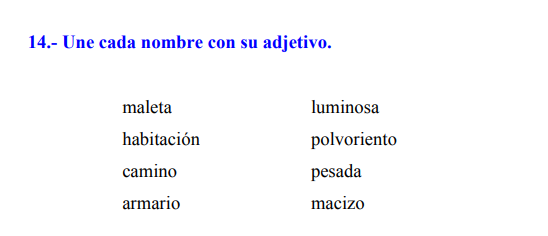

| Campo | Valor |
|--------|--------|
| **Fuente** | Ficha: «14.- Une cada nombre con su adjetivo.» |
| **Bloque** | **Gramática** (concordancia nombre–adjetivo) |
| **¿Ortografía?** | **No** |
| **Reto (modo)** | **`match-pairs`** — o variante ligera de **`match-adj-noun`** (18) |
| **Enunciado ficha** | Une cada nombre con su adjetivo. |
| **Enunciado Aray** | **«¿Qué le pega?»** · tip: «Toca el nombre y su adjetivo.» |
| **Ayuda** | «Van a juego: *maleta pesada*, *camino polvoriento*.» |
| **Decisión de producto** | **Emparejar tocando** (2 columnas), sin líneas a mano. |
| **Encaje** | Hermano del **18** (allí: foto + elegir 2 adjetivos). Aquí: **1 a 1** puro, como el 03/15. |
| **Nivel 3.º** | Adecuado |

### Pares de la ficha
| Nombre | Adjetivo |
|--------|----------|
| maleta | pesada |
| habitación | luminosa |
| camino | polvoriento |
| armario | macizo |

### Visual / Funcional
Dos columnas barajadas; tocar A → tocar B. Validar par (género + sentido).

### Dónde
Gramática — junto al 18.

### Prioridad sugerida
Alta si ya hay Empareja; banco barato.

---

## Ejercicio 26 — Artículo + nombre

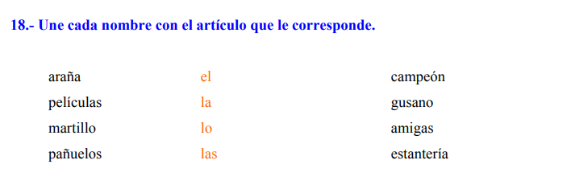

| Campo | Valor |
|--------|--------|
| **Fuente** | Ficha: «18.- Une cada nombre con el artículo que le corresponde.» |
| **Bloque** | **Gramática** (artículos determinados) |
| **¿Ortografía?** | **No** |
| **Reto (modo)** | **`pick-article`** — **mismo que el 11** (no dibujar líneas) |
| **Enunciado ficha** | Une cada nombre con el artículo que le corresponde. |
| **Enunciado Aray** | **«¿Qué le pones delante?»** |
| **Decisión de producto** | Nombre (o foto) + 4 botones **el · la · los · las**. La ficha pone **«lo»** en el centro: casi seguro tipazo por **los** (*pañuelos*). En Aray: **los**, no lo. |
| **Encaje** | Más lemas para el 11/13/16. |
| **Nivel 3.º** | Adecuado |

### Banco de la ficha
| Nombre | Artículo |
|--------|----------|
| araña | **la** |
| películas | **las** |
| martillo | **el** |
| pañuelos | **los** |
| campeón | **el** |
| gusano | **el** |
| amigas | **las** |
| estantería | **la** |

### Visual / Funcional / Dónde
Idénticos al **11**. Fusionar banco.

### Prioridad sugerida
Igual que el 11.

---

## Ejercicio 27 — Igual y al revés (sinónimo / antónimo)

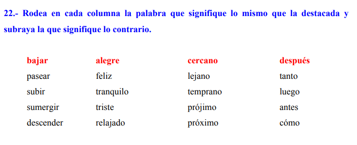

| Campo | Valor |
|--------|--------|
| **Fuente** | Ficha: «22.- Rodea… la que signifique lo mismo… y subraya la… contrario.» (4 columnas) |
| **Bloque** | **Vocabulario** (sinónimos + antónimos / contrarios) |
| **¿Ortografía?** | **No** |
| **Reto (modo)** | **`same-or-opposite`** — **NUEVO** (o 2 pasos sobre opciones) |
| **Enunciado ficha** | Rodea la que significa lo mismo y subraya la contraria. |
| **Enunciado Aray** | **«¿Igual o al revés?»** · tip: «Primero la que significa lo mismo. Luego la contraria.» |
| **Ayuda** | «**Igual** = sinónimo. **Al revés** = contrario / antónimo.» |
| **Decisión de producto** | **4 columnas = 4 ítems** de la ronda (bajar · alegre · cercano · después), **no** una sola pantalla con 4 columnas. Como la web: uno tras otro. |
| **Nivel 3.º** | Adecuado |

### Ítems (1 por turno)
| Destacada | Opciones | Igual (sinónimo) | Al revés (antónimo) |
|-----------|----------|------------------|---------------------|
| **bajar** | pasear, subir, sumergir, descender | descender | subir |
| **alegre** | feliz, tranquilo, triste, relajado | feliz | triste |
| **cercano** | lejano, temprano, prójimo, próximo | próximo | lejano |
| **después** | tanto, luego, antes, cómo | luego | antes |

### Visual
- Prompt: **¿Igual o al revés?**
- Palabra grande en rojo/acento (`bajar`).
- 4 fichas de opciones.
- Paso 1 chip: «Toca la que **significa lo mismo**» → Paso 2: «Toca la **contraria**».
- Sin rodear/subrayar a mano.

### Funcional
1. Banco de ítems `{ target, options[], synonym, antonym }`.
2. Validar dos toques en orden (o marcar con etiquetas Igual / Al revés).
3. Ronda: estos 4 + más del banco 15 (contrarios).
4. Economía side-run.

### Dónde
Vocabulario — junto al 15 (contrarios). El 15 es solo emparejar contrarios; aquí es **sinónimo + antónimo** en el mismo ítem.

### Prioridad sugerida
Media-alta — muy claro; UI de 2 pasos.

---

## Ejercicio 28 — ¿G, gu, gü o j?

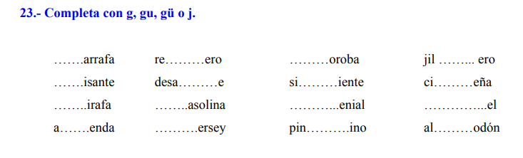

| Campo | Valor |
|--------|--------|
| **Fuente** | Ficha: «23.- Completa con g, gu, gü o j.» (rejilla 16) |
| **Bloque** | **Ortografía** (g / gu / gü / j) |
| **¿Ortografía?** | **Sí** |
| **Reto (modo)** | **`missing`** — 1 palabra por turno (las 16 = banco) |
| **Regla Aray** | Cruce **`g-j`** + **`gu-gue`** (diéresis gü) |
| **Enunciado ficha** | Completa con g, gu, gü o j. |
| **Enunciado Aray** | **«¿G, gu, gü o j?»** · tip: «Mira la vocal y si lleva puntitos.» |
| **Ayuda** | «Ante e/i: **j** o **g/gu/gü** según el sonido. Con puntitos = **gü**.» |
| **Nivel 3.º** | Muy alineado · hermano del 06/07 |

### Banco (1 ítem = 1 hueco)
| Completo | Pieza |
|----------|-------|
| garrafa, gasolina, agenda, genial, gel, algodón | **g** |
| guisante, reguero, siguiente, jilguero | **gu** |
| desagüe, pingüino, cigüeña | **gü** |
| jirafa, jersey, joroba | **j** |

### Visual / Funcional
Hueco + 4 botones **g · gu · gü · j**. Solo tocar. Mix por reglas `g-j` / `gu-gue`.

### Dónde
**Ortografía** — ampliar bancos 06/07.

### Prioridad sugerida
Alta y barata (modo listo + 4 opciones).

---

## Ejercicio 29 — Completa el par (c/qu · z/c · g/gu · d/z)

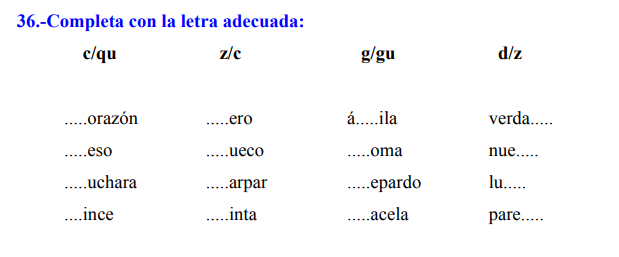

| Campo | Valor |
|--------|--------|
| **Fuente** | Ficha: «36.- Completa con la letra adecuada:» + 4 columnas con cabecera de par |
| **Bloque** | **Ortografía** (mix de reglas) |
| **¿Ortografía?** | **Sí** |
| **Reto (modo)** | **`missing`** — **1 palabra por turno**; la cabecera de columna fija el par de botones |
| **Enunciado ficha** | Completa con la letra adecuada |
| **Enunciado Aray** | Según el ítem: **«¿C o qu?»** · **«¿Z o c?»** · **«¿G o gu?»** · **«¿-d o -z?»** |
| **Decisión de producto** | **4 columnas ≠ 4 pantallas a la vez.** Son **4 familias** en el banco (16 ítems). Como la web: uno tras otro. |
| **Nivel 3.º** | Adecuado |

### Familias → reglas Aray
| Columna | Botones | Regla | Ejemplos |
|---------|---------|-------|----------|
| c/qu | **c** · **qu** | `c-z-qu` | corazón, queso, cuchara, quince |
| z/c | **z** · **c** | `c-z-qu` | cero, zueco, zarpar, cinta |
| g/gu | **g** · **gu** | `gu-gue` | águila, goma, guepardo, gacela |
| d/z | **d** · **z** | `d-z` | verdad, nuez, luz, pared |

### Visual / Funcional
Hueco + **2 botones** del par del ítem (no 8 opciones). Tips por regla ya existentes. Refuerza bancos 07, 19, 21.

### Dónde
**Ortografía** — mix / rondas por regla o `mix` general.

### Prioridad sugerida
Alta y barata — puro banco + copy del prompt.

---

## Ejercicio 30 — ¿Mp, mb o nv?

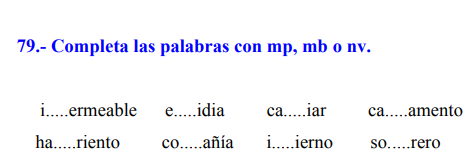

| Campo | Valor |
|--------|--------|
| **Fuente** | Ficha: «79.- Completa las palabras con mp, mb o nv.» |
| **Bloque** | **Ortografía** (mp / mb / nv) |
| **¿Ortografía?** | **Sí** |
| **Reto (modo)** | **`missing`** — 1 palabra por turno (8 = banco) |
| **Regla Aray** | **`mb-mp-nv`** (aquí el hueco es el **dígrafo**, no solo m/n) |
| **Enunciado ficha** | Completa las palabras con mp, mb o nv. |
| **Enunciado Aray** | **«¿Mp, mb o nv?»** · tip: «m delante de p/b · n delante de v.» |
| **Encaje** | Hermano del 10/12/23 (¿M o n?): misma regla; opciones **mp · mb · nv**. |
| **Nivel 3.º** | Adecuado |

### Banco
| Hueco | Completo | Pieza |
|-------|----------|-------|
| i___ermeable | impermeable | **mp** |
| e___idia | envidia | **nv** |
| ca___iar | cambiar | **mb** |
| ca___amento | campamento | **mp** |
| ha___riento | hambriento | **mb** |
| co___añía | compañía | **mp** |
| i___ierno | invierno | **nv** |
| so___rero | sombrero | **mb** |

### Visual / Funcional
Hueco + 3 botones **mp · mb · nv**. Solo tocar.

### Dónde
**Ortografía** — mismo bloque que el 10.

### Prioridad sugerida
Alta y barata.

---

## Ejercicio 31 — Sílabas con br / bl

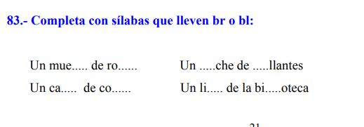

| Campo | Valor |
|--------|--------|
| **Fuente** | Ficha: «83.- Completa con sílabas que lleven br o bl:» |
| **Bloque** | **Ortografía** (grupos **br** / **bl**) |
| **¿Ortografía?** | **Sí** |
| **Reto (modo)** | **`missing`** / **`fill-syllable`** — 1 hueco por turno |
| **Regla Aray** | **`bl-br`** — **NUEVA** (no está en types aún) o subfoco de otra regla |
| **Enunciado ficha** | Completa con sílabas que lleven br o bl |
| **Enunciado Aray** | **«¿Br o bl?»** · tip: «Elige la sílaba que encaja.» |
| **Decisión de producto** | Frase corta con **un** hueco; botones de sílabas candidatas (`mue`, `ble`, `bro`…) o del cluster **br/bl** según diseño. Las 4 frases = varios ítems del banco. |
| **Nivel 3.º** | Adecuado |

### Banco (frases → huecos)
| Frase | Completo |
|-------|----------|
| Un mue___ de ro___ | mue**ble** · ro**ble** |
| Un ca___ de co___ | ca**ble** · co**bre** |
| Un ___che de ___llantes | **bro**che · **bri**llantes |
| Un li___ de la bi___oteca | li**bro** · bi**bli**oteca |

### Visual / Funcional
1 hueco + opciones de sílaba (MCQ). Sin teclado. Ronda = ir vaciando huecos de las frases.

### Dónde
**Ortografía** — regla nueva `bl-br` o pack de sílabas.

### Prioridad sugerida
Media — bonito; puede necesitar regla/banco nuevo.

---

## Ejercicio 32 — G o j + familia

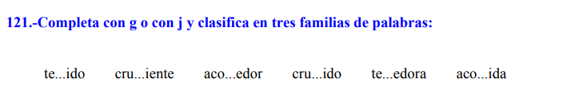

| Campo | Valor |
|--------|--------|
| **Fuente** | Ficha: «121.- Completa con g o con j y clasifica en tres familias de palabras» |
| **Bloque** | **Ortografía** (+ vocabulario: familias léxicas) |
| **¿Ortografía?** | **Sí** (y clasificación) |
| **Reto (modo)** | **2 pasos:** `missing` (`g-j`) + **`sort-family`** — **NUEVO** (o solo el 1.º) |
| **Enunciado ficha** | Completa con g o con j y clasifica en tres familias |
| **Enunciado Aray** | Paso 1: **«¿G o j?»** · Paso 2: **«¿De qué familia?»** |
| **Ayuda** | «Misma familia = misma raíz: *tejer*, *crujir*, *acoger*.» |
| **Decisión de producto** | **No** 6 palabras a la vez. 1) hueco + **g/j**; 2) la palabra va a un bloque de familia (3 bandos). |
| **Nivel 3.º** | Adecuado |

### Banco / familias
| Familia (raíz) | Palabras | Letra |
|----------------|----------|-------|
| tejer | tejido, tejedora | **j** |
| crujir | crujiente, crujido | **j** |
| acoger | acogedor, acogida | **g** |

### Visual
- Paso 1: como ortografía actual (`te___ido` + botones g/j).
- Paso 2: 3 bloques tocables — **Tejer** · **Crujir** · **Acoger** (o chips con el infinitivo).
- Alternativa v1: solo paso 1 (banco `g-j`); familias en otra ronda.

### Funcional
1. Validar letra → opcionalmente pedir familia.
2. O ronda A = solo g/j; ronda B = clasificar las 6 ya resueltas.
3. Economía side-run.

### Dónde
**Ortografía** (`g-j`) + opcional Vocabulario familias.

### Prioridad sugerida
Media — el g/j es barato; las 3 familias aportan valor pero es modo extra.

---

## Ejercicio 33 — Pronombre + verbo

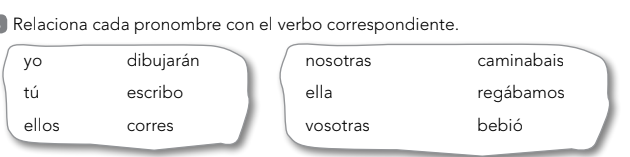

| Campo | Valor |
|--------|--------|
| **Fuente** | Ficha: «Relaciona cada pronombre con el verbo correspondiente.» (2 cajas) |
| **Bloque** | **Gramática** (concordancia persona–verbo / conjugación) |
| **¿Ortografía?** | **No** |
| **Reto (modo)** | **`match-pairs`** — banco `pronoun-verb` (como 03/15/25) |
| **Enunciado ficha** | Relaciona cada pronombre con el verbo correspondiente. |
| **Enunciado Aray** | **«¿Quién hace qué?»** · tip: «Toca el pronombre y su verbo.» |
| **Ayuda** | «Yo va con *-o* (*escribo*). Ellos con *-n* (*dibujarán*)…» |
| **Decisión de producto** | **2 cajas = 2 tableros** (o 6 pares en ronda). Emparejar tocando, sin líneas. |
| **Nivel 3.º** | Idea OK; algunas formas son duras (*caminabais*, *dibujarán*, imperfecto). En Aray: priorizar presentes / pasados simples del ciclo medio. |

### Pares de la ficha
| Pronombre | Verbo |
|-----------|-------|
| yo | escribo |
| tú | corres |
| ellos | dibujarán |
| nosotras | regábamos |
| ella | bebió |
| vosotras | caminabais |

### Visual / Funcional
Como Empareja: 2 columnas barajadas; tocar A → B. Validar id de par.

### Dónde
Gramática / Frases — cerca del 04/05 (concordancia).

### Prioridad sugerida
Media-alta — UI conocida; filtrar tiempos difíciles en el banco.

---

## Ejercicio 34 — ¿R o rr? (más lemas)

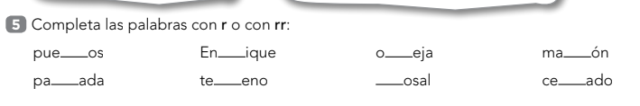

| Campo | Valor |
|--------|--------|
| **Fuente** | Ficha: «5 Completa las palabras con r o con rr:» |
| **Bloque** | **Ortografía** (r / rr) |
| **¿Ortografía?** | **Sí** |
| **Reto (modo)** | **`missing`** — **mismo que el 17** |
| **Regla Aray** | **`r-rr`** |
| **Enunciado Aray** | **«¿R o rr?»** |
| **Encaje** | Más lemas: puerros, Enrique, oreja, marrón, parada, terreno, rosal, cerrado. 1 por turno. |
| **Nivel 3.º** | Adecuado |

### Visual / Funcional / Dónde
Idénticos al **17**. Fusionar banco.

### Prioridad sugerida
Igual que el 17.

---

## Ejercicio 35 — Frases hechas

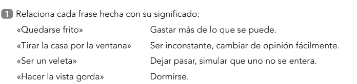

| Campo | Valor |
|--------|--------|
| **Fuente** | Ficha: «1 Relaciona cada frase hecha con su significado:» |
| **Bloque** | **Vocabulario** (frases hechas / expresiones) |
| **¿Ortografía?** | **No** |
| **Reto (modo)** | **`match-pairs`** — tag `idiom` |
| **Enunciado ficha** | Relaciona cada frase hecha con su significado |
| **Enunciado Aray** | **«¿Qué quiere decir?»** · tip: «Toca la frase y su significado.» |
| **Ayuda** | «Las **frases hechas** no se entienden palabra a palabra: *quedarse frito* = dormirse.» |
| **Decisión de producto** | Emparejar tocando. **Si falla → explicar el porqué** (tip de la expresión correcta o de la que tocó). |
| **Nivel 3.º** | Adecuado (léxico coloquial; muy jugable) |

### Pares + tip si falla
| Frase hecha | Significado | Porqué (feedback) |
|-------------|-------------|-------------------|
| Quedarse frito | Dormirse | «Como si te apagaras: te quedas profundamente dormido.» |
| Tirar la casa por la ventana | Gastar más de lo que se puede | «Gastas un montón, sin mirar el bolsillo.» |
| Ser un veleta | Ser inconstante, cambiar de opinión fácilmente | «La veleta gira con el viento: cambia según sopla.» |
| Hacer la vista gorda | Dejar pasar, simular que uno no se entera | «Haces como que no lo ves y lo dejas pasar.» |

### Visual / Funcional
1. Dos columnas (frase · significado), barajadas.
2. Acierto → «¡Eso es!»
3. **Fallo →** mensaje corto con el **porqué** de la pareja buena (y/o por qué no encaja la elegida).
4. Ronda: 1 tablero = 4 pares (+ más frases hechas en banco).

### Dónde
Vocabulario — junto a contrarios (15) / igual-al-revés (27).

### Prioridad sugerida
Media-alta — Empareja + **tips ricos al fallar** (pedido explícito).

---

## Ejercicio 36 — ¿G o j? (más lemas)

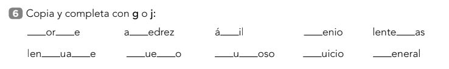

| Campo | Valor |
|--------|--------|
| **Fuente** | Ficha: «6 Copia y completa con g o j:» |
| **Bloque** | **Ortografía** (g / j) |
| **¿Ortografía?** | **Sí** |
| **Reto (modo)** | **`missing`** — regla **`g-j`** · 1 hueco por turno |
| **Enunciado ficha** | Copia y completa con g o j |
| **Enunciado Aray** | **«¿G o j?»** |
| **Decisión de producto** | Sin copiar a mano. Palabras con 2 huecos (*Jorge*, *lenguaje*, *juego*) → **dos ítems** o huecos en serie. |
| **Nivel 3.º** | Adecuado · refuerza 28/32 |

### Banco
| Completo | Piezas |
|----------|--------|
| Jorge | **j** · **g** |
| ajedrez, ágil, lentejas, juicio | **j** |
| genio, general | **g** |
| lenguaje | **g** · **j** |
| juego, jugoso | **j** · **g** |

### Visual / Funcional / Dónde
Hueco + botones **g** · **j**. Ortografía `g-j`.

### Prioridad sugerida
Alta y barata (banco).

---

## Ejercicio 37 — ¿Gu o gü?

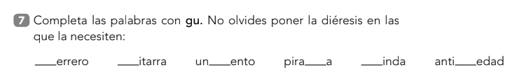

| Campo | Valor |
|--------|--------|
| **Fuente** | Ficha: «7 Completa las palabras con gu. No olvides poner la diéresis…» |
| **Bloque** | **Ortografía** (gu / gü) |
| **¿Ortografía?** | **Sí** |
| **Reto (modo)** | **`missing`** — regla **`gu-gue`** · 1 por turno |
| **Enunciado ficha** | Completa con gu; diéresis si hace falta |
| **Enunciado Aray** | **«¿Gu o gü?»** · tip: «Si suena la u, lleva puntitos.» |
| **Ayuda** | «Ante e/i: **gu** (u muda) o **gü** (u suena).» |
| **Nivel 3.º** | Adecuado · hermano del 06/28 |

### Banco
| Completo | Pieza |
|----------|-------|
| guerrero, guitarra, guinda, piragua | **gu** |
| ungüento, antigüedad | **gü** |

### Visual / Funcional
Hueco + botones **gu** · **gü**. Sin teclado ni “poner diéresis a mano”.

### Dónde
**Ortografía** — banco `gu-gue`.

### Prioridad sugerida
Alta y barata.

---

## Ejercicio 38 — Sílabas bra / bre / bri / bro / bru

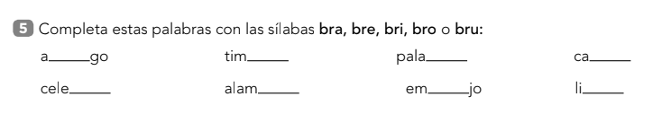

| Campo | Valor |
|--------|--------|
| **Fuente** | Ficha: «5 Completa… con las sílabas bra, bre, bri, bro o bru» |
| **Bloque** | **Ortografía** (sílabas con **br**) |
| **¿Ortografía?** | **Sí** |
| **Reto (modo)** | **`missing`** / **`fill-syllable`** — 1 por turno |
| **Regla Aray** | **`bl-br`** (subfoco **br** + vocal) · hermano del 31 |
| **Enunciado ficha** | Completa con bra, bre, bri, bro o bru |
| **Enunciado Aray** | **«¿Qué sílaba?»** · tip: «Elige bra, bre, bri, bro o bru.» |
| **Nivel 3.º** | Adecuado |

### Banco
| Hueco | Completo | Sílaba |
|-------|----------|--------|
| a___go | abrigo | **bri** |
| tim___ | timbre | **bre** |
| pala___ | palabra | **bra** |
| ca___ | cabra | **bra** |
| cele___ | celebra | **bra** |
| alam___ | alambre | **bre** |
| em___jo | embrujo | **bru** |
| li___ | libro | **bro** |

### Visual / Funcional
Hueco + 5 botones (o 4 MCQ con distractores del set). Como el 06 (pieza sílaba).

### Dónde
**Ortografía** — junto al 31 (br/bl).

### Prioridad sugerida
Media-alta — misma UI de sílabas que 06/31.

---

## Ejercicio 39 — ¿B o v? (más lemas)

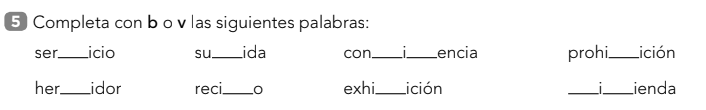

| Campo | Valor |
|--------|--------|
| **Fuente** | Ficha: «5 Completa con b o v las siguientes palabras:» |
| **Bloque** | **Ortografía** (b / v) |
| **¿Ortografía?** | **Sí** |
| **Reto (modo)** | **`missing`** — **mismo que el 08/09/22** |
| **Regla Aray** | **`b-v`** |
| **Enunciado Aray** | **«¿B o v?»** |
| **Encaje** | Más lemas (servicio, subida, convivencia, prohibición, hervidor, recibo, exhibición, vivienda). 2 huecos → 2 ítems. |
| **Nivel 3.º** | Adecuado |

### Visual / Funcional / Dónde
Idénticos al **08**. Fusionar banco.

### Prioridad sugerida
Igual que el 08.

---

## Ejercicio 40 — Antónimos (columna central)

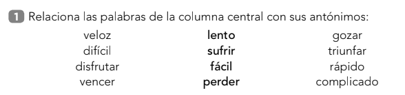

| Campo | Valor |
|--------|--------|
| **Fuente** | Ficha: «1 Relaciona las palabras de la columna central con sus antónimos» |
| **Bloque** | **Vocabulario** (antónimos / contrarios) |
| **¿Ortografía?** | **No** |
| **Reto (modo)** | **`match-pairs`** o MCQ — **mismo que el 15** (+ banco) |
| **Enunciado ficha** | Relaciona las palabras de la columna central con sus antónimos |
| **Enunciado Aray** | **«¿Cuál es el contrario?»** |
| **Decisión de producto** | **1 palabra central por turno** (lento, sufrir…). Cada una tiene **2** contrarios cercanos en la ficha → en Aray basta elegir **1** (o “toca los 2” en v2). Sin 3 columnas a la vez. |
| **Nivel 3.º** | Adecuado |

### Banco (central → contrarios)
| Central | Contrarios (ficha) |
|---------|-------------------|
| lento | veloz, rápido |
| sufrir | disfrutar, gozar |
| fácil | difícil, complicado |
| perder | vencer, triunfar |

### Visual / Funcional
Palabra grande + opciones tocables / emparejar. Ayuda «?» como en 15. Fusionar con banco de contrarios.

### Dónde
Vocabulario — =15 / cerca del 27.

### Prioridad sugerida
Igual que el 15 (banco).

---

## Ejercicio 41 — La que no pega (foca)

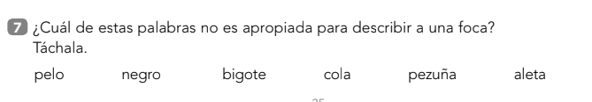

| Campo | Valor |
|--------|--------|
| **Fuente** | Ficha: «7 ¿Cuál… no es apropiada para describir a una foca? Táchala.» |
| **Bloque** | **Vocabulario / comprensión** (intrusa semántica) |
| **¿Ortografía?** | **No** |
| **Reto (modo)** | **`odd-one-out`** — **NUEVO** (parecido a Intrusa de ortografía, pero por **sentido**) |
| **Enunciado ficha** | ¿Cuál de estas palabras no es apropiada para describir a una foca? Táchala. |
| **Enunciado Aray** | **«¿Cuál no pega?»** · tip: «Toca la palabra que no va con la foca.» |
| **Ayuda** | Opcional foto de foca. «La foca no tiene pezuña: tiene aleta.» |
| **Decisión de producto** | **Tocar**, no tachar. 1 ítem = 1 sujeto + N palabras. |
| **Nivel 3.º** | Adecuado |

### Ítem de la ficha
| Sujeto | Palabras | Intrusa |
|--------|----------|---------|
| foca | pelo, negro, bigote, cola, pezuña, aleta | **pezuña** |

### Visual / Funcional
- Prompt + (opcional) imagen.
- Fichas tocables; al acertar → tip corto del porqué.
- Banco: más animales/objetos con 1 intrusa cada uno → ronda de varios ítems.

### Dónde
Vocabulario / Comprensión ligera — no ortografía Intrusa (letras).

### Prioridad sugerida
Media — muy jugable; necesita banco de sets.

---

## Ejercicio 42 — Agudas / llanas / esdrújulas

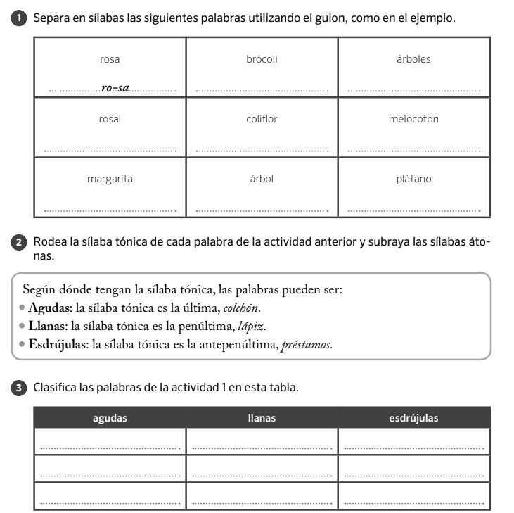

| Campo | Valor |
|--------|--------|
| **Fuente** | Ficha: solo **punto 3** («Clasifica…») + caja de definición; palabras del **punto 1** |
| **Bloque** | **Ortografía / acentuación** (sílaba tónica) |
| **¿Ortografía?** | **Parcial** (clasificar por acento, no escribir tildes aquí) |
| **Reto (modo)** | **`sort-stress`** — **NUEVO** (3 bloques, como 02/14) |
| **Enunciado ficha** | Clasifica las palabras de la actividad 1 en esta tabla |
| **Enunciado Aray** | **«¿Aguda, llana o esdrújula?»** |
| **Ayuda (arriba, siempre o «?»)** | Copia niño de la caja: |
| | **Aguda** — tónica al final (*colchón*) |
| | **Llana** — tónica en la penúltima (*lápiz*) |
| | **Esdrújula** — tónica en la antepenúltima (*préstamos*) |
| **Fuera de alcance (esta ficha)** | Punto 1 (separar sílabas) y punto 2 (rodear tónica) — **no** en v1 |
| **Nivel 3.º** | Adecuado |

### Banco (palabras del punto 1)
| Palabra | Tipo |
|---------|------|
| rosa | **llana** |
| rosal | **aguda** |
| margarita | **llana** |
| brócoli | **esdrújula** |
| coliflor | **aguda** |
| árbol | **llana** |
| árboles | **esdrújula** |
| melocotón | **aguda** |
| plátano | **esdrújula** |

### Visual
- Arriba: chip **Ayuda** o franja fija con las 3 definiciones cortas.
- Centro: **1 palabra grande** por turno.
- Debajo: **3 botones/bloques** — Aguda · Llana · Esdrújula.
- (Alt. tablero: pool de 9 + 3 cajas; menos coherente con la web → preferir 1 a 1.)

### Funcional
1. Tocar el bando correcto.
2. Fallo → tip («La fuerza está en…») sin pedir guiones.
3. Ronda: las 9 (+ más del banco).

### Dónde
Ortografía / Acentos — estación propia o junto a tildes.

### Prioridad sugerida
Alta — claro, solo tocar, ayuda = lo que pediste.

---

## Ejercicio 43 — Sinónimos

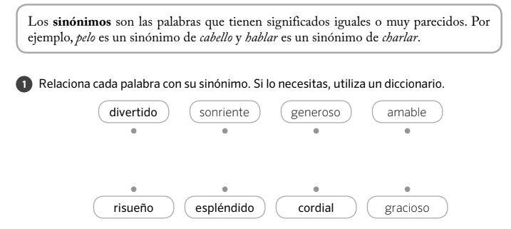

| Campo | Valor |
|--------|--------|
| **Fuente** | Ficha: definición + «1 Relaciona cada palabra con su sinónimo…» |
| **Bloque** | **Vocabulario** (sinónimos) |
| **¿Ortografía?** | **No** |
| **Reto (modo)** | **`match-pairs`** — tag `synonym` (hermano del 15 antónimos) |
| **Enunciado ficha** | Relaciona cada palabra con su sinónimo. *(omitir «usa un diccionario»)* |
| **Enunciado Aray** | **«¿Cuál significa lo mismo?»** |
| **Ayuda** | «Los **sinónimos** significan casi lo mismo: *pelo* ↔ *cabello*.» |
| **Decisión de producto** | Emparejar tocando. **Sin** diccionario ni mención a buscar fuera. |
| **Nivel 3.º** | Adecuado |

### Pares de la ficha
| Palabra | Sinónimo |
|---------|----------|
| divertido | gracioso |
| sonriente | risueño |
| generoso | espléndido |
| amable | cordial |

### Visual / Funcional
Como Empareja / contrarios. Ayuda «?» con la definición. Ronda = tablero de 4 (+ más banco).

### Dónde
Vocabulario — junto a 15 (contrarios) y 27 (igual/al revés).

### Prioridad sugerida
Alta — misma UI que antónimos.

---

## Ejercicio 44 — ¿R o rr? (más lemas)

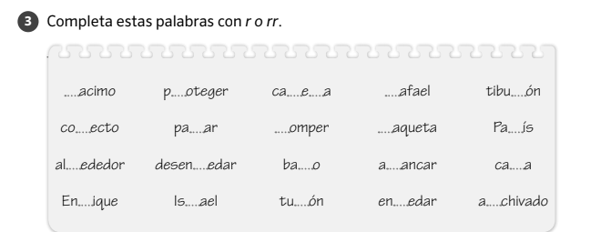

| Campo | Valor |
|--------|--------|
| **Fuente** | Ficha: «3 Completa estas palabras con r o rr.» |
| **Bloque** | **Ortografía** (r / rr) |
| **¿Ortografía?** | **Sí** |
| **Reto (modo)** | **`missing`** — **mismo que el 17/34** |
| **Regla Aray** | **`r-rr`** |
| **Enunciado Aray** | **«¿R o rr?»** |
| **Encaje** | Banco grande (racimo, proteger, carrera, Rafael, tiburón, correcto, barro, turrón…). 1 hueco por turno; *carrera* = 2 ítems. |
| **Nivel 3.º** | Adecuado |

### Visual / Funcional / Dónde
Idénticos al **17**. Fusionar banco.

### Prioridad sugerida
Igual que el 17.

---

## Ejercicio 45 — Antónimos (más pares)

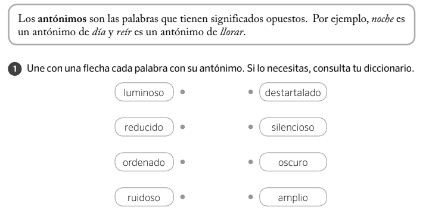

| Campo | Valor |
|--------|--------|
| **Fuente** | Ficha: definición antónimos + «1 Une… con su antónimo» |
| **Bloque** | **Vocabulario** (antónimos) |
| **¿Ortografía?** | **No** |
| **Reto (modo)** | **`match-pairs`** — **mismo que el 15/40** |
| **Enunciado Aray** | **«¿Cuál es el contrario?»** |
| **Ayuda** | «Los **antónimos** significan lo opuesto: *noche* ↔ *día*.» |
| **Decisión de producto** | Emparejar tocando. **Sin** diccionario. |
| **Nivel 3.º** | Adecuado · *destartalado* un poco culto → tip o syn más fácil en banco ampliado |

### Pares
| Palabra | Antónimo |
|---------|----------|
| luminoso | oscuro |
| reducido | amplio |
| ordenado | destartalado |
| ruidoso | silencioso |

### Visual / Funcional / Dónde
Idénticos al **15**. Fusionar banco. Ayuda «?» como en 43.

### Prioridad sugerida
Igual que el 15.

---

## Ejercicio 46 — Adjetivos al sustantivo

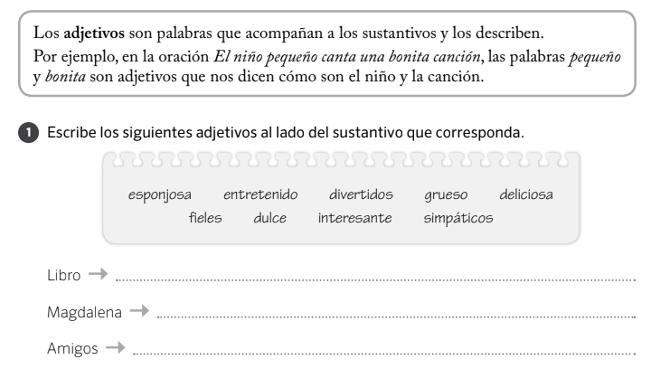

| Campo | Valor |
|--------|--------|
| **Fuente** | Ficha: definición adjetivos + «1 Escribe los siguientes adjetivos al lado del sustantivo…» |
| **Bloque** | **Gramática** (adjetivo–sustantivo: género/número + sentido) |
| **¿Ortografía?** | **No** |
| **Reto (modo)** | **`match-adj-noun`** — **mismo que el 18** (ampliar banco) |
| **Enunciado ficha** | Escribe los adjetivos al lado del sustantivo |
| **Enunciado Aray** | **«¿Qué le pega?»** · tip: «Toca los adjetivos que van con el nombre.» |
| **Ayuda** | «Los **adjetivos** dicen cómo es algo: *niño pequeño*, *bonita canción*.» |
| **Decisión de producto** | **Sin escribir.** Sustantivo (o foto) + nube de adjetivos; tocar los que encajan (varios por nombre). |
| **Nivel 3.º** | Adecuado |

### Banco de la ficha
Adjetivos: esponjosa · entretenido · divertidos · grueso · deliciosa · fieles · dulce · interesante · simpáticos

| Sustantivo | Adjetivos que encajan (aprox.) |
|------------|--------------------------------|
| Libro | entretenido, grueso, interesante |
| Magdalena | esponjosa, deliciosa, dulce |
| Amigos | divertidos, fieles, simpáticos |

### Visual / Funcional
Como el **18**: 1 sustantivo por turno + fichas; validar género/número y sentido. Ayuda «?».

### Dónde
Gramática — fusionar con 18/25.

### Prioridad sugerida
Igual que el 18.

---

## Ejercicio 47 — ¿G, gu o gü? (animales)

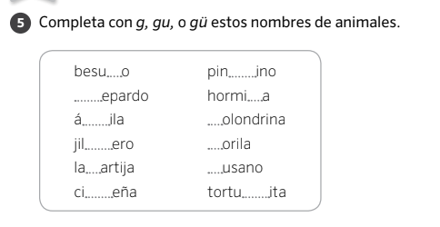

| Campo | Valor |
|--------|--------|
| **Fuente** | Ficha: «5 Completa con g, gu, o gü estos nombres de animales.» |
| **Bloque** | **Ortografía** (g / gu / gü) |
| **¿Ortografía?** | **Sí** |
| **Reto (modo)** | **`missing`** — regla **`gu-gue`** · 1 animal por turno |
| **Enunciado Aray** | **«¿G, gu o gü?»** · tip: «Si suena la u, lleva puntitos.» |
| **Ayuda** | Igual que el 37. Opcional: foto del animal. |
| **Nivel 3.º** | Adecuado · hermano 06/28/37 |

### Banco
| Completo | Pieza |
|----------|-------|
| besugo, lagartija, hormiga, golondrina, gorila, gusano | **g** |
| guepardo, águila, jilguero, tortuguita | **gu** |
| cigüeña, pingüino | **gü** |

### Visual / Funcional
Hueco + 3 botones **g · gu · gü**. Sin teclado.

### Dónde
**Ortografía** — fusionar banco `gu-gue`.

### Prioridad sugerida
Alta y barata.

---

## Ejercicio 48 — ¿G, gu o gü? (más lemas)

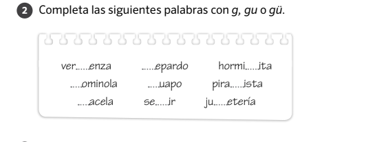

| Campo | Valor |
|--------|--------|
| **Fuente** | Ficha: «2 Completa… con g, gu o gü.» |
| **Bloque** | **Ortografía** (g / gu / gü) |
| **¿Ortografía?** | **Sí** |
| **Reto (modo)** | **`missing`** — **mismo que el 37/47** |
| **Regla Aray** | **`gu-gue`** |
| **Enunciado Aray** | **«¿G, gu o gü?»** |
| **Encaje** | Más lemas: vergüenza, gominola, gacela, guepardo, guapo, seguir, hormiguita, piragüista, juguetería. |
| **Nivel 3.º** | Adecuado |

### Visual / Funcional / Dónde
Idénticos al **47**. Fusionar banco.

### Prioridad sugerida
Igual que el 37.

---

## Ejercicio 49 — ¿G o j? (más lemas)

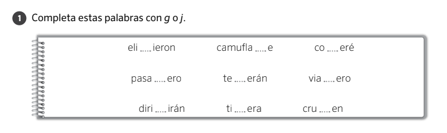

| Campo | Valor |
|--------|--------|
| **Fuente** | Ficha: «1 Completa estas palabras con g o j.» |
| **Bloque** | **Ortografía** (g / j) |
| **¿Ortografía?** | **Sí** |
| **Reto (modo)** | **`missing`** — **mismo que el 36** |
| **Regla Aray** | **`g-j`** |
| **Enunciado Aray** | **«¿G o j?»** |
| **Encaje** | Más lemas: eligieron, camuflaje, cogeré, pasajero, tejerán, viajero, dirigirán, tijera, crujen. |
| **Nivel 3.º** | Adecuado (algunas formas verbales futuras) |

### Visual / Funcional / Dónde
Idénticos al **36**. Fusionar banco `g-j`.

### Prioridad sugerida
Igual que el 36.

---

## Ejercicio 50 — Sufijo: ¿objeto o profesión?

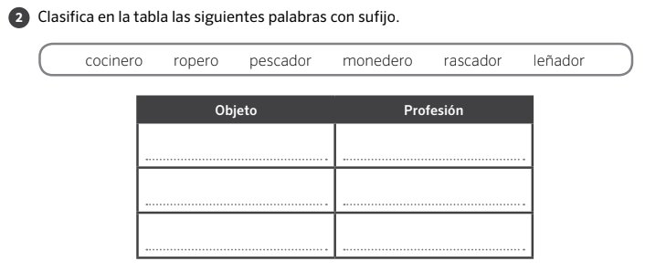

| Campo | Valor |
|--------|--------|
| **Fuente** | Ficha: «2 Clasifica en la tabla las siguientes palabras con sufijo.» |
| **Bloque** | **Vocabulario / morfología** (sufijos ·ero / ·ador…) |
| **¿Ortografía?** | **No** |
| **Reto (modo)** | **`sort-suffix`** — **NUEVO** (2 bloques, como 02) |
| **Enunciado ficha** | Clasifica… en Objeto / Profesión |
| **Enunciado Aray** | **«¿Objeto o profesión?»** · tip: «Toca el bando que toca.» |
| **Ayuda** | «Algunas palabras con *-ero* / *-ador* son **cosas** (*monedero*) y otras son **trabajos** (*cocinero*).» |
| **Decisión de producto** | 1 palabra por turno + 2 botones **Objeto** · **Profesión**. Sin tabla de rayas. |
| **Nivel 3.º** | Adecuado |

### Banco
| Palabra | Tipo |
|---------|------|
| ropero, monedero, rascador | **objeto** |
| cocinero, pescador, leñador | **profesión** |

### Visual / Funcional
Como «¿Una o muchas?». Fallo → tip corto. Ronda: las 6 (+ más).

### Dónde
Vocabulario / Palabras — morfología.

### Prioridad sugerida
Media-alta — patrón de 2 bloques ya previsto.

---

## Ejercicio 51 — ¿M o n? (más lemas + ayuda)

| Campo | Valor |
|--------|--------|
| **Fuente** | Ficha: regla «Se escribe m antes de b y de p…» + «1 Completa… con m o n» |
| **Bloque** | **Ortografía** (m / n ante b·p·v…) |
| **¿Ortografía?** | **Sí** |
| **Reto (modo)** | **`missing`** — **mismo que el 10** |
| **Regla Aray** | **`mb-mp-nv`** |
| **Enunciado Aray** | **«¿M o n?»** |
| **Ayuda** | «Se escribe **m** antes de **b** y **p** (*embudo*, *columpio*). Antes de **v** → **n**.» |
| **Encaje** | Más lemas: gamba, envío, tambor, entrada, vampiro, tiempo, envase, trompa, ensaimada, campo. |
| **Nivel 3.º** | Adecuado |

### Visual / Funcional / Dónde
Idénticos al **10**. Fusionar banco + ayuda «?».

### Prioridad sugerida
Igual que el 10.

---

## Ejercicio 52 — Monta la frase (más)

| Campo | Valor |
|--------|--------|
| **Fuente** | Ficha: «3. Ordena las palabras y forma oraciones.» |
| **Bloque** | **Gramática / sintaxis** |
| **¿Ortografía?** | **No** |
| **Reto (modo)** | **`order-sentence`** — **mismo que el 01** |
| **Enunciado Aray** | **«Monta la frase»** |
| **Encaje** | Más frases para el banco. Sin rayas de cuaderno: tocar fichas en orden. |
| **Nivel 3.º** | Adecuado |

### Frases de la ficha
1. El tren llegó puntual a la estación.
2. El perro de María no muerde.

### Visual / Funcional / Dónde
Idénticos al **01**. Fusionar banco.

### Prioridad sugerida
Igual que el 01.

---

## Ejercicio 53 — Ordena las sílabas

| Campo | Valor |
|--------|--------|
| **Fuente** | Ficha: «1. Ordena las sílabas y descubre las palabras ocultas.» |
| **Bloque** | **Ortografía / conciencia silábica** |
| **¿Ortografía?** | **Parcial** (montar la palabra, no regla de letra) |
| **Reto (modo)** | **`order-syllables`** — **NUEVO** (como Monta la frase, pero con sílabas) |
| **Enunciado ficha** | Ordena las sílabas y descubre las palabras ocultas |
| **Enunciado Aray** | **«Monta la palabra»** · tip: «Toca las sílabas en orden.» |
| **Decisión de producto** | **1 palabra por turno** (4 cajas = 4 ítems). Sin rayas de escribir. |
| **Nivel 3.º** | Adecuado (refuerzo; palabras cortas) |

### Banco de la ficha
| Sílabas | Palabra |
|---------|---------|
| ño · a | **año** |
| ma · se · na | **semana** |
| ce · na · quin | **quincena** |
| glo · si | **siglo** |

### Visual / Funcional
Pool de sílabas barajadas → fila de respuesta al tocar. Validar secuencia. Feedback «¡Era: semana!».

### Dónde
Ortografía / sílabas — cerca de fill-syllable (06/38).

### Prioridad sugerida
Media-alta — UI casi igual a `order-sentence`.

---

## Ejercicio 54 — Elige el sinónimo

| Campo | Valor |
|--------|--------|
| **Fuente** | Ficha: «1 Rodea la palabra sinónima de la destacada…» |
| **Bloque** | **Vocabulario** (sinónimos) |
| **¿Ortografía?** | **No** |
| **Reto (modo)** | **`pick-synonym`** — o MCQ sobre banco del **43** |
| **Enunciado ficha** | Rodea la palabra sinónima de la destacada |
| **Enunciado Aray** | **«¿Cuál significa lo mismo?»** |
| **Ayuda** | Como el 43 (qué es sinónimo). |
| **Decisión de producto** | **1 palabra destacada por turno** + 4 botones. Sin rodear a mano. 3 filas = 3 ítems. |
| **Nivel 3.º** | Adecuado |

### Ítems
| Destacada | Opciones | Correcta |
|-----------|----------|----------|
| generoso | codicioso, espontáneo, desprendido, valiente | **desprendido** |
| avaro | malvado, tacaño, presumido, mentiroso | **tacaño** |
| extraño | raro, llamativo, actual, divertido | **raro** |

### Visual / Funcional
Palabra grande + 4 fichas. Acierto / tip al fallar. Hermano del 43 (allí emparejar; aquí MCQ).

### Dónde
Vocabulario — junto a 43/27.

### Prioridad sugerida
Alta y barata si ya hay Empareja sinónimos.

---

## Ejercicio 55 — Misma frase, otras palabras

| Campo | Valor |
|--------|--------|
| **Fuente** | Ficha: «2. Subraya la oración que tenga el mismo significado…» |
| **Bloque** | **Vocabulario / comprensión** (sinónimos en contexto) |
| **¿Ortografía?** | **No** |
| **Reto (modo)** | **`pick-same-meaning`** — **NUEVO** (MCQ de oraciones; hermano del 54) |
| **Enunciado ficha** | Subraya la oración que tenga el mismo significado que la del recuadro |
| **Enunciado Aray** | **«¿Cuál dice lo mismo?»** |
| **Ayuda** | «Busca la frase que significa casi igual, con otras palabras.» |
| **Decisión de producto** | **1 recuadro por turno** + 3 botones-frase. Sin subrayar. 4 cajas = 4 ítems. |
| **Nivel 3.º** | Adecuado |

### Ítems
| Recuadro | Correcta |
|----------|----------|
| Mis primos son escandalosos. | Mis primos son **ruidosos**. |
| Paula es muy inteligente. | Paula es muy **lista**. |
| Guillermo está enfermo. | Guillermo está **malo**. |
| La ventana está sucia. | La ventana está **manchada**. |

### Visual / Funcional
Frase destacada arriba; 3 opciones tocables abajo. Tip al fallar (antónimo o distracción: *sano*, *limpia*…).

### Dónde
Vocabulario — junto a 54/43.

### Prioridad sugerida
Media-alta — misma mecánica MCQ que 54, texto más largo.

---

## Ejercicio 56 — ¿C o qu?

| Campo | Valor |
|--------|--------|
| **Fuente** | Ficha: «2 Completa con c o con qu.» |
| **Bloque** | **Ortografía** (c / qu) |
| **¿Ortografía?** | **Sí** |
| **Reto (modo)** | **`missing`** — regla **`c-z-qu`** (par c/qu) |
| **Enunciado Aray** | **«¿C o qu?»** · tip: «Antes de e/i el sonido /k/ va con **qu**.» |
| **Encaje** | Como columna c/qu del **29**. 8 lemas. |
| **Nivel 3.º** | Adecuado |

### Banco
| Completo | Pieza |
|----------|-------|
| mantequilla, parque, orquesta, croquetas, horquilla, estanque | **qu** |
| camión, barco | **c** |

### Visual / Funcional / Dónde
Hueco + botones **c** · **qu**. Ortografía. Fusionar con 21/29.

### Prioridad sugerida
Alta y barata.

---

## Ejercicio 57 — Monta la frase (más)

| Campo | Valor |
|--------|--------|
| **Fuente** | Ficha: «2 Ordena las palabras para formar oraciones.» |
| **Bloque** | **Gramática / sintaxis** |
| **¿Ortografía?** | **No** |
| **Reto (modo)** | **`order-sentence`** — **mismo que el 01/52** |
| **Enunciado Aray** | **«Monta la frase»** |
| **Encaje** | Más frases. Mayúscula y punto como pista. |
| **Nivel 3.º** | Adecuado |

### Frases
1. El huerto de Amalia está bien cuidado.
2. Mañana jugaré el campeonato de ajedrez.

### Visual / Funcional / Dónde
Idénticos al **01**. Fusionar banco.

### Prioridad sugerida
Igual que el 01.

---

## Ejercicio 58 — Completa con el recuadro

| Campo | Valor |
|--------|--------|
| **Fuente** | Ficha: «1 Completa las oraciones con las palabras del recuadro.» |
| **Bloque** | **Ortografía / vocabulario** (gu·gü en contexto + sentido) |
| **¿Ortografía?** | **Parcial** (elige la palabra bien escrita y que encaja) |
| **Reto (modo)** | **`fill-bank`** — **NUEVO** (banco de fichas → huecos) |
| **Enunciado ficha** | Completa las oraciones con las palabras del recuadro |
| **Enunciado Aray** | **«¿Qué palabra va aquí?»** · tip: «Arrastra o toca la ficha del recuadro.» |
| **Decisión de producto** | **Sin teclado ni escribir.** Fichas del recuadro → hueco. Preferencia: **arrastrar**; en móvil también **tocar ficha → tocar hueco** (mismo resultado, más cómodo). |
| **Nivel 3.º** | Adecuado · refuerza `gu-gue` (pingüinos, piragüismo, higuera…) |

### Banco / frases
| Frase (hueco) | Palabra |
|---------------|---------|
| Mi abuelo tiene una ___ que da higos. | **higuera** |
| Los ___ son grandes buceadores. | **pingüinos** |
| Miguel se pone los ___ en invierno. | **guantes** |
| Margarita come ___ todas las semanas. | **espaguetis** |
| Álvaro practica ___ los domingos. | **piragüismo** |

### Visual
- **Opción A (tablero):** 5 frases + nube de 5 fichas; arrastrar cada una al hueco.
- **Opción B (web, 1 a 1):** una frase grande + las fichas que quedan; arrastrar/tocar. Más coherente con la app.

### Funcional
1. Validar palabra exacta en cada hueco.
2. Al acertar, la ficha se gasta.
3. Fallo → tip corto (sentido o diéresis).
4. Ronda = vaciar el recuadro.

### Dónde
Ortografía / Completa — cerca de `complete` y `gu-gue`.

### Prioridad sugerida
Media-alta — muy jugable; UI de drag/tap.

---

## Ejercicio 59 — ¿R o rr? (más lemas · con dedupe)

| Campo | Valor |
|--------|--------|
| **Fuente** | Ficha: «1 Completa con r o rr.» |
| **Bloque** | **Ortografía** (r / rr) |
| **¿Ortografía?** | **Sí** |
| **Reto (modo)** | **`missing`** — **mismo que el 17/34/44** |
| **Regla Aray** | **`r-rr`** |
| **Enunciado ficha** | Completa con r o rr. |
| **Enunciado Aray** | **«¿R o rr?»** |
| **Decisión de producto** | Solo tocar / arrastrar **r** · **rr** al hueco. **Sin escribir.** Al fusionar banco: **no duplicar lemas** ya en 17/34/44 ni en `lemmas.generated` (`r-rr`). |
| **Nivel 3.º** | Adecuado |

### Chequeo de repeticiones (vs 17 + 34 + 44 + banco app)

| Hueco | Completo | ¿Ya lo tenemos? |
|-------|----------|-----------------|
| ___ueda | **r**ueda | **Nueva** |
| en___oscar | en**r**oscar | **Ya en app** (`r-rr`) → no añadir otra vez |
| ___odilla | **r**odilla | **Nueva para `r-rr`** (en app está bajo `ll-illa`, otro hueco) |
| co___edor | co**rr**edor | **Nueva** |
| ___eno | **r**eno | **Nueva** (no confundir con *remo* del 17) |
| hon___ado | hon**r**ado | **Ya en app** (`r-rr`) → no añadir otra vez |
| ba___endero | ba**rr**endero | **Nueva** |
| tie___a | tie**rr**a | **Ya en app** (`r-rr`) → no añadir otra vez |
| ___uiseñor | **r**uiseñor | **Nueva** |
| son___isa | son**r**isa | **Ya en ficha 17 + app** → omitir |
| al___ededor | al**r**ededor | **Ya en ficha 17 + app** → omitir |
| ___ugir | **r**ugir | **Nueva** |

**Al implementar:** fusionar solo las **nuevas** → `rueda` · `rodilla` (regla `r-rr`) · `corredor` · `reno` · `barrendero` · `ruiseñor` · `rugir`.  
Omitir: `enroscar` · `honrado` · `tierra` · `sonrisa` · `alrededor`.

### Visual / Funcional / Dónde
Idénticos al **17**. 1 ítem por turno. Mix/review bajo `r-rr`.

### Prioridad sugerida
Igual que el 17 (barata; solo ampliar lemas nuevos).

---

## Ejercicio 60 — Nombre + adjetivo (recuadro)

| Campo | Valor |
|--------|--------|
| **Fuente** | Ficha: «3 Completa los grupos de palabras con estos sustantivos:» |
| **Bloque** | **Gramática** (concordancia nombre–adjetivo + sentido) |
| **¿Ortografía?** | **No** |
| **Reto (modo)** | **`match-pairs`** / **`fill-bank`** — hermana del **25** (y del 18/46) |
| **Enunciado ficha** | Completa los grupos de palabras con estos sustantivos: melón · pueblo · flor · señora |
| **Enunciado Aray** | **«¿Qué le pega?»** · tip: «Mira el *el/la* y lo que dice el adjetivo.» |
| **Ayuda** | «El nombre y el adjetivo van a juego: *la flor mustia*, *el melón maduro*.» |
| **Decisión de producto** | **Sin escribir.** Recuadro de sustantivos → hueco (arrastrar o tocar). Artículo ya puesto = pista de género. 1 grupo por turno (coherente web). |
| **Nivel 3.º** | Adecuado |

### Pares de la ficha
| Grupo | Sustantivo | Notas |
|-------|------------|--------|
| La ___ mustia. | **flor** | *flor* ya en **18** (otros adj.); par *flor–mustia* **nuevo** |
| El ___ tranquilo. | **pueblo** | **Nuevo** |
| La ___ delgada. | **señora** | **Nuevo** |
| El ___ maduro. | **melón** | **Nuevo** |

**Dedupe:** ningún par exacto en 18/25/46. Solo reaparece el lema *flor* (ok: distinto adjetivo).

### Visual
- Prompt: **¿Qué le pega?**
- Frase grande: `La ___ mustia.` + 3–4 fichas de sustantivos (las que quedan).
- Arrastrar/tocar ficha → hueco.

### Funcional
1. Validar sustantivo + género (el/la) + sentido del adjetivo.
2. Fallo → tip corto (*mustia* = marchita → flor; *maduro* → fruta…).
3. Ronda = 4 ítems (o más del banco ampliado).

### Dónde
Gramática — fusionar banco con **25** / **18**.

### Prioridad sugerida
Alta si ya hay Empareja / fill-bank; banco barato.

---

## Ejercicio 61 — Clasifica por género

| Campo | Valor |
|--------|--------|
| **Fuente** | Ficha: «4 Clasifica estos sustantivos según su género:» + recuerdo el/la |
| **Bloque** | **Gramática** (género del sustantivo: masculino / femenino) |
| **¿Ortografía?** | **No** |
| **Reto (modo)** | **`sort-m-f`** — **NUEVO** (hermano del 02 `sort-number`; distinto del **14**) |
| **Enunciado ficha** | Clasifica estos sustantivos según su género… Los masculinos pueden llevar *el* y los femeninos *la*. |
| **Enunciado Aray** | **«¿El o la?»** · tip: «Si va con *el*, es masculino; si va con *la*, femenino.» |
| **Ayuda** | «Los nombres tienen género: *el trueno* (masculino), *la luna* (femenino).» |
| **Decisión de producto** | **Sin escribir ni columnas de cuaderno.** 1 nombre por turno → tocar bloque **El** / **La** (o arrastrar). No pedir la lista completa de golpe. |
| **Vs el 14** | El **14** pide la **pareja** (lobo↔loba). Aquí solo **clasificar** el nombre dado. No fusionar bancos. |
| **Vs el 11** | El **11** elige artículo (el/la/los/las). Aquí bastan **2 bloques** el·la; mismo tip conceptual. |
| **Nivel 3.º** | Adecuado |

### Banco de la ficha
| Masculinos (el) | Femeninos (la) |
|-----------------|----------------|
| trueno | luna |
| calcetín | cena |
| colibrí | noche |
| otoño | nariz |

**Dedupe:** ninguno de estos 8 aparece en el banco de pares del **14**. *noche* sí sale en antónimos (45) como lema de vocabulario — ok, otro modo.

### Visual
- Prompt: **¿El o la?**
- Nombre grande (`trueno` / `nariz`…).
- Dos bloques: **El** · **La**.
- Opcional: al acertar, mostrar `el trueno` / `la nariz`.

### Funcional
1. Banco `{ word, gender: 'm'|'f' }`.
2. Tocar / soltar en el bloque → validar.
3. Fallo → tip (*nariz* → *la nariz*).
4. Ronda ~8–10.

### Dónde
Gramática — junto al 02 (bloques) y al 11/14 (género).

### Prioridad sugerida
Alta — UI casi copy del 02; banco barato.

---

## Ejercicio 62 — ¿Una o muchas? (más lemas)

| Campo | Valor |
|--------|--------|
| **Fuente** | Ficha: «1 Rodea los sustantivos que están en singular y subraya los que están en plural.» |
| **Bloque** | **Gramática / morfología** (número: singular / plural) |
| **¿Ortografía?** | **No** |
| **Reto (modo)** | **`sort-number`** — **mismo que el 02** |
| **Enunciado ficha** | Rodea… singular y subraya… plural |
| **Enunciado Aray** | **«¿Una o muchas?»** · tip: «Toca el bando: una o muchas.» |
| **Decisión de producto** | **Sin rodear ni subrayar.** 1 palabra por turno → **Una** / **Muchas** (o arrastrar a 2 bloques). La ficha alimenta el **banco**, no el gesto de lápiz. |
| **Nivel 3.º** | Adecuado |

### Banco de la ficha
| Una (singular) | Muchas (plural) |
|----------------|-----------------|
| semana | caramelos |
| ancla | dados |
| trébol | rocas |
| nube | focas |
| buzo | manzanas |
| puente | zanahorias |
| lanza | estantes |
| genio | hormigas |

**Dedupe:** ninguno coincide con el banco del **02** (rosa, lilas, margaritas, geranio, amapola, claveles). **+16 lemas** nuevos → fusionar.

### Visual / Funcional / Dónde
Idénticos al **02**.

### Prioridad sugerida
Igual que el 02.

---

## Ejercicio 63 — ¿-d o -z? (más lemas)

| Campo | Valor |
|--------|--------|
| **Fuente** | Ficha: «3 Completa con -z o -d.» |
| **Bloque** | **Ortografía** (final en **d** / **z**) |
| **¿Ortografía?** | **Sí** |
| **Reto (modo)** | **`missing`** — **mismo que el 19** |
| **Regla Aray** | **`d-z`** |
| **Enunciado ficha** | Completa con -z o -d. |
| **Enunciado Aray** | **«¿-d o -z?»** |
| **Decisión de producto** | Solo tocar **-d** · **-z**. 1 palabra por turno. Al fusionar: **omitir duplicados**. |
| **Nivel 3.º** | Adecuado |

### Chequeo de repeticiones (vs 19 + 29)

| Hueco | Completo | ¿Ya lo tenemos? |
|-------|----------|-----------------|
| perdi___ | perdi**z** | **Nueva** |
| pare___ | pare**d** | **Ya en ficha 29** (familia d/z) → no añadir otra vez |
| amista___ | amista**d** | **Ya en ficha 19** → omitir |
| aprendi___ | aprendi**z** | **Nueva** |

**Al implementar:** fusionar solo **`perdiz`** · **`aprendiz`**. Omitir `pared` · `amistad`.

### Visual / Funcional / Dónde
Idénticos al **19**. Mix/review bajo `d-z`.

### Prioridad sugerida
Igual que el 19.

---

## Ejercicio 64 — Campo semántico

| Campo | Valor |
|--------|--------|
| **Fuente** | Ficha: «1 Clasifica estas palabras según el campo semántico…» |
| **Bloque** | **Vocabulario** (campos semánticos / familias de palabras) |
| **¿Ortografía?** | **No** |
| **Reto (modo)** | **`sort-semantic`** — **NUEVO** (hermano del 02, pero **3 bandos**) |
| **Enunciado ficha** | Clasifica estas palabras según el campo semántico al que pertenecen |
| **Enunciado Aray** | **«¿A qué familia va?»** · tip: «Toca el bando: profesiones, tiendas o ropa.» |
| **Ayuda** | «Las palabras de la misma **familia de sentido** van juntas: *pintor* es un trabajo; *gorro* se pone.» |
| **Decisión de producto** | **Sin rayas ni escribir.** 1 palabra por turno → 3 botones/bloques. No tablero de 12 a la vez. |
| **Vs el 50** | El **50** clasifica por **sufijo** (objeto vs profesión). Aquí por **significado** (3 campos). Bancos distintos. |
| **Nivel 3.º** | Adecuado |

### Banco de la ficha
| Profesiones | Tiendas | Ropa |
|-------------|---------|------|
| pintor | joyería | gorro |
| periodista | papelería | chubasquero |
| fotógrafa | frutería | vestido |
| profesor | mercería | abrigo |

**Dedupe:** ninguno de estos 12 está en el banco del **50**. Campos nuevos.

### Visual
- Prompt: **¿A qué familia va?**
- Palabra grande (`chubasquero`).
- Tres bloques: **Profesiones** · **Tiendas** · **Ropa**.

### Funcional
1. Banco `{ word, field: 'job'|'shop'|'clothes' }` (+ más sets: animales, comida…).
2. Tocar bando → validar.
3. Fallo → tip corto (*frutería* = tienda de frutas).
4. Ronda ~8–12.

### Dónde
Vocabulario / Palabras — cerca del 03 (colectivos) y del 50.

### Prioridad sugerida
Media-alta — UI = 02 con un bando más; banco jugable.

---

## Ejercicio 65 — Intrusa (campo semántico)

| Campo | Valor |
|--------|--------|
| **Fuente** | Ficha: «2 Tacha la palabra intrusa de cada campo semántico.» |
| **Bloque** | **Vocabulario / comprensión** (intrusa semántica) |
| **¿Ortografía?** | **No** |
| **Reto (modo)** | **`odd-one-out`** — **mismo que el 41** |
| **Enunciado ficha** | Tacha la palabra intrusa de cada campo semántico |
| **Enunciado Aray** | **«¿Cuál no pega?»** · tip: «Toca la que no es del grupo.» |
| **Ayuda** | «En cada familia hay una que **no encaja**: *rama* no es un árbol; es una parte.» |
| **Decisión de producto** | **Tocar**, no tachar. **1 campo por turno** (no 3 columnas a la vez). Al acertar → tip del porqué. |
| **Vs el 64** | El **64** mete la palabra en su familia. Aquí la familia ya está y buscas la **intrusa**. Mismo tema semántico, modos distintos. |
| **Nivel 3.º** | Adecuado |

### Sets de la ficha
| Campo | Palabras | Intrusa | Porqué (tip) |
|-------|----------|---------|--------------|
| Árboles | pino, rama, roble | **rama** | Es una parte, no un árbol |
| Vehículos | tractor, rueda, bicicleta | **rueda** | Es una pieza, no un vehículo |
| Materiales | lana, metal, agua | **agua** | No es un material como la lana o el metal |

**Dedupe:** distinto del set *foca* del **41**. *rueda* también candidata en **59** (`r-rr`) — otro modo, ok. Ningún set repetido.

### Visual / Funcional / Dónde
Idénticos al **41**. Fusionar banco de sets. Relación temática con el **64**.

### Prioridad sugerida
Igual que el 41.

---

## Ejercicio 66 — ¿Ha o a?

| Campo | Valor |
|--------|--------|
| **Fuente** | Ficha: caja RECUERDA (ha = haber · a = preposición) + «1 Completa» en 2 columnas |
| **Bloque** | **Ortografía** (ha / a) |
| **¿Ortografía?** | **Sí** |
| **Reto (modo)** | **`complete`** (frase con hueco) — botones **ha** · **a** |
| **Regla Aray** | Ampliar **`h`** / **`haber-hablar`** (ya existe lema `ha` vs error `a` en `h.json`) · opcional tag `ha-a` |
| **Enunciado ficha** | Completa (columnas «Con ha» / «Con a») |
| **Enunciado Aray** | **«¿Ha o a?»** · tip: «Si es del verbo *haber*, lleva **h**. Si es la preposición, sin **h**.» |
| **Ayuda** | De la caja RECUERDA: «**ha** = forma de *haber* (*ha venido*). **a** = preposición (*a la escuela*).» Ejemplo: *Un fotógrafo **ha** venido **a** la escuela.* |
| **Decisión de producto** | **Sin columnas «Con ha / Con a»** (dan la respuesta). 1 frase + 1 hueco por turno. Solo tocar **ha** · **a**. Sin teclado. |
| **Nivel 3.º** | Muy alineado |

### Banco de frases (1 hueco = 1 ítem)
| Frase | Respuesta |
|-------|-----------|
| María ___ estudiado. | **ha** |
| Ana ___ comido. | **ha** |
| Pablo ___ jugado. | **ha** |
| Andrés ___ leído. | **ha** |
| He visto ___ Cristina. | **a** |
| Voy ___ casa de Pedro. | **a** |
| ___ mí me gusta cantar. | **a** |
| ¿Vamos ___ llamar a Juan? | **a** |
| ¿Vamos a llamar ___ Juan? | **a** |

*(La última frase de la ficha tiene 2 huecos → 2 ítems.)*

**Dedupe:** estas frases **no** están en `frases-completar.json`. El lema suelto `ha` ya está en editorial H — las **frases** sí son aportación nueva al modo Completa.

### Visual
- Prompt: **¿Ha o a?**
- Frase grande con hueco.
- Dos botones: **ha** · **a**.
- «?» con la regla + ejemplo.

### Funcional
1. Pack de frases bajo Completa / `h`.
2. Tocar opción → validar.
3. Fallo → tip (*ha jugado* = haber; *voy a casa* = preposición).
4. Mix/review posible.

### Dónde
**Ortografía** — Completa la frase · regla H / haber.

### Prioridad sugerida
Alta — modo Completa ya existe; solo banco + copy.

---

## Ejercicio 67 — Formas de *haber*

| Campo | Valor |
|--------|--------|
| **Fuente** | Ficha: «2 Completa las siguientes oraciones con las formas del verbo que correspondan:» + recuadro he/has/ha/hemos/habéis/han |
| **Bloque** | **Gramática** (conjugación de *haber* · perfecto) |
| **¿Ortografía?** | **Parcial** (todas llevan **h**, pero el reto es la **persona**, no ha vs a) |
| **Reto (modo)** | **`fill-bank`** / **`pick-haber`** — hermana del **58** (recuadro → hueco) |
| **Enunciado ficha** | Completa… con las formas del verbo que correspondan |
| **Enunciado Aray** | **«¿Qué forma de *haber*?»** · tip: «Mira quién hace la acción: yo → *he*, tú → *has*…» |
| **Ayuda** | «*Haber* ayuda a decir lo hecho: *yo **he** jugado*, *ellos **han** venido*. Siempre con **h**.» |
| **Decisión de producto** | **Sin escribir.** Recuadro de 6 fichas → hueco (arrastrar/tocar). **1 frase por turno.** Opcional: al acertar, gastar la ficha (como el 58). |
| **Vs el 66** | El **66** elige **ha** vs **a**. Aquí eliges **he/has/ha/hemos/habéis/han** según el sujeto. No fusionar como el mismo banco. |
| **Vs el 33** | El **33** empareja pronombre↔verbo varios. Aquí solo paradigma de *haber* en frases. |
| **Nivel 3.º** | Adecuado |

### Banco de la ficha
| Frase | Forma |
|-------|-------|
| Mónica ___ montado en barco. | **ha** |
| Nosotros ___ jugado a la petanca en la playa. | **hemos** |
| Yo ___ visitado a mis abuelos esta semana. | **he** |
| Vosotros ___ comido huevos fritos con patatas. | **habéis** |
| Alfonso y Marta ___ venido a jugar a mi casa. | **han** |
| Tú ___ tocado muy bien en el concierto. | **has** |

**Dedupe:** frases nuevas (no en Completa ni en el 66). *ha* reaparece como forma, pero el **ítem** es distinto (elección entre 6, no ha/a).

### Visual
- Prompt: **¿Qué forma de haber?**
- Frase grande + 6 fichas (o las que queden): **he · has · ha · hemos · habéis · han**.
- Ilustración del barco = solo mood (opcional).

### Funcional
1. Validar forma exacta según sujeto.
2. Fallo → tip (*nosotros* → *hemos*).
3. Ronda = las 6 (o barajar más frases del mismo paradigma).

### Dónde
Gramática / Frases — cerca del 33 y del 66 (haber).

### Prioridad sugerida
Media-alta — muy jugable si ya hay fill-bank.

---

## Ejercicio 68 — ¿Ha o a? (más frases)

| Campo | Valor |
|--------|--------|
| **Fuente** | Ficha: «3 Completa cada oración con *ha* o *a*.» |
| **Bloque** | **Ortografía** (ha / a) |
| **¿Ortografía?** | **Sí** |
| **Reto (modo)** | **`complete`** — **mismo que el 66** |
| **Regla Aray** | **`h`** / **`haber-hablar`** (tag `ha-a`) |
| **Enunciado Aray** | **«¿Ha o a?»** |
| **Ayuda** | Igual que el 66. Tip extra útil aquí: «*va **a** + infinitivo* (*va a ir*) ≠ *ha* + participio (*ha ido*).» |
| **Nivel 3.º** | Adecuado |

### Banco de frases
| Frase | Respuesta | Notas |
|-------|-----------|--------|
| Mi madre ___ ido al cine. | **ha** | haber + participio |
| Juan va ___ ir al circo. | **a** | ir a + infinitivo |
| Hoy va ___ venir un profesor nuevo. | **a** | ir a + infinitivo |
| Alba ___ jugado al parchís. | **ha** | haber + participio |

**Dedupe:** las 4 frases son **nuevas** vs el 66 (estudiado, comido, Cristina…). Fusionar banco Completa `ha-a`.

### Visual / Funcional / Dónde
Idénticos al **66**.

### Prioridad sugerida
Igual que el 66.

---

## Ejercicio 69 — Poemas g/j · r/rr · c/qu

| Campo | Valor |
|--------|--------|
| **Fuente** | Ficha: «1 Completa y copia» — 3 cajas (g/j · r/rr · c/qu) + líneas para copiar |
| **Bloque** | **Ortografía** (3 reglas en una ficha) |
| **¿Ortografía?** | **Sí** |
| **Reto (modo)** | **`missing`** — **1 hueco por turno**; la caja fija el par de botones |
| **Enunciado ficha** | Completa y copia |
| **Enunciado Aray** | Según caja: **«¿G o j?»** · **«¿R o rr?»** · **«¿C o qu?»** |
| **Decisión de producto** | **Sin copiar a mano** ni rellenar el poema entero. Cada blank → 1 ítem. Multi-hueco (*cerrajero*, *cerradura*…) → varios ítems. Ilustraciones = mood opcional. |
| **Nivel 3.º** | Adecuado |

### A) Con g o j → regla `g-j`
Poema (*Bajo una burbuja…*).

| Completo | Pieza | ¿Ya lo tenemos? |
|----------|-------|-----------------|
| ba**j**o | **j** | App bajo `b-v` (otro hueco). Para **`g-j`**: aportable |
| burbu**j**a | **j** | Editorial BV (lema b/v). Para **`g-j`**: aportable |
| ro**j**o | **j** | **Ya en app `g-j`** → omitir |
| **j**abón | **j** | **Nueva** |
| **j**ugaba | **j** | App bajo `aba`. Para **`g-j`**: aportable |
| bru**j**a | **j** | **Ya en `gj.json`** → omitir |
| calle**j**ón | **j** | **Nueva** |

**Fusionar `g-j`:** `jabón` · `callejón` (+ opcional `bajo`/`burbuja`/`jugaba` si el hueco es j). Omitir `rojo` · `bruja`.

### B) Con r o rr → regla `r-rr`
Poema (*Cerrajero, cierra la cerradura…*).

| Completo | Pieza(s) | ¿Ya lo tenemos? |
|----------|----------|-----------------|
| ce**rr**aje**r**o | **rr** · **r** | **Nueva** (2 ítems) |
| cie**rr**a | **rr** | **Nueva** |
| ce**rr**adu**r**a | **rr** · **r** | **Ya en app `r-rr`** → omitir |
| **r**atón | **r** | **Nueva** |
| **r**abudo | **r** | **Nueva** |
| **r**oba | **r** | **Nueva** |
| madu**r**a | **r** | **Nueva** |

**Fusionar `r-rr`:** `cerrajero` · `cierra` · `ratón` · `rabudo` · `roba` · `madura`. Omitir `cerradura`. (*cerrado* del 34 ≠ *cerradura*.)

### C) Con c o qu → regla `c-z-qu`
Poema (*Cuando cuentes cuentos…*). **Todos los huecos = c** (antes de *ue/ua*); en ronda mezclar con ítems **qu** de 21/29/56 para que no sea trivial.

| Completo | Pieza | ¿Ya? |
|----------|-------|------|
| **c**uando · **c**uentes · **c**uentos · **c**uenta · **c**uántos · **c**uentas | **c** | **Nuevas** (familia *cuent-*) |

**Fusionar `c-z-qu`:** lemas de la familia *cuento/contar/cuando/cuántos* (deduplicar formas: p. ej. 1× *cuentos*, 1× *cuántos*, 1× *cuando*…).

### Visual / Funcional
Como el **29** (familias → botones del par). Tips de regla ya existentes.

### Dónde
**Ortografía** — ampliar bancos `g-j` · `r-rr` · `c-z-qu`.

### Prioridad sugerida
Alta y barata (puro banco; 3 reglas de golpe).

---

## Ejercicio 70 — Verbo ↔ parte del cuerpo

| Campo | Valor |
|--------|--------|
| **Fuente** | Ficha: «5 Escribe cada palabra junto a la parte del cuerpo con que se relaciona.» |
| **Bloque** | **Vocabulario** (campos semánticos · verbos de sentido) |
| **¿Ortografía?** | **No** |
| **Reto (modo)** | **`sort-semantic`** — **mismo patrón que el 64** (aquí **2** bandos) |
| **Enunciado ficha** | Escribe cada palabra junto a la parte del cuerpo… |
| **Enunciado Aray** | **«¿Con la boca o con los ojos?»** · tip: «Arrastra el verbo al sitio que toca.» |
| **Ayuda** | «Algunos verbos van con la **boca** (*masticar*) y otros con los **ojos** (*mirar*).» |
| **Decisión de producto** | **Arrastrar** ficha → bloque **boca** / **ojos**. En móvil: también **tocar verbo → tocar destino** (mismo resultado). **Sin escribir.** 1 verbo por turno (o pool corto + 2 cubos). |
| **Nivel 3.º** | Adecuado |

### Banco de la ficha
| Boca | Ojos |
|------|------|
| sorber | contemplar |
| relamer | mirar |
| masticar | divisar |

**Dedupe:** set nuevo vs el 64 (profesiones/tiendas/ropa). Ningún verbo repetido en otros sort.

### Visual
- Prompt: **¿Con la boca o con los ojos?**
- Arriba: fichas de verbos (barajadas).
- Debajo: dos zonas drop — **👄 Boca** · **👀 Ojos** (o sin emoji si el look de la app lo evita; icono/ilustración vale).
- Feedback al soltar bien/mal.

### Funcional
1. `{ word, body: 'mouth'|'eyes' }`.
2. Drag o tap-tap → validar.
3. Fallo → tip corto (*divisar* = ver de lejos → ojos).
4. Ronda = 6 (+ más pares cuerpo: orejas/nariz…).

### Dónde
Vocabulario — junto al **64** / **65**.

### Prioridad sugerida
Media-alta — drag/tap ya previsto en fill-bank; banco corto y claro.

---

## Ejercicio 71 — Intrusa (sentidos)

| Campo | Valor |
|--------|--------|
| **Fuente** | Ficha: «7 Subraya el adjetivo que no está relacionado con cada sentido.» |
| **Bloque** | **Vocabulario** (sentidos · intrusa semántica) |
| **¿Ortografía?** | **No** |
| **Reto (modo)** | **`odd-one-out`** — **mismo que el 41/65** |
| **Enunciado ficha** | Subraya el adjetivo que no está relacionado con cada sentido |
| **Enunciado Aray** | **«¿Cuál no pega?»** · tip: «Toca la palabra que no va con ese sentido.» |
| **Ayuda** | «Cada sentido tiene palabras suyas: el **gusto** habla de *dulce* o *salado*, no de *amable*.» |
| **Decisión de producto** | **Tocar**, no subrayar. **1 sentido por turno** + 4 adjetivos. Al acertar → tip del porqué. |
| **Vs el 70** | El **70** clasifica verbos boca/ojos. Aquí buscas la **intrusa** entre adjetivos de cada sentido. Tema cercano, modos distintos. |
| **Nivel 3.º** | Adecuado |

### Sets de la ficha
| Sentido | Adjetivos | Intrusa | Porqué (tip) |
|---------|-----------|---------|--------------|
| tacto | suave, rugoso, incómodo, áspero | **incómodo** | No describe textura |
| olfato | aromático, apestoso, inodoro, prudente | **prudente** | Es de carácter, no de olor |
| vista | visible, invisible, resistente, borroso | **resistente** | No habla de ver |
| gusto | dulce, amable, salado, ácido | **amable** | Es de carácter, no de sabor |
| oído | cortés, melodioso, silencioso, bullicioso | **cortés** | Es de educación, no de sonido |

**Dedupe:** sets nuevos vs foca (41) y árboles/vehículos/materiales (65). *amable* sale como sinónimo en otra ficha — otro modo, ok.

### Visual / Funcional / Dónde
Idénticos al **41**. Fusionar banco de sets. Relación temática con **70**.

### Prioridad sugerida
Igual que el 41.

---

## Ejercicio 72 — Completa con sustantivos (tablero)

| Campo | Valor |
|--------|--------|
| **Fuente** | Ficha: «1 Completa estas frases… nombres o sustantivos…» + foto paisaje nevado |
| **Bloque** | **Gramática / vocabulario** (sustantivos en contexto) |
| **¿Ortografía?** | **No** |
| **Reto (modo)** | **`fill-bank`** — **tablero completo** (variante del **58**) |
| **Enunciado ficha** | Completa estas frases anotando los nombres o sustantivos que consideres adecuados |
| **Enunciado Aray** | **«¿Qué nombre va aquí?»** · tip: «Arrastra cada ficha a su hueco. ¡Las 8 tienen sitio!» |
| **Ayuda** | «Los **sustantivos** (nombres) son las cosas, personas o sitios: *mochila*, *Luis*, *paisaje*.» |
| **Decisión de producto** | **Tablero único: 4 frases + 8 fichas a la vez.** **No** dividir en 4 turnos: el banco es **compartido** y la gracia es repartir bien todas las palabras. Arrastrar (móvil: tocar ficha → tocar hueco). Sin escribir. Foto del paisaje = pista visual de la última frase. |
| **Nivel 3.º** | Adecuado |

### Banco → frases (solución)
| Frase | Huecos |
|-------|--------|
| Tu ___ pesa más que la de ___. | **mochila** · **Luis** |
| El ___ buscaba la ___ del patio. | **conserje** · **llave** |
| La ___ botó varias veces en el ___. | **pelota** · **suelo** |
| Mi ___ representa un ___ nevado. | **dibujo** · **paisaje** |

Recuadro: `suelo` · `Luis` · `dibujo` · `mochila` · `pelota` · `llave` · `conserje` · `paisaje`

**Dedupe:** frases/lemas nuevos vs el 58 (gu/gü). *mochila* sale en una frase del 01 (otro modo) — ok.

### Visual
- Prompt: **¿Qué nombre va aquí?**
- **4 frases** visibles con huecos + **nube de 8 fichas**.
- Foto pequeña del paisaje (opcional pero útil).
- Al colocar bien, la ficha se gasta; al completar las 8 → ¡ronda hecha!

### Funcional
1. Validar cada hueco (palabra exacta).
2. Se puede permitir recolocar hasta «Comprobar» o validar al soltar.
3. Fallo → tip de sentido (*quien busca la llave* → conserje).
4. **1 partida = 1 tablero completo** (no 4 minijuegos).

### Dónde
Gramática / Completa — junto al **58** (misma UI, aquí **forzar** opción tablero).

### Prioridad sugerida
Media-alta — exception consciente a «1 ítem por turno».

---

## Ejercicio 73 — Género (banco grande · varias rondas)

  

| Campo | Valor |
|--------|--------|
| **Fuente** | Ficha: «1 Pinta… masculinos… femeninos… Después recórtalos y pégalos…» + 2 hojas de recortables (~50 nombres) |
| **Bloque** | **Gramática** (género: masculino / femenino) |
| **¿Ortografía?** | **No** |
| **Reto (modo)** | **`sort-m-f`** — **mismo que el 61** |
| **Enunciado ficha** | Pinta / recorta / pega en hojas distintas |
| **Enunciado Aray** | **«¿El o la?»** · tip: «Arrastra al bando: masculino o femenino.» |
| **Ayuda** | «Masculinos van con *el/los* (*el perro*). Femeninos con *la/las* (*la gata*).» |
| **Decisión de producto** | **Sin pintar ni recortar.** Arrastrar (móvil: tocar→destino) a **Masculinos (el, los)** / **Femeninos (la, las).** **No** soltar las ~50 de golpe: **varias rondas** de **10–12** palabras (opción “partida larga” = 20). Cada ronda = un minijuego completo. |
| **Nivel 3.º** | Adecuado · incluye trampas (*nariz*, *agua*, *sofás*…) |

### Formato de ronda (recomendado)
| Tipo | Nº palabras | Notas |
|------|-------------|--------|
| Normal | **10–12** | Mezcla m/f + 1–2 trampas |
| Larga | **20** | Si aguantan el tablero |
| Express | **1 a 1** | Como el 61 (nombre grande + 2 botones) — misma regla, UI más simple |

### Banco (fusionar con 61 · dedupe)
**Hoja A — masculinos:** perro · taburetes · lápiz · sofás · tenedor · jardín · tren · disfraz · dedo · delfín · escorpión · caballos · ríos · dientes · camello · piano  

**Hoja A — femeninos:** gata · mesas · planta · naranja · barca · zapatillas · goma · cama · nariz · orejas · carpeta · uña · ratas · montaña · cima · agua · cartera · moneda · flautas  

**Hoja B — masculinos:** violines · porteros · saxofón · ordenador · teclado · papel · sacapuntas · platillos  

**Hoja B — femeninos:** trompeta · impresora · tinta · papelera · pelota · peonzas · portería  

**Dedupe:** *nariz* ya en el **61** → una sola entrada. *pelota* también en el **72** (otro modo) — ok. Resto **nuevo** vs 61.

### Trampas / tips
| Palabra | Género | Tip si falla |
|---------|--------|--------------|
| nariz | f | *la nariz* (acaba en z) |
| agua | f | *el agua* fría, pero es femenino (*agua clara*) |
| sofás | m | *los sofás* |
| disfraz | m | *el disfraz* |
| naranja | f | aquí = fruta (*la naranja*) |

### Visual / Funcional / Dónde
Como el **61**, con pool de fichas por ronda si es tablero de 10–12. Ortografía no. Gramática junto al 61.

### Prioridad sugerida
Alta — banco enorme barato una vez exista `sort-m-f`.

---

## Ejercicio 74 — ¿C o z? (más lemas · casi todo ya)

| Campo | Valor |
|--------|--------|
| **Fuente** | Ficha: «4 Completa estas palabras con *c* o *z*. Luego escríbelas:» |
| **Bloque** | **Ortografía** (c / z) |
| **¿Ortografía?** | **Sí** |
| **Reto (modo)** | **`missing`** — **mismo que el 21/24** (par **c** · **z**) |
| **Regla Aray** | **`c-z-qu`** |
| **Enunciado ficha** | Completa… con c o z. Luego escríbelas |
| **Enunciado Aray** | **«¿C o z?»** |
| **Decisión de producto** | **Sin escribir/copiar.** 1 palabra por turno + botones **c** · **z**. |
| **Nivel 3.º** | Adecuado |

### Chequeo de repeticiones
| Hueco | Completo | Pieza | ¿Ya lo tenemos? |
|-------|----------|-------|-----------------|
| a___ul | a**z**ul | **z** | **Ya** en `czqu.json` → omitir |
| ___umo | **z**umo | **z** | **Ya** en `czqu.json` + ficha **24** → omitir |
| ___isne | **c**isne | **c** | **Ya** en `czqu.json` → omitir |
| ___ebolla | **c**ebolla | **c** | **Ya** en `czqu.json` → omitir |
| ___ubo | **c**ubo | **c** | **Nueva** |
| co___ina | co**c**ina | **c** | **Ya** en `czqu.json` → omitir |
| a___úcar | a**z**úcar | **z** | **Ya** en `czqu.json` + ficha **21** → omitir |
| ___apato | **z**apato | **z** | **Ya** en `czqu.json` → omitir |

**Al implementar:** de esta ficha solo aporta **`cubo`**. El resto ya está en el pack editorial `c-z-qu` / fichas 21–24. No hinchar el banco con duplicados.

### Visual / Funcional / Dónde
Idénticos al **21** (subfoco c/z).

### Prioridad sugerida
Baja como ficha suelta (casi todo repetido); útil solo por *cubo* + validar que el pack app esté conectado.

---

## Ejercicio 75 — Intrusa (familia de palabras)

| Campo | Valor |
|--------|--------|
| **Fuente** | Ficha: «Tacha el intruso que hay en cada familia de palabras:» (4 pergaminos) |
| **Bloque** | **Vocabulario / morfología** (familias léxicas · misma raíz) |
| **¿Ortografía?** | **No** |
| **Reto (modo)** | **`odd-one-out`** — tag `word-family` (UI del **41**; criterio distinto al semántico) |
| **Enunciado ficha** | Tacha el intruso que hay en cada familia de palabras |
| **Enunciado Aray** | **«¿Cuál no es de la familia?»** · tip: «Toca la que no comparte la misma raíz.» |
| **Ayuda** | «Misma **familia** = misma raíz: *pelo*, *peluquería*. Ojo: a veces se parecen y no lo son (*carretera* ≠ *carta*).» |
| **Decisión de producto** | **Tocar**, no tachar. **1 pergamino / familia por turno** (4 ítems en la ronda). **Tip del porqué obligatorio** si falla (aquí el engaño es visual). |
| **Vs el 41/65/71** | Allí la intrusa es por **sentido** (foca, árboles, sentidos). Aquí por **raíz / familia léxica**. |
| **Vs el 32** | El **32** **clasifica** en familias. Aquí buscas la que **no** pertenece. |
| **Nivel 3.º** | Adecuado · un poco más difícil (trampas ortográficas de aspecto) |

### Sets de la ficha
| Familia (aprox.) | Palabras | Intrusa | Tip si falla |
|------------------|----------|---------|--------------|
| carta / correo | carta, cartero, cartera, carretera | **carretera** | Parece *carta*, pero es de *camino/carrera* |
| pelo | pelo, peluche, peladilla, peluquería | **peladilla** | Va con *pelar* (almendra), no con *pelo* |
| blando | blando, blancura, blandito, ablandar | **blancura** | Es de *blanco*, no de *blando* |
| despertar | despiste, despierta, despertar, despertador | **despiste** | Es de *pista*, no de *despertar* |

**Dedupe:** sets nuevos vs 41/65/71. *cartera* también en banco de género (**73**) — otro modo, ok. Familias distintas del **32** (tejer/crujir/acoger).

### Visual
- Prompt: **¿Cuál no es de la familia?**
- 4 fichas en columna (estilo pergamino opcional).
- Al acertar → tip corto del porqué.

### Funcional / Dónde
Como el **41**. Vocabulario — cerca del 32 (familias).

### Prioridad sugerida
Media — jugable; el valor está en los tips.

---

## Ejercicio 76 — Campo semántico (flores · juegos · deportes · profesiones)

| Campo | Valor |
|--------|--------|
| **Fuente** | Ficha: «2 Clasifica las palabras del cuadro por campos semánticos:» + dibujo rosa |
| **Bloque** | **Vocabulario** (campos semánticos) |
| **¿Ortografía?** | **No** |
| **Reto (modo)** | **`sort-semantic`** — **mismo que el 64** (aquí **4** bandos) |
| **Enunciado ficha** | Clasifica las palabras del cuadro por campos semánticos |
| **Enunciado Aray** | **«¿A qué familia va?»** · tip: «Arrastra cada palabra a su campo.» |
| **Ayuda** | «Mismo **campo** = misma idea: *rosa* es flor; *tenis* es deporte.» |
| **Decisión de producto** | **Arrastrar** (móvil: tocar→destino). **Tablero completo: 12 fichas + 4 bandos** — el banco es compartido (como el **72**). Alternativa express: 1 palabra + 4 botones (como el 64). Sin escribir. |
| **Nivel 3.º** | Adecuado · *comba* como juego (cuerda) OK en primaria |

### Banco de la ficha
| Flores | Juegos | Deportes | Profesiones |
|--------|--------|----------|-------------|
| rosa | damas | tenis | sastre |
| margarita | parchís | natación | electricista |
| amapola | comba | baloncesto | bombero |

**Dedupe:** categorías nuevas vs el **64** (tiendas/ropa). *Profesiones* coincide de nombre con el 64, pero lemas distintos (*sastre/bombero* ≠ *pintor/profesor*). *rosa/amapola/margarita* también en el **02** (número) — otro modo, ok.

### Visual
- Prompt: **¿A qué familia va?**
- Nube de 12 fichas + 4 zonas: **Flores · Juegos · Deportes · Profesiones**.
- Rosa ilustrada = mood/pista opcional.

### Funcional
1. Validar campo por palabra.
2. Fallo → tip (*comba* = juego de saltar).
3. Ronda = vaciar el cuadro (12 aciertos).

### Dónde
Vocabulario — fusionar sets con el **64**.

### Prioridad sugerida
Igual que el 64.

---

## Ejercicio 77 — Elige 2 sinónimos

| Campo | Valor |
|--------|--------|
| **Fuente** | Ficha: «3 Subraya los dos sinónimos de cada palabra:» (4 columnas) |
| **Bloque** | **Vocabulario** (sinónimos) |
| **¿Ortografía?** | **No** |
| **Reto (modo)** | **`pick-synonym-2`** — variante del **54** (elige **2** de 4, no 1) |
| **Enunciado ficha** | Subraya los dos sinónimos de cada palabra |
| **Enunciado Aray** | **«¿Cuáles significan lo mismo?»** · tip: «Toca las **2** que van con la palabra grande.» |
| **Ayuda** | «Los **sinónimos** dicen casi lo mismo: *alegre* ≈ *feliz* ≈ *contento*.» |
| **Decisión de producto** | **Sin subrayar.** 1 palabra destacada por turno + 4 fichas; tocar las **2** correctas (como el 18 elige 2 adjetivos). Validar al tener 2 (o botón Comprobar). **4 columnas = 4 ítems**, no tablero de 4 a la vez. |
| **Vs el 54** | Allí 1 correcta. Aquí **2** correctas + 2 distractores. |
| **Vs el 43** | Allí emparejar 1↔1. Aquí multi-elección. |
| **Nivel 3.º** | Adecuado |

### Ítems de la ficha
| Destacada | Opciones | Los 2 sinónimos |
|-----------|----------|-----------------|
| dibujar | tachar, pintar, ilustrar, manchar | **pintar** · **ilustrar** |
| cuento | cómic, historia, poema, narración | **historia** · **narración** |
| alegre | feliz, serio, contento, intranquilo | **feliz** · **contento** |
| profesora | lista, señora, maestra, docente | **maestra** · **docente** |

**Dedupe:** pares nuevos vs 43/54. *alegre*↔*feliz* también en el **27** (allí + antónimo); aquí se pide **segundo** sinónimo (*contento*) — ampliar ítem, no duplicar modo.

### Visual
- Prompt: **¿Cuáles significan lo mismo?**
- Palabra grande + 4 fichas; las 2 elegidas se marcan.
- Feedback: tip si falta una o hay intrusa.

### Funcional / Dónde
Vocabulario — junto a 43/54/27. Ronda = 4 ítems (+ más sets).

### Prioridad sugerida
Media-alta — UI casi del 54 + regla “elige 2”.

---

## Ejercicio 78 — Contrarios / antónimos (más pares)

| Campo | Valor |
|--------|--------|
| **Fuente** | Ficha: «Une con flechas…» (ejemplo cerrado→abierto dibujado) |
| **Bloque** | **Vocabulario** (antónimos / contrarios) |
| **¿Ortografía?** | **No** |
| **Reto (modo)** | **`match-pairs`** — **mismo que el 15/40/45** |
| **Enunciado Aray** | **«¿Cuál es el contrario?»** · tip: «Toca las dos que son opuestas.» |
| **Ayuda** | Como el 15/45. |
| **Decisión de producto** | Emparejar **tocando** (A→B) o arrastrar. **Tablero Empareja** con las parejas de la ronda (típico 5–7). Sin dibujar flechas a mano. |
| **Nivel 3.º** | Adecuado · muy básico (refuerzo) |

### Pares de la ficha
| Palabra | Contrario | ¿Ya? |
|---------|-----------|------|
| lleno | vacío | **Nuevo** |
| subir | bajar | Relacionado con **27** (allí opciones) → **mismo par**, no duplicar si ya en banco |
| largo | corto | **Nuevo** |
| difícil | fácil | **Ya en 40** (*fácil*↔*difícil*) → omitir |
| bueno | malo | **Nuevo** |
| apagar | encender | **Nuevo** |
| cerrado | abierto | **Nuevo** (ej. de la ficha) |

**Al fusionar:** añadir `lleno/vacío` · `largo/corto` · `bueno/malo` · `apagar/encender` · `cerrado/abierto`. Omitir `difícil/fácil`. *subir/bajar* solo si no está ya como par canónico del 27.

### Visual / Funcional / Dónde
Idénticos al **15**. Vocabulario — fusionar banco de contrarios.

### Prioridad sugerida
Igual que el 15 (banco barato).

---

## Ejercicio 79 — Género + número

| Campo | Valor |
|--------|--------|
| **Fuente** | Ficha: «5 Relaciona las dos columnas:» (grupo nominal ↔ etiqueta) |
| **Bloque** | **Gramática** (género + número del grupo artículo+nombre) |
| **¿Ortografía?** | **No** |
| **Reto (modo)** | **`pick-gender-number`** — **NUEVO** (o `match-pairs` frase↔etiqueta) |
| **Enunciado ficha** | Relaciona las dos columnas |
| **Enunciado Aray** | **«¿Cómo es?»** · tip: «Mira el *el/la/los/las* y elige.» |
| **Ayuda** | «*La plaza* = femenino y solo una. *Los bancos* = masculino y varios.» |
| **Decisión de producto** | **Sin flechas a mano.** Preferido web: 1 grupo por turno + **4 botones** (más claro). Alternativa: Empareja las 4 de golpe (tablero corto OK). Arrastrar o tocar. |
| **Vs el 11** | El **11** elige el artículo. Aquí el artículo **ya va** y clasificas género+número. |
| **Vs el 61/02** | Allí solo género **o** solo número. Aquí **los dos a la vez**. |
| **Nivel 3.º** | Adecuado |

### Pares de la ficha
| Grupo | Etiqueta |
|-------|----------|
| la plaza | **femenino singular** |
| las farolas | **femenino plural** |
| los bancos | **masculino plural** |
| el frontón | **masculino singular** |

**Etiquetas niño (opcional UI):** «Ella · una» · «Ellas · muchas» · «Ellos · muchos» · «Él · uno».

**Dedupe:** sets nuevos. Ningún solape de ítems con 11/61.

### Visual
- Prompt: **¿Cómo es?**
- Grupo grande: `las farolas`
- 4 fichas/botones de etiqueta.

### Funcional
1. Banco `{ phrase, gender, number }`.
2. Tocar etiqueta → validar.
3. Fallo → tip (*las* = femenino + plural).
4. Ronda = 4 (+ más grupos del banco ampliado).

### Dónde
Gramática — junto a 11 / 02 / 61.

### Prioridad sugerida
Media-alta — puente natural entre artículo y género/número.

---

## Ejercicio 80 — Pronombre + verbo (más pares)

| Campo | Valor |
|--------|--------|
| **Fuente** | Ficha: «5 Relaciona cada pronombre con el verbo correspondiente.» (2 columnas) |
| **Bloque** | **Gramática** (concordancia persona–verbo) |
| **¿Ortografía?** | **No** |
| **Reto (modo)** | **`match-pairs`** — **mismo que el 33** (`pronoun-verb`) |
| **Enunciado Aray** | **«¿Quién hace qué?»** |
| **Ayuda** | Igual que el 33. |
| **Decisión de producto** | Emparejar tocando/arrastrando. Tablero de **6 pares** (como Empareja). Sin flechas a mano. |
| **Nivel 3.º** | Adecuado · *pagaban* / *paseabais* = imperfecto (como el 33: filtrable si se quiere más fácil) |

### Pares de la ficha
| Pronombre | Verbo | ¿Ya en 33? |
|-----------|-------|------------|
| yo | dibujo | No (*escribo*) |
| tú | vives | No (*corres*) |
| ellas | pagaban | No |
| nosotras | cantamos | No (*regábamos*) |
| él | compra | No (*ella/bebió*) |
| vosotros | paseabais | No (*vosotras/caminabais*) |

**Dedupe:** los 6 pares son **nuevos** → fusionar banco `pronoun-verb`. Mismos pronombres, otras formas verbales.

### Visual / Funcional / Dónde
Idénticos al **33**.

### Prioridad sugerida
Igual que el 33.

---

## Ejercicio 81 — ¿G o gu? (más lemas)

| Campo | Valor |
|--------|--------|
| **Fuente** | Ficha: «2 Completa estas palabras con g o gu:» |
| **Bloque** | **Ortografía** (g / gu) |
| **¿Ortografía?** | **Sí** |
| **Reto (modo)** | **`missing`** — **mismo que el 07/47** (par **g** · **gu**; sin gü aquí) |
| **Regla Aray** | **`gu-gue`** |
| **Enunciado Aray** | **«¿G o gu?»** · tip: «Antes de e o i hace falta la u.» |
| **Decisión de producto** | 1 palabra por turno + botones **g** · **gu**. Sin escribir. |
| **Nivel 3.º** | Adecuado |

### Chequeo de repeticiones (vs 07/28/29/47 + packs)
| Completo | Pieza | ¿Ya? |
|----------|-------|------|
| ho**gu**era | **gu** | **Nueva** |
| man**gu**ito | **gu** | **Nueva** |
| **g**usano | **g** | **Ya en 47** → omitir |
| tri**g**o | **g** | **Nueva** |
| hormi**gu**ero | **gu** | Ya en `h.json` (otro foco). Para **`gu-gue`**: aportable / unificar |
| bode**g**a | **g** | **Nueva** |
| **g**orila | **g** | **Ya en 47** → omitir |
| a**g**ua | **g** | Ejemplo en **06**; cuidado no duplicar si ya en banco `gu-gue` |
| Mála**g**a | **g** | **Nueva** |
| á**gu**ila | **gu** | **Ya en 47/29/`gu.json`** → omitir |
| jil**gu**ero | **gu** | **Ya en 47/28** → omitir |
| a**gu**jero | **gu** | **Nueva** |

**Al fusionar:** `hoguera` · `manguito` · `trigo` · `bodega` · `Málaga` · `agujero` (+ `hormiguero` si no está bajo `gu-gue`). Omitir `gusano` · `gorila` · `águila` · `jilguero`.

### Visual / Funcional / Dónde
Idénticos al **07**. Mix/review `gu-gue`.

### Prioridad sugerida
Igual que el 07 (banco).

---

## Ejercicio 82 — Acción ↔ quien la hace

| Campo | Valor |
|--------|--------|
| **Fuente** | Ficha: «5 Relaciona cada acción con quien la realiza:» |
| **Bloque** | **Vocabulario** (acción ↔ persona / profesión) |
| **¿Ortografía?** | **No** |
| **Reto (modo)** | **`match-pairs`** — tag `action-agent` |
| **Enunciado ficha** | Relaciona cada acción con quien la realiza |
| **Enunciado Aray** | **«¿Quién lo hace?»** · tip: «Une la acción con la persona.» |
| **Ayuda** | «*Curar* lo hace el **médico**; *enseñar*, el **profesor**.» |
| **Decisión de producto** | Emparejar tocando/arrastrando. Tablero de **5 pares**. Sin flechas a mano. |
| **Vs el 33/80** | Allí es **pronombre ↔ forma verbal** (conjugación). Aquí **infinitivo ↔ quien** (oficio/rol). Mismo Empareja, banco distinto. **No** reusar el prompt «¿Quién hace qué?» del 33. |
| **Vs el 64/76** | Allí clasificas profesiones en un campo. Aquí las **emparejas** con su verbo. |
| **Nivel 3.º** | Adecuado |

### Pares de la ficha
| Acción | Quien |
|--------|-------|
| curar | médico |
| vender | frutero |
| correr | atleta |
| jugar | niño |
| enseñar | profesor |

**Dedupe:** pares nuevos. *profesor* sale como lema en el **64** (campo profesiones) — otro modo, ok.

### Visual / Funcional / Dónde
Como Empareja (**03/15**). Vocabulario — cerca de profesiones (64) y del 33 (sin mezclar bancos).

### Prioridad sugerida
Alta — UI conocida; banco corto y claro.

---

## Ejercicio 83 — ¿B o v? (-bir / -vir)

| Campo | Valor |
|--------|--------|
| **Fuente** | Ficha: «2 Completa con b o v las siguientes palabras:» (infinitivos …ir) |
| **Bloque** | **Ortografía** (b / v en -bir / -vir) |
| **¿Ortografía?** | **Sí** |
| **Reto (modo)** | **`missing`** — **mismo que el 08/09** |
| **Regla Aray** | **`b-v`** |
| **Enunciado Aray** | **«¿B o v?»** · tip: «Casi todos los *-bir* van con **b**. Excepciones: *vivir*, *servir*, *hervir*.» |
| **Ayuda** | Como el 09. |
| **Decisión de producto** | 1 infinitivo por turno + botones **b** · **v** (o **-bir** · **-vir** como el 09). Sin escribir. |
| **Nivel 3.º** | Adecuado · *sucumbir* / *concebir* un poco cultos → tip o filtrar en fácil |

### Chequeo de repeticiones (vs 08/09)
| Completo | Pieza | ¿Ya? |
|----------|-------|------|
| escri**b**ir | **b** | Familia **08/09** → omitir |
| sucum**b**ir | **b** | **Nueva** |
| vi**v**ir | **v** | **Ya en 09** → omitir |
| conce**b**ir | **b** | Familia **08** → omitir |
| ser**v**ir | **v** | **Ya en 09** → omitir |
| prohi**b**ir | **b** | Familia **08** → omitir |
| her**v**ir | **v** | **Ya en 09** → omitir |
| suscri**b**ir | **b** | **Nueva** (hermana de *escribir*) |
| reci**b**ir | **b** | **Ya en 09** → omitir |

**Al fusionar:** solo **`sucumbir`** · **`suscribir`**. El resto ya cubierto por 08/09.

### Visual / Funcional / Dónde
Idénticos al **08** (letra) o **09** (bloque). Ortografía `b-v`.

### Prioridad sugerida
Baja como ficha suelta (casi todo repetido); aporta 2 lemas.

---

## Ejercicio 84 — Une la frase (3 piezas · más)

| Campo | Valor |
|--------|--------|
| **Fuente** | Ficha: «3 Relaciona las tres columnas para formar oraciones.» |
| **Bloque** | **Gramática / sintaxis** (concordancia sujeto–verbo + sentido) |
| **¿Ortografía?** | **No** |
| **Reto (modo)** | **`join-sentence-3`** — **mismo que el 04** |
| **Enunciado Aray** | **«Une la frase»** · tip: «Toca las 3 piezas que van juntas.» |
| **Decisión de producto** | **Tablero de 3 frases** (vaciar las 3 columnas). Tocar/arrastrar. Sin escribir. |
| **Nivel 3.º** | Adecuado |

### Tríos de la ficha
| Quién | Qué hace | El resto |
|-------|----------|----------|
| El arco iris | formaba | un semicírculo. |
| Los carteles | anunciaban | las rebajas. |
| El viento | movía | la bandera. |

**Dedupe:** tríos **nuevos** vs el 04 (yo/vosotras/ellos). Fusionar banco `join-sentence-3`.

### Visual / Funcional / Dónde
Idénticos al **04**.

### Prioridad sugerida
Igual que el 04.

---

## Ejercicio 85 — Intrusa (entre sinónimos)

| Campo | Valor |
|--------|--------|
| **Fuente** | Ficha: «2. Tacha en cada recuadro la palabra que no es sinónimo del resto.» |
| **Bloque** | **Vocabulario** (sinónimos · intrusa = antónimo / no-sinónimo) |
| **¿Ortografía?** | **No** |
| **Reto (modo)** | **`odd-one-out`** — tag `synonym` (UI del **41**) |
| **Enunciado ficha** | Tacha… la palabra que no es sinónimo del resto |
| **Enunciado Aray** | **«¿Cuál no significa lo mismo?»** · tip: «Toca la que no es sinónimo de las otras.» |
| **Ayuda** | «Las que **sí** son sinónimos dicen casi lo mismo. La intrusa dice otra cosa (a veces el contrario).» |
| **Decisión de producto** | **Tocar**, no tachar. **1 recuadro por turno** (3 ítems en la ronda). |
| **Vs el 77** | Allí eliges **2** sinónimos de una destacada. Aquí buscas la que **no** lo es en un grupo. |
| **Vs el 27** | Allí eliges igual **y** al revés. Aquí solo la intrusa. |
| **Nivel 3.º** | Adecuado · *imprescindible* un poco largo → tip OK |

### Sets de la ficha
| Grupo (sinónimos) | Intrusa | Tip |
|-------------------|---------|-----|
| alegre, contento, feliz | **triste** | Es el contrario |
| conversar, hablar, charlar | **callar** | Es el contrario |
| imprescindible, esencial, indispensable | **innecesario** | Es el contrario |

**Dedupe:** sets nuevos vs 41/65/71/75. Familia *alegre/feliz/contento* ya en **27/77** — otro modo (aquí la gracia es pillar *triste*). OK.

### Visual / Funcional / Dónde
Como el **41**. Vocabulario — junto a 43/77/27.

### Prioridad sugerida
Igual que el 41.

---

## Ejercicio 86 — ¿Cuál es el aumentativo?

| Campo | Valor |
|--------|--------|
| **Fuente** | Ficha: «1. Rodea la palabra de cada serie que es un aumentativo.» |
| **Bloque** | **Vocabulario / morfología** (aumentativos vs palabras que solo “parecen”) |
| **¿Ortografía?** | **No** |
| **Reto (modo)** | **`pick-augmentative`** — **NUEVO** (MCQ de 4; hermano inverso del `odd-one-out`) |
| **Enunciado ficha** | Rodea la palabra de cada serie que es un aumentativo |
| **Enunciado Aray** | **«¿Cuál es el grandote?»** · tip: «Toca la que dice *más grande* de verdad.» |
| **Ayuda** | «Un **aumentativo** hace la cosa más grande: *filete* → *filetón*. Ojo: *avión* acaba en *-ón* pero no es “un ave grande”.» |
| **Decisión de producto** | **Tocar**, no rodear. **1 serie por turno** (5 ítems). Sin escribir. |
| **Vs el 50** | El **50** clasifica sufijos objeto/profesión. Aquí discriminas **aumentativo real** vs falsa terminación. |
| **Nivel 3.º** | Adecuado · algunas formas (*plantona*, *paginaza*) son de ficha/juego — tip con la base (*planta*, *página*) |

### Series de la ficha
| Opciones | Aumentativo | Base (tip) |
|----------|-------------|------------|
| acordeón, balón, filetón, avión | **filetón** | de *filete* |
| corona, tumbona, matrona, plantona | **plantona** | de *planta* |
| bellota, marmota, manzanota, gaviota | **manzanota** | de *manzana* |
| arañazo, patinazo, trozazo, pinchazo | **trozazo** | de *trozo* (los otros = golpe/acción) |
| paginaza, calabaza, mostaza, tenaza | **paginaza** | de *página* |

**Dedupe:** modo y banco **nuevos**. Nada igual en el backlog.

### Visual
- Prompt: **¿Cuál es el grandote?**
- 4 fichas en fila; al acertar → tip de la base.

### Funcional
1. `{ options[], correct, base }`.
2. Tocar → validar.
3. Fallo → tip (*avión* no viene de *ave* + aumentativo escolar).
4. Ronda = 5 series (+ más).

### Dónde
Vocabulario / Palabras — morfología, cerca del 50.

### Prioridad sugerida
Media — muy jugable; necesita ayuda «?» clara.

---

## Ejercicio 87 — ¿M o n? (más lemas · con dedupe)

| Campo | Valor |
|--------|--------|
| **Fuente** | Ficha: «4. Completa estas palabras con *n* o con *m*.» |
| **Bloque** | **Ortografía** (m ante b · n ante v) |
| **¿Ortografía?** | **Sí** |
| **Reto (modo)** | **`missing`** — **mismo que el 10/12/23/51** |
| **Regla Aray** | **`mb-mp-nv`** |
| **Enunciado Aray** | **«¿M o n?»** · tip: «Antes de **b** → **m**. Antes de **v** → **n**.» |
| **Decisión de producto** | 1 palabra por turno + botones **m** · **n**. Sin escribir. |
| **Nivel 3.º** | Adecuado |

### Chequeo de repeticiones
| Completo | Pieza | ¿Ya? |
|----------|-------|------|
| alfo**m**bra | **m** | **Nueva** |
| e**n**viar | **n** | **Ya** en `mpmb.json` → omitir |
| a**m**bulancia | **m** | **Nueva** (*ambulatorio* en 10 ≠) |
| tra**n**vía | **n** | **Ya en 12** → omitir |
| so**m**brero | **m** | **Ya en 30** / pack → omitir |
| i**n**vento | **n** | **Ya en 10** → omitir |
| ala**m**bre | **m** | **Nueva** para `mb-mp-nv` (*alambre* en bl-br es otro hueco) |
| e**n**volver | **n** | **Ya en 23** → omitir |
| ba**m**bú | **m** | **Nueva** |
| i**n**vierno | **n** | **Ya en 10/30** → omitir |
| bo**m**bacho | **m** | **Nueva** |
| i**n**vitar | **n** | **Nueva** (*invitación* en 10 ≠) |
| aso**m**bro | **m** | **Nueva** |
| e**n**vase | **n** | **Ya en 10/51** → omitir |
| chu**m**bera | **m** | **Nueva** |

**Al fusionar:** `alfombra` · `ambulancia` · `alambre` · `bambú` · `bombacho` · `invitar` · `asombro` · `chumbera`.  
Omitir: enviar · tranvía · sombrero · invento · envolver · invierno · envase.

### Visual / Funcional / Dónde
Idénticos al **10**.

### Prioridad sugerida
Igual que el 10 (banco).

---

## Ejercicio 88 — ¿G o j? (más lemas)

| Campo | Valor |
|--------|--------|
| **Fuente** | Ficha: «4. Completa estas palabras escribiendo *g* o *j*.» |
| **Bloque** | **Ortografía** (g / j) |
| **¿Ortografía?** | **Sí** |
| **Reto (modo)** | **`missing`** — **mismo que el 36/49** |
| **Regla Aray** | **`g-j`** |
| **Enunciado Aray** | **«¿G o j?»** |
| **Decisión de producto** | 1 palabra por turno + botones **g** · **j**. Sin escribir. |
| **Nivel 3.º** | Adecuado · *astrología* / *estrategia* un poco largas → OK con tip |

### Chequeo de repeticiones (vs 36/49/32 + `gj.json`)
| Completo | Pieza | ¿Ya? |
|----------|-------|------|
| a**g**ente | **g** | **Nueva** |
| **g**iro | **g** | **Nueva** |
| beren**j**ena | **j** | **Nueva** |
| te**j**ido | **j** | En familia del **32** (tejer); si no está en `g-j` missing → **aportar** |
| astrolo**g**ía | **g** | **Nueva** |
| masa**j**ista | **j** | **Nueva** |
| paisa**j**e | **j** | **Ya en `gj.json`** → omitir |
| di**g**estión | **g** | **Nueva** |
| co**j**ín | **j** | **Nueva** |
| agu**j**etas | **j** | **Nueva** |
| Án**g**el | **g** | **Nueva** |
| estrate**g**ia | **g** | **Nueva** |

**Al fusionar:** casi todas nuevas excepto **`paisaje`**. *tejido* unificar con banco del 32 si hace falta.

### Visual / Funcional / Dónde
Idénticos al **36**.

### Prioridad sugerida
Igual que el 36 (banco rico).

---

## Ejercicio 89 — Contrarios / antónimos (más pares)

| Campo | Valor |
|--------|--------|
| **Fuente** | Ficha: «2 Relaciona los antónimos de las dos columnas:» |
| **Bloque** | **Vocabulario** (antónimos / contrarios) |
| **¿Ortografía?** | **No** |
| **Reto (modo)** | **`match-pairs`** — **mismo que el 15/45/78** |
| **Enunciado Aray** | **«¿Cuál es el contrario?»** |
| **Ayuda** | Como el 15. |
| **Decisión de producto** | Emparejar tocando/arrastrando. Tablero de **4 pares**. |
| **Nivel 3.º** | Aceptable · *fortuito* / *parlanchín* / *embustero* son algo cultos → tip o syn más fácil en ayuda (*fortuito* ≈ *sin querer*) |

### Pares de la ficha
| Palabra | Contrario |
|---------|-----------|
| sincero | embustero |
| parlanchín | callado |
| monótono | entretenido |
| fortuito | preparado |

**Dedupe:** pares **nuevos** vs 15/40/45/78. *entretenido* sale como adjetivo en el **46** — otro modo, ok.

### Visual / Funcional / Dónde
Idénticos al **15**. Fusionar banco de contrarios.

### Prioridad sugerida
Igual que el 15 (con tips para el léxico duro).

---

## Ejercicio 90 — Común ↔ propio

| Campo | Valor |
|--------|--------|
| **Fuente** | Ficha: «2. Relaciona cada sustantivo común con un sustantivo propio.» |
| **Bloque** | **Gramática** (sustantivo común / propio · mayúsculas) |
| **¿Ortografía?** | **Parcial** (el propio va con mayúscula; el reto es emparejar) |
| **Reto (modo)** | **`match-pairs`** — tag `common-proper` |
| **Enunciado ficha** | Relaciona cada sustantivo común con un sustantivo propio |
| **Enunciado Aray** | **«¿Cuál es su nombre?»** · tip: «Une el tipo (*ciudad*) con el nombre de verdad (*París*).» |
| **Ayuda** | «**Común** = clase (*río*). **Propio** = nombre concreto y con mayúscula (*Ebro*).» |
| **Decisión de producto** | Emparejar tocando/arrastrando. Tablero de **5 pares**. Pista: género en personas (*doctora*↔*Elisa*, *panadero*↔*Víctor*). |
| **Nivel 3.º** | Adecuado · *Valdeavellano* es topónimo de ficha (pueblo concreto) — OK o sustituible por otro pueblo conocido al implementar |

### Pares de la ficha
| Común | Propio |
|-------|--------|
| pueblo | Valdeavellano |
| ciudad | París |
| río | Ebro |
| doctora | Elisa |
| panadero | Víctor |

**Dedupe:** banco **nuevo**. *panadero* sale en pares de género del **14** — otro modo, ok.

### Visual / Funcional / Dónde
Como Empareja. Gramática / Palabras — cerca de mayúsculas y del 14 (género).

### Prioridad sugerida
Media-alta — UI conocida; concepto claro con ayuda «?».

---

## Ejercicio 91 — Sinónimos (más pares)

| Campo | Valor |
|--------|--------|
| **Fuente** | Ficha: «3. Relaciona cada palabra con su sinónimo.» |
| **Bloque** | **Vocabulario** (sinónimos) |
| **¿Ortografía?** | **No** |
| **Reto (modo)** | **`match-pairs`** — **mismo que el 43** |
| **Enunciado Aray** | **«¿Cuál significa lo mismo?»** |
| **Ayuda** | Como el 43. |
| **Decisión de producto** | Emparejar tocando/arrastrando. Tablero de **4 pares**. |
| **Nivel 3.º** | Adecuado |

### Pares de la ficha
| Palabra | Sinónimo | ¿Ya? |
|---------|----------|------|
| feliz | contento | Familia de **27/77** (*alegre*); como par 1↔1 **aportable** / no duplicar si ya hay `feliz↔contento` |
| débil | frágil | **Nuevo** |
| rápido | veloz | **Nuevo** como sinónimos (*veloz/rápido* en **40** son contrarios de *lento*) |
| querer | amar | **Nuevo** |

**Al fusionar:** `débil/frágil` · `rápido/veloz` · `querer/amar` (+ `feliz/contento` si no existe ya).

### Visual / Funcional / Dónde
Idénticos al **43**.

### Prioridad sugerida
Igual que el 43.

---

## Ejercicio 92 — Contrarios / antónimos (más pares)

| Campo | Valor |
|--------|--------|
| **Fuente** | Ficha: «4. Relaciona los contrarios.» |
| **Bloque** | **Vocabulario** (antónimos / contrarios) |
| **¿Ortografía?** | **No** |
| **Reto (modo)** | **`match-pairs`** — **mismo que el 15/78/89** |
| **Enunciado Aray** | **«¿Cuál es el contrario?»** |
| **Decisión de producto** | Emparejar tocando/arrastrando. Tablero Empareja (hasta 7 pares o ronda de 5–6). |
| **Nivel 3.º** | Adecuado |

### Chequeo de repeticiones
| Par | ¿Ya? |
|-----|------|
| entrar ↔ salir | **Nuevo** |
| fuerte ↔ débil | **Nuevo** |
| abrir ↔ cerrar | **Nuevo** (relacionado con *cerrado/abierto* del **78**, otro par) |
| bueno ↔ malo | **Ya en 78** → omitir |
| callar ↔ hablar | **Nuevo** como Empareja (*callar* en **85** es otro modo) |
| sincero ↔ mentiroso | Casi = **89** (*sincero*↔*embustero*) → **omitir** o unificar un solo contrario |
| sabroso ↔ soso | **Nuevo** |

**Al fusionar:** `entrar/salir` · `fuerte/débil` · `abrir/cerrar` · `callar/hablar` · `sabroso/soso`. Omitir `bueno/malo`. No meter segundo contrario de *sincero* si ya está *embustero*.

### Visual / Funcional / Dónde
Idénticos al **15**.

### Prioridad sugerida
Igual que el 15.

---

## Ejercicio 93 — ¿R o rr? (banco grande · con dedupe)

| Campo | Valor |
|--------|--------|
| **Fuente** | Ficha: «4. Completa las siguientes palabras añadiendo *r* o *rr*.» (24 palabras) |
| **Bloque** | **Ortografía** (r / rr) |
| **¿Ortografía?** | **Sí** |
| **Reto (modo)** | **`missing`** — **mismo que el 17/34/44/59/69** |
| **Regla Aray** | **`r-rr`** |
| **Enunciado Aray** | **«¿R o rr?»** |
| **Decisión de producto** | 1 palabra por turno + **r** · **rr**. **No** 24 a la vez: varias rondas de **8–12** (como el 73). |
| **Nivel 3.º** | Adecuado · buena mezcla: inicio, tras l/n/s, suave/rr entre vocales |

### Chequeo de repeticiones (vs 17/34/59/69 + app)
| Completo | Pieza | ¿Ya? |
|----------|-------|------|
| ca**rr**o | **rr** | **Ya** app / `rr.json` → omitir |
| **r**uido | **r** | **Nueva** |
| cacha**rr**o | **rr** | **Nueva** |
| abu**rr**ido | **rr** | **Nueva** |
| ba**r**ato | **r** | **Nueva** |
| ca**rr**uaje | **rr** | **Nueva** |
| Is**r**ael | **r** | **Ya** app → omitir |
| sie**rr**a | **rr** | **Nueva** |
| **R**ocío | **r** | **Nueva** |
| **r**atón | **r** | **Ya en 69** → omitir |
| **r**adio | **r** | **Nueva** |
| ce**rr**ajero | **rr** | **Ya en 69** → omitir |
| **r**amo | **r** | **Nueva** para `r-rr` (*ramo* en **03** es otro modo) |
| al**r**ededor | **r** | **Ya en 17/59** → omitir |
| ca**r**acol | **r** | **Ya en 17** → omitir |
| te**rr**aza | **rr** | **Nueva** |
| **r**aíz | **r** | **Nueva** |
| ai**r**e | **r** | **Nueva** para `r-rr` |
| en**r**edo | **r** | **Ya** app → omitir |
| **r**ápido | **r** | **Nueva** para `r-rr` |
| En**r**ique | **r** | **Ya en 34** / app → omitir |
| a**rr**uga | **rr** | **Nueva** |
| piza**rr**a | **rr** | **Nueva** |
| aé**r**eo | **r** | **Nueva** |

**Al fusionar (~16):** ruido · cacharro · aburrido · barato · carruaje · sierra · Rocío · radio · ramo · terraza · raíz · aire · rápido · arruga · pizarra · aéreo.  
**Omitir (~8):** carro · Israel · ratón · cerrajero · alrededor · caracol · enredo · Enrique.

### Visual / Funcional / Dónde
Idénticos al **17**.

### Prioridad sugerida
Igual que el 17 (banco rico tras dedupe).

---

## Ejercicio 94 — Pronombre + verbo (*leer*)

| Campo | Valor |
|--------|--------|
| **Fuente** | Ficha: «2. Relaciona cada pronombre personal con el verbo adecuado.» (2 bloques: singular / plural de *leer*) |
| **Bloque** | **Gramática** (concordancia persona–verbo) |
| **¿Ortografía?** | **No** |
| **Reto (modo)** | **`match-pairs`** — **mismo que el 33/80** (`pronoun-verb`) |
| **Enunciado Aray** | **«¿Quién hace qué?»** · tip: «Une el pronombre con su forma de *leer*.» |
| **Ayuda** | Igual que el 33. |
| **Decisión de producto** | Emparejar tocando/arrastrando. **Una partida = paradigma de *leer*** (6 pares). Opcional UI: 2 tableros (sg / pl) como la ficha, o un Empareja de 6. |
| **Nivel 3.º** | Muy adecuado (presente de un solo verbo; más fácil que imperfectos del 33/80) |

### Pares de la ficha
| Pronombre | Verbo |
|-----------|-------|
| Yo | leo |
| Tú | lees |
| Él | lee |
| Nosotras | leemos |
| Vosotros | leéis |
| Ellas | leen |

**Dedupe:** formas **nuevas** vs 33/80 (otros verbos). Mismos pronombres, paradigma *leer* → fusionar banco.

### Visual / Funcional / Dónde
Idénticos al **33**. Priorizar este set en “fácil” del modo.

### Prioridad sugerida
Igual que el 33 (muy jugable).

---

## Ejercicio 95 — ¿Pasado, presente o futuro?

| Campo | Valor |
|--------|--------|
| **Fuente** | Ficha: «2. Clasifica estas formas verbales según el tiempo que indican.» + tabla 3 columnas |
| **Bloque** | **Gramática** (tiempos verbales: pasado / presente / futuro) |
| **¿Ortografía?** | **No** |
| **Reto (modo)** | **`sort-tense`** — **NUEVO** (hermano del 02/42: **3** bandos) |
| **Enunciado ficha** | Clasifica estas formas verbales según el tiempo que indican |
| **Enunciado Aray** | **«¿Cuándo pasa?»** · tip: «Arrastra a Pasado, Presente o Futuro.» |
| **Ayuda** | «**Presente** = ahora (*escribo*). **Pasado** = ya pasó (*terminaste*). **Futuro** = todavía no (*leerá*).» |
| **Decisión de producto** | **Arrastrar** (móvil: tocar→destino). Tablero de **6 fichas + 3 bandos** (banco pequeño; completo tiene sentido). Alternativa express: 1 verbo + 3 botones. Sin escribir ni tabla de rayas. |
| **Vs el 33/94** | Allí emparejas **persona**. Aquí clasificas **tiempo**. |
| **Nivel 3.º** | Adecuado · *inventaban* = imperfecto (pasado); tip si falla |

### Banco de la ficha
| Pasado | Presente | Futuro |
|--------|----------|--------|
| terminaste | saltas | moveremos |
| inventaban | escribo | leerá |

**Dedupe:** modo y lemas **nuevos**.

### Visual
- Prompt: **¿Cuándo pasa?**
- 6 fichas + bloques **Pasado · Presente · Futuro**.

### Funcional
1. `{ word, tense: 'past'|'present'|'future' }`.
2. Drag/tap → validar.
3. Fallo → tip de terminación (*-emos/-á* futuro; *-aste/-aban* pasado…).
4. Ronda = vaciar las 6 (+ más del banco ampliado).

### Dónde
Gramática / Frases — junto a conjugación (33/94).

### Prioridad sugerida
Media-alta — UI = sort de 3 bandos; concepto curricular claro.

---

## Ejercicio 96 — ¿Ca, co, cu, que o qui?

| Campo | Valor |
|--------|--------|
| **Fuente** | Ficha: «4. Completa estas palabras con *ca*, *co*, *cu*, *que* o *qui*.» |
| **Bloque** | **Ortografía** (sílabas del sonido /k/) |
| **¿Ortografía?** | **Sí** |
| **Reto (modo)** | **`fill-syllable`** — hermana del **06/38** (pieza sílaba) |
| **Regla Aray** | **`c-z-qu`** (subfoco ca/co/cu · que/qui) |
| **Enunciado Aray** | **«¿Qué pieza?»** · tip: «Antes de e/i el sonido /k/ va con **qu**.» |
| **Ayuda** | «*ca co cu* · delante de **e** o **i** → **que** / **qui**.» |
| **Decisión de producto** | 1 palabra por turno + 5 botones **ca · co · cu · que · qui** (o arrastrar la pieza). Sin escribir. |
| **Vs el 56** | El **56** elige letra **c/qu**. Aquí eliges la **sílaba** completa. |
| **Nivel 3.º** | Adecuado · *biquini* = grafía de ficha (con *qui*) |

### Banco de la ficha
| Completo | Pieza |
|----------|-------|
| e**qui**po | **qui** |
| fantásti**co** | **co** |
| ma**que**ta | **que** |
| **cu**adra | **cu** |
| **ca**mino | **ca** |
| **co**mida | **co** |
| bi**qui**ni | **qui** |
| agua**ca**te | **ca** |
| do**cu**mento | **cu** |
| ban**que**ta | **que** |

**Dedupe:** lemas **nuevos** vs 21/56 (otros focos c/qu). Ninguno en packs editoriales revisados.

### Visual / Funcional / Dónde
Como el **06** (pool de piezas). Ortografía `c-z-qu` / fill-syllable.

### Prioridad sugerida
Alta y barata si ya hay fill-syllable.

---

## Ejercicio 97 — Monta la palabra (za/zo/zu · ce/ci)

| Campo | Valor |
|--------|--------|
| **Fuente** | Ficha: «5. Ordena las sílabas y escribe palabras con *za, zo, zu, ce* o *ci*.» |
| **Bloque** | **Ortografía / conciencia silábica** (c · z en sílabas) |
| **¿Ortografía?** | **Parcial** (montar; refuerza familia ce/ci · za/zo/zu) |
| **Reto (modo)** | **`order-syllables`** — **mismo que el 53** |
| **Regla Aray** | Tag / mix bajo **`c-z-qu`** (opcional) |
| **Enunciado Aray** | **«Monta la palabra»** · tip: «Arrastra o toca las sílabas en orden.» |
| **Decisión de producto** | **Sin escribir.** 1 palabra por turno; arrastrar sílabas a la franja (o tocar en orden). |
| **Nivel 3.º** | Adecuado |

### Banco de la ficha
| Sílabas (desorden) | Palabra |
|--------------------|---------|
| zu · pe · ña | **pezuña** |
| na · fre · zo | **frenazo** |
| do · za · cal | **calzado** |
| ci · lla · ar | **arcilla** |
| tín · cal · ce | **calcetín** |
| cel · a · gas | **gacelas** |

**Dedupe:** sets de sílabas **nuevos** vs el **53**. *pezuña* en el **41** (intrusa) y *calcetín* en el **61** (género) — otros modos, ok.

### Visual / Funcional / Dónde
Idénticos al **53**. Ortografía cerca de `c-z-qu`.

### Prioridad sugerida
Igual que el 53.

---

## Ejercicio 98 — Pronombre + predicado

| Campo | Valor |
|--------|--------|
| **Fuente** | Ficha: «2. Relaciona las dos columnas para formar oraciones.» |
| **Bloque** | **Gramática** (concordancia pronombre–verbo + predicado) |
| **¿Ortografía?** | **No** |
| **Reto (modo)** | **`match-pairs`** — **mismo que el 33** (tag `pronoun-verb`; aquí el lado B es predicado completo) |
| **Enunciado Aray** | **«¿Quién hace qué?»** · tip: «Une el pronombre con su frase.» |
| **Ayuda** | Como el 33. |
| **Decisión de producto** | Emparejar tocando/arrastrando. Tablero de **4 pares**. Sin flechas a mano. |
| **Vs el 04/84** | Allí hay **3** columnas (sujeto·verbo·resto). Aquí **2**: pronombre ↔ predicado ya montado. |
| **Vs el 94** | Allí formas sueltas de *leer*. Aquí predicados con sentido. |
| **Nivel 3.º** | Adecuado |

### Pares de la ficha
| Pronombre | Predicado |
|-----------|-----------|
| Tú | dibujas un paisaje. |
| Ella | toma un refresco. |
| Ellos | visitan a sus abuelos. |
| Nosotros | participamos en el concurso. |

**Dedupe:** pares **nuevos** vs 33/80/94.

### Visual / Funcional / Dónde
Idénticos al **33**. Gramática / Frases.

### Prioridad sugerida
Igual que el 33.

---

## Ejercicio 99 — Común ↔ propio (más pares)

| Campo | Valor |
|--------|--------|
| **Fuente** | Ficha: «3 Relaciona cada nombre con el nombre propio correspondiente:» |
| **Bloque** | **Gramática** (sustantivo común / propio) |
| **¿Ortografía?** | **Parcial** |
| **Reto (modo)** | **`match-pairs`** — **mismo que el 90** (`common-proper`) |
| **Enunciado Aray** | **«¿Cuál es su nombre?»** |
| **Ayuda** | Igual que el 90. |
| **Decisión de producto** | Emparejar tocando/arrastrando. Tablero de **5 pares**. |
| **Nivel 3.º** | Adecuado |

### Pares de la ficha
| Común | Propio | ¿Ya? |
|-------|--------|------|
| pintor | Goya | **Nuevo** |
| país | Italia | **Nuevo** |
| ciudad | Valladolid | Mismo común que **90** (*París*) → **otro ejemplo**; no mezclar ambos propios en el mismo tablero |
| mar | Mediterráneo | **Nuevo** |
| planeta | Marte | **Nuevo** |

**Al fusionar:** `pintor/Goya` · `país/Italia` · `mar/Mediterráneo` · `planeta/Marte` · ampliar pool de *ciudad* con *Valladolid* (alternar con *París*).

### Visual / Funcional / Dónde
Idénticos al **90**.

### Prioridad sugerida
Igual que el 90.

---

## Ejercicio 100 — ¿Masculino o femenino? (más lemas)

| Campo | Valor |
|--------|--------|
| **Fuente** | Ficha: «3 Escribe M (masculino) o F (femenino) detrás de cada nombre.» |
| **Bloque** | **Gramática** (género del sustantivo) |
| **¿Ortografía?** | **No** |
| **Reto (modo)** | **`sort-m-f`** — **mismo que el 61/73** |
| **Enunciado ficha** | Escribe M o F detrás de cada nombre |
| **Enunciado Aray** | **«¿El o la?»** · tip: «Masculino o femenino.» |
| **Ayuda** | Como el 61. |
| **Decisión de producto** | **Sin escribir M/F a mano.** Dos UIs válidas (misma lógica): **(A)** arrastrar a bloques **El / La** (o Masculino / Femenino); **(B)** nombre grande + 2 botones **M · F** (o El · La). Preferencia: la que ya use el 61. 1 nombre por turno o ronda corta de ~9. |
| **Nivel 3.º** | Adecuado · trampas: *frente*, *aprendiz*, *tijeras* |

### Banco de la ficha
| Masculino (el/los) | Femenino (la/las) |
|--------------------|-------------------|
| mendigo | playa |
| ultramarinos | ría |
| aprendiz | tijeras |
| puente | frente *(la frente = cabeza)* |
|  | embajadora |

**Tips si falla**
| Palabra | Tip |
|---------|-----|
| tijeras | *las tijeras* (casi siempre en plural) |
| ultramarinos | *los ultramarinos* (tienda) |
| aprendiz | *el aprendiz* (en la ficha = masculino) |
| frente | Aquí *la frente* (de la cara). *El frente* = otro significado |
| puente | *el puente* (acaba en -e) |

**Dedupe:** lemas **nuevos** vs 61/73. *puente* en el **62** (número) y *aprendiz* en el **63** (d/z) — otros modos, ok.

### Visual / Funcional / Dónde
Idénticos al **61**. Fusionar banco.

### Prioridad sugerida
Igual que el 61.

---

## Ejercicio 101 — ¿G o j? (más lemas)

| Campo | Valor |
|--------|--------|
| **Fuente** | Ficha: «2 Escribe g o j donde corresponda:» |
| **Bloque** | **Ortografía** (g / j) |
| **¿Ortografía?** | **Sí** |
| **Reto (modo)** | **`missing`** — **mismo que el 36/88** |
| **Regla Aray** | **`g-j`** |
| **Enunciado Aray** | **«¿G o j?»** |
| **Decisión de producto** | 1 hueco por turno + botones **g** · **j**. *garaje* = **2 ítems** (g + j). Sin escribir. |
| **Nivel 3.º** | Adecuado |

### Chequeo de repeticiones
| Completo | Pieza(s) | ¿Ya? |
|----------|----------|------|
| **g**ara**j**e | **g** · **j** | **Nueva** (2 ítems) |
| can**j**ear | **j** | **Nueva** |
| espon**j**a | **j** | **Nueva** |
| enca**j**e | **j** | **Nueva** |
| le**j**ía | **j** | **Nueva** |
| **g**ermen | **g** | **Nueva** |
| relo**j** | **j** | **Ya en app `g-j`** → omitir |
| ali**g**erar | **g** | **Nueva** |
| a**g**encia | **g** | **Nueva** |

**Al fusionar:** garaje · canjear · esponja · encaje · lejía · germen · aligerar · agencia. Omitir **reloj**.

### Visual / Funcional / Dónde
Idénticos al **36**.

### Prioridad sugerida
Igual que el 36.

---

## Ejercicio 102 — Género + número (tabla)

| Campo | Valor |
|--------|--------|
| **Fuente** | Ficha: «1. Clasifica los siguientes sustantivos según su género y número.» + tabla 2×2 |
| **Bloque** | **Gramática** (género + número) |
| **¿Ortografía?** | **No** |
| **Reto (modo)** | **`pick-gender-number`** / **`sort-gender-number`** — **mismo concepto que el 79** (aquí **4 bandos** en tabla) |
| **Enunciado Aray** | **«¿Cómo es?»** · tip: «Arrastra: masculino/femenino y uno/muchos.» |
| **Ayuda** | «Mira si es *el/la* y si es uno o varios: *el sillón*, *las galletas*.» |
| **Decisión de producto** | **Arrastrar** a tabla 2×2 (o 4 botones). **Tablero completo de 8** (banco pequeño y equilibrado: 2 por casilla). Sin escribir en rayas. |
| **Vs el 79** | El **79** clasifica un **grupo con artículo** (*la plaza*). Aquí el nombre **solo** → inferir género+número. |
| **Vs el 61/02** | Allí solo género **o** solo número. |
| **Nivel 3.º** | Adecuado |

### Banco de la ficha
|  | Masculino | Femenino |
|--|-----------|----------|
| **Singular** | sillón · estuche | mochila · libreta |
| **Plural** | cuadernos · parques | zapatillas · galletas |

**Dedupe:** ítems nuevos como combo género+número. *zapatillas* en **73** (solo género) y *mochila* en **72** — otros modos, ok.

### Visual
- Prompt: **¿Cómo es?**
- 8 fichas + tabla **Masculino/Femenino × Singular/Plural**.

### Funcional / Dónde
Fusionar banco con el **79**. Gramática junto a 61/02/79.

### Prioridad sugerida
Media-alta — natural si ya existe el 79.

---

## Ejercicio 103 — ¿-bir o -vir? (más · casi todo ya)

| Campo | Valor |
|--------|--------|
| **Fuente** | Ficha: «3. Completa estas palabras con -bir o -vir.» |
| **Bloque** | **Ortografía** (-bir / -vir) |
| **¿Ortografía?** | **Sí** |
| **Reto (modo)** | **`missing`** — **mismo que el 09/83** |
| **Regla Aray** | **`b-v`** |
| **Enunciado Aray** | **«¿-bir o -vir?»** · tip: «Casi todos *-bir*. Excepciones: *vivir*, *servir*, *hervir*.» |
| **Decisión de producto** | 1 verbo por turno + botones **-bir** · **-vir**. Sin escribir. |
| **Nivel 3.º** | Adecuado · *prescribir* / *percibir* un poco cultos |

### Chequeo de repeticiones (vs 09/08/83)
| Completo | Pieza | ¿Ya? |
|----------|-------|------|
| inscri**bir** | **-bir** | **Nueva** |
| her**vir** | **-vir** | **Ya en 09** → omitir |
| reci**bir** | **-bir** | **Ya en 09** → omitir |
| su**bir** | **-bir** | **Ya en 09** → omitir |
| descri**bir** | **-bir** | **Nueva** |
| prohi**bir** | **-bir** | Familia **08** → omitir |
| perci**bir** | **-bir** | **Ya en 09** → omitir |
| prescri**bir** | **-bir** | **Nueva** |
| exhi**bir** | **-bir** | Familia **08** (*exhiben*) → unificar / ya cubierta |
| ser**vir** | **-vir** | **Ya en 09** → omitir |
| vi**vir** | **-vir** | **Ya en 09** → omitir |
| suscri**bir** | **-bir** | **Ya en 83** → omitir |

**Al fusionar:** solo **`inscribir`** · **`describir`** · **`prescribir`**. El resto ya en 08/09/83.

### Visual / Funcional / Dónde
Idénticos al **09**.

### Prioridad sugerida
Baja como ficha suelta (casi todo repetido); +3 lemas.

---

## Índice rápido

| # | Nombre corto | Enunciado Aray | ¿Ortografía? | Reto | Estado |
|---|--------------|----------------|--------------|------|--------|
| 01 | Monta la frase | Monta la frase | No | `order-sentence` (NUEVO) | Catalogado |
| 02 | Una o muchas | ¿Una o muchas? | No | `sort-number` (NUEVO) | Catalogado |
| 03 | Empareja el grupo | ¿Quién va con quién? | No | `match-pairs` (NUEVO) | Catalogado |
| 04 | Une la frase | Une la frase (solo unir) | No | `join-sentence-3` (NUEVO) | Catalogado |
| 05 | Une y pilla el verbo | Une y pilla el verbo | No | `join-find-verb` (NUEVO) | Catalogado |
| 06 | Pieza gue / güi | ¿Qué pieza falta? | **Sí** | `missing` / `fill-syllable` | Catalogado |
| 07 | G o gu | ¿G o gu? | **Sí** | `missing` (`gu-gue`) | Catalogado |
| 08 | B o v (verbos) | ¿B o v? | **Sí** | `missing` (`b-v`) | Catalogado |
| 09 | -bir / -vir | ¿-bir o -vir? | **Sí** | `missing` (`b-v`) | Catalogado |
| 10 | M o n (b/v) | ¿M o n? | **Sí** | `missing` (`mb-mp-nv`) | Catalogado |
| 11 | Artículos | ¿Qué le pones delante? | No | `pick-article` (NUEVO) | Catalogado |
| 12 | M o n (más lemas) | ¿M o n? | **Sí** | `missing` (`mb-mp-nv`) | Catalogado (=10) |
| 13 | Artículos (más) | ¿Qué le pones delante? | No | `pick-article` (NUEVO) | Catalogado (=11) |
| 14 | Género Él/Ella | ¿Y el otro? | No | `sort-gender` (NUEVO) | Catalogado |
| 15 | Contrarios | ¿Cuál es el contrario? | No | `match-pairs` (antónimos) | Catalogado |
| 16 | Artículos + un/una | ¿Qué le pones delante? | No | `pick-article` (+ indeterminados) | Catalogado |
| 17 | R o rr | ¿R o rr? | **Sí** | `missing` (`r-rr`) | Catalogado |
| 18 | Adjetivos | ¿Qué le pega? | No | `match-adj-noun` (NUEVO) | Catalogado |
| 19 | -d / -z | ¿-d o -z? | **Sí** | `missing` (`d-z`) | Catalogado |
| 20 | Une (4 piezas) | Une la frase | No | `join-sentence-4` (NUEVO) | Catalogado |
| 21 | C / z / qu | ¿C, z o qu? | **Sí** | `missing` (`c-z-qu`) | Catalogado |
| 22 | B o v (verbos) | ¿B o v? | **Sí** | `missing` (`b-v`) | Catalogado (=08) |
| 23 | M o n (más) | ¿M o n? | **Sí** | `missing` (`mb-mp-nv`) | Catalogado (=10) |
| 24 | C o z (frase) | ¿C o z? | **Sí** | `missing`/`complete` (`c-z-qu`) | Catalogado |
| 25 | Nombre + adjetivo | ¿Qué le pega? | No | `match-pairs` / adj | Catalogado |
| 26 | Artículo + nombre | ¿Qué le pones delante? | No | `pick-article` (NUEVO) | Catalogado (=11) |
| 27 | Igual / al revés | ¿Igual o al revés? | No | `same-or-opposite` (NUEVO) | Catalogado |
| 28 | G / gu / gü / j | ¿G, gu, gü o j? | **Sí** | `missing` (`g-j`+`gu-gue`) | Catalogado |
| 29 | Pares (c/qu…) | ¿C o qu? / etc. | **Sí** | `missing` (mix reglas) | Catalogado |
| 30 | Mp / mb / nv | ¿Mp, mb o nv? | **Sí** | `missing` (`mb-mp-nv`) | Catalogado |
| 31 | Br / bl | ¿Br o bl? | **Sí** | `missing` (`bl-br` NUEVA) | Catalogado |
| 32 | G/j + familia | ¿G o j? / ¿Familia? | **Sí** | `missing` + `sort-family` | Catalogado |
| 33 | Pronombre + verbo | ¿Quién hace qué? | No | `match-pairs` (conjug.) | Catalogado |
| 34 | R o rr (más) | ¿R o rr? | **Sí** | `missing` (`r-rr`) | Catalogado (=17) |
| 35 | Frases hechas | ¿Qué quiere decir? | No | `match-pairs` (+ tip porqué) | Catalogado |
| 36 | G o j (más) | ¿G o j? | **Sí** | `missing` (`g-j`) | Catalogado |
| 37 | Gu o gü | ¿Gu o gü? | **Sí** | `missing` (`gu-gue`) | Catalogado |
| 38 | Sílabas bra… | ¿Qué sílaba? | **Sí** | `fill-syllable` (`bl-br`) | Catalogado |
| 39 | B o v (más) | ¿B o v? | **Sí** | `missing` (`b-v`) | Catalogado (=08) |
| 40 | Antónimos (más) | ¿Cuál es el contrario? | No | `match-pairs` (antónimos) | Catalogado (=15) |
| 41 | Intrusa (sentido) | ¿Cuál no pega? | No | `odd-one-out` (NUEVO) | Catalogado |
| 42 | Aguda / llana / esdrújula | ¿Aguda, llana o esdrújula? | Parcial | `sort-stress` (NUEVO) | Catalogado |
| 43 | Sinónimos | ¿Cuál significa lo mismo? | No | `match-pairs` (sinónimos) | Catalogado |
| 44 | R o rr (más) | ¿R o rr? | **Sí** | `missing` (`r-rr`) | Catalogado (=17) |
| 45 | Antónimos (más) | ¿Cuál es el contrario? | No | `match-pairs` (antónimos) | Catalogado (=15) |
| 46 | Adjetivos (más) | ¿Qué le pega? | No | `match-adj-noun` (NUEVO) | Catalogado (=18) |
| 47 | G/gu/gü animales | ¿G, gu o gü? | **Sí** | `missing` (`gu-gue`) | Catalogado |
| 48 | G/gu/gü (más) | ¿G, gu o gü? | **Sí** | `missing` (`gu-gue`) | Catalogado (=47) |
| 49 | G o j (más) | ¿G o j? | **Sí** | `missing` (`g-j`) | Catalogado (=36) |
| 50 | Sufijo objeto/profesión | ¿Objeto o profesión? | No | `sort-suffix` (NUEVO) | Catalogado |
| 51 | M o n (más) | ¿M o n? | **Sí** | `missing` (`mb-mp-nv`) | Catalogado (=10) |
| 52 | Monta la frase (más) | Monta la frase | No | `order-sentence` (NUEVO) | Catalogado (=01) |
| 53 | Monta la palabra | Monta la palabra | Parcial | `order-syllables` (NUEVO) | Catalogado |
| 54 | Elige sinónimo | ¿Cuál significa lo mismo? | No | `pick-synonym` / MCQ | Catalogado |
| 55 | Misma frase | ¿Cuál dice lo mismo? | No | `pick-same-meaning` (NUEVO) | Catalogado |
| 56 | C o qu | ¿C o qu? | **Sí** | `missing` (`c-z-qu`) | Catalogado |
| 57 | Monta la frase (más) | Monta la frase | No | `order-sentence` (NUEVO) | Catalogado (=01) |
| 58 | Completa recuadro | ¿Qué palabra va aquí? | Parcial | `fill-bank` (drag/tap) | Catalogado |
| 59 | R o rr (más) | ¿R o rr? | **Sí** | `missing` (`r-rr`) | Catalogado (=17 · con dedupe) |
| 60 | Nombre + adjetivo | ¿Qué le pega? | No | `match-pairs` / `fill-bank` | Catalogado (=25) |
| 61 | Género el/la | ¿El o la? | No | `sort-m-f` (NUEVO) | Catalogado |
| 62 | Una o muchas (más) | ¿Una o muchas? | No | `sort-number` (NUEVO) | Catalogado (=02) |
| 63 | -d / -z (más) | ¿-d o -z? | **Sí** | `missing` (`d-z`) | Catalogado (=19 · con dedupe) |
| 64 | Campo semántico | ¿A qué familia va? | No | `sort-semantic` (NUEVO) | Catalogado |
| 65 | Intrusa (campo) | ¿Cuál no pega? | No | `odd-one-out` (NUEVO) | Catalogado (=41) |
| 66 | Ha o a | ¿Ha o a? | **Sí** | `complete` (`h` / haber) | Catalogado |
| 67 | Formas de haber | ¿Qué forma de haber? | Parcial | `fill-bank` / pick | Catalogado |
| 68 | Ha o a (más) | ¿Ha o a? | **Sí** | `complete` (`h` / haber) | Catalogado (=66) |
| 69 | Poemas g/j·r/rr·c/qu | ¿G o j? / ¿R o rr? / ¿C o qu? | **Sí** | `missing` (3 reglas · dedupe) | Catalogado |
| 70 | Verbo ↔ cuerpo | ¿Con la boca o con los ojos? | No | `sort-semantic` (drag) | Catalogado (=64) |
| 71 | Intrusa (sentidos) | ¿Cuál no pega? | No | `odd-one-out` (NUEVO) | Catalogado (=41) |
| 72 | Completa sustantivos | ¿Qué nombre va aquí? | No | `fill-bank` (**tablero**) | Catalogado |
| 73 | Género (banco grande) | ¿El o la? | No | `sort-m-f` (rondas 10–12) | Catalogado (=61) |
| 74 | C o z (más) | ¿C o z? | **Sí** | `missing` (`c-z-qu`) | Catalogado (=21 · casi todo ya) |
| 75 | Intrusa (familia) | ¿Cuál no es de la familia? | No | `odd-one-out` (familia) | Catalogado |
| 76 | Campo semántico (más) | ¿A qué familia va? | No | `sort-semantic` (4 bandos) | Catalogado (=64) |
| 77 | Elige 2 sinónimos | ¿Cuáles significan lo mismo? | No | `pick-synonym-2` | Catalogado |
| 78 | Antónimos (más) | ¿Cuál es el contrario? | No | `match-pairs` (antónimos) | Catalogado (=15 · con dedupe) |
| 79 | Género + número | ¿Cómo es? | No | `pick-gender-number` (NUEVO) | Catalogado |
| 80 | Pronombre + verbo (más) | ¿Quién hace qué? | No | `match-pairs` (conjug.) | Catalogado (=33) |
| 81 | G o gu (más) | ¿G o gu? | **Sí** | `missing` (`gu-gue`) | Catalogado (=07 · con dedupe) |
| 82 | Acción ↔ quien | ¿Quién lo hace? | No | `match-pairs` (acción) | Catalogado |
| 83 | B o v (-bir/-vir) | ¿B o v? | **Sí** | `missing` (`b-v`) | Catalogado (=08/09 · casi todo ya) |
| 84 | Une la frase (más) | Une la frase | No | `join-sentence-3` (NUEVO) | Catalogado (=04) |
| 85 | Intrusa (sinónimos) | ¿Cuál no significa lo mismo? | No | `odd-one-out` (sinónimos) | Catalogado (=41) |
| 86 | Aumentativo | ¿Cuál es el grandote? | No | `pick-augmentative` (NUEVO) | Catalogado |
| 87 | M o n (más) | ¿M o n? | **Sí** | `missing` (`mb-mp-nv`) | Catalogado (=10 · con dedupe) |
| 88 | G o j (más) | ¿G o j? | **Sí** | `missing` (`g-j`) | Catalogado (=36 · con dedupe) |
| 89 | Antónimos (más) | ¿Cuál es el contrario? | No | `match-pairs` (antónimos) | Catalogado (=15) |
| 90 | Común ↔ propio | ¿Cuál es su nombre? | Parcial | `match-pairs` (común/propio) | Catalogado |
| 91 | Sinónimos (más) | ¿Cuál significa lo mismo? | No | `match-pairs` (sinónimos) | Catalogado (=43 · con dedupe) |
| 92 | Antónimos (más) | ¿Cuál es el contrario? | No | `match-pairs` (antónimos) | Catalogado (=15 · con dedupe) |
| 93 | R o rr (banco grande) | ¿R o rr? | **Sí** | `missing` (`r-rr`) | Catalogado (=17 · con dedupe) |
| 94 | Pronombre + verbo (leer) | ¿Quién hace qué? | No | `match-pairs` (conjug.) | Catalogado (=33) |
| 95 | Tiempos verbales | ¿Cuándo pasa? | No | `sort-tense` (NUEVO) | Catalogado |
| 96 | Ca/co/cu/que/qui | ¿Qué pieza? | **Sí** | `fill-syllable` (`c-z-qu`) | Catalogado |
| 97 | Monta palabra (c/z) | Monta la palabra | Parcial | `order-syllables` (NUEVO) | Catalogado (=53) |
| 98 | Pronombre + predicado | ¿Quién hace qué? | No | `match-pairs` (conjug.) | Catalogado (=33) |
| 99 | Común ↔ propio (más) | ¿Cuál es su nombre? | Parcial | `match-pairs` (común/propio) | Catalogado (=90) |
| 100 | Género M/F (más) | ¿El o la? | No | `sort-m-f` (NUEVO) | Catalogado (=61) |
| 101 | G o j (más) | ¿G o j? | **Sí** | `missing` (`g-j`) | Catalogado (=36 · con dedupe) |
| 102 | Género + número (tabla) | ¿Cómo es? | No | `pick-gender-number` (tabla) | Catalogado (=79) |
| 103 | -bir / -vir (más) | ¿-bir o -vir? | **Sí** | `missing` (`b-v`) | Catalogado (=09 · casi todo ya) |

*(Siguen más filas cuando pases más pantallazos.)*
