# Inglés — borrador de categorías

Documento vivo: se rellena al clasificar lo que llega a `feinetas/Ingles/_inbox/`.
**No define aún packs jugables** en la app (hub vacío a propósito).

## Estado

| Fecha | Nota |
|-------|------|
| 2026-08-03 | Hub vaciado. Bancos Colegio/Familia/Colores en `_archivo/`. Inbox preparado. |
| 2026-08-03 | Primera ficha catalogada: like / don't like + food. |
| 2026-08-03 | Ejercicio 02: write like/don't like (caras + comida). |
| 2026-08-03 | Ejercicio 03: circle food (imagen → palabra). |
| 2026-08-03 | Ejercicio 04: like/don't like + *but* (dos personajes). |
| 2026-08-03 | Ejercicio 05: can/can't + deportes (match frase↔imagen). |
| 2026-08-03 | Ejercicio 06: can/can't deportes (completar actividad). |
| 2026-08-03 | Ejercicio 07: match frase ↔ deporte (más actividades). |
| 2026-08-03 | Ejercicio 08: Can Maria/Nick…? (tabla + Yes/No). |
| 2026-08-03 | Ejercicio 09: rutinas diarias (match frase↔imagen). |
| 2026-08-03 | Ejercicio 10: rutinas (completar I + chunk). |
| 2026-08-03 | Ejercicio 11: ordenar frase (rutina + hora). |
| 2026-08-03 | Ejercicio 12: What time is it? (reloj + frase). |
| 2026-08-03 | Ejercicio 13: rutinas ampliadas (circle imagen→chunk). |
| 2026-08-03 | Ejercicio 14: rutinas (completar letras del chunk). |
| 2026-08-03 | Ejercicio 15: Is it … o'clock? Yes/No (reloj). |
| 2026-08-03 | Ejercicio 16: rutina + at + hora (reloj + icono). |
| 2026-08-03 | Ejercicio 17: lugares (campamento · match). |

## Material en inbox

| Archivo | Notas | Estado |
|---------|-------|--------|
| `refs/01-like-dont-like-food.png` | Circle like / don't like (Danny + comida) | Catalogado |
| `refs/02-write-like-dont-like-food.png` | Write like / don't like (caras + platos) | Catalogado |
| `refs/03-circle-food-picture.png` | Circle: imagen comida → palabra | Catalogado |
| `refs/04-like-but-dont-like-food.png` | Like/don't like + *but* (niño/niña) | Catalogado |
| `refs/05-can-cant-sports-match.png` | Can/can't deportes (frase ↔ imagen) | Catalogado |
| `refs/06-can-cant-sports-write.png` | Can/can't deportes (I can/can't + verbo) | Catalogado |
| `refs/07-match-sports-phrases.png` | Match: chunk deporte ↔ escena | Catalogado |
| `refs/08-can-questions-maria-nick.png` | Can she/he…? Yes/No (tabla Maria/Nick) | Catalogado |
| `refs/09-routines-match.png` | Rutinas: match frase ↔ escena | Catalogado |
| `refs/10-routines-write.png` | Rutinas: I + completar chunk | Catalogado |
| `refs/11-routines-time-sort.png` | Ordenar: rutina + o'clock / half past | Catalogado |
| `refs/12-what-time-is-it.png` | What time is it? (reloj analógico) | Catalogado |
| `refs/13-routines-vocab-circle.png` | Rutinas ampliadas: circle imagen→chunk | Catalogado |
| `refs/14-routines-spell-letters.png` | Rutinas: escribir letras del chunk | Catalogado |
| `refs/15-is-it-time-yn.png` | Is it …? Yes, it is / No, it isn't | Catalogado |
| `refs/16-routines-at-time.png` | I … at … (rutina + reloj) | Catalogado |
| `refs/17-places-camp-match.png` | Lugares: we go to the … (match) | Catalogado |
| `01.pdf`, `1.pdf` … `8.pdf` | Lotes PDF en disco | Pendiente lectura |

---

## Ejercicio 01 — Like / don't like (comida)

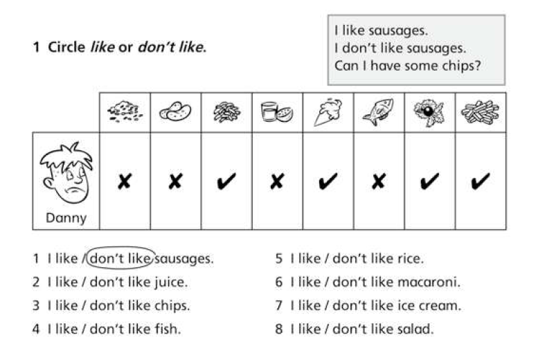

| Campo | Valor |
|--------|--------|
| **Fuente** | Ficha: «1 Circle *like* or *don't like*.» + tabla Danny |
| **Bloque** | **Vocabulario** (food) + **estructura** (*I like / I don't like*) |
| **Categoría propuesta** | `food` (+ subtema preferencias) |
| **Mecánica Aray sugerida** | MCQ: elegir *like* / *don't like* según tabla o imagen; o modo «Danny dice» con checks |
| **Imágenes** | La ficha usa iconos de comida. En Aray: **ilustraciones propias** (estilo juego, no emoji, no clipart de ficha). Generables: rice, sausages, macaroni, juice, ice cream, fish, salad, chips |

### Lemas / ítems

| EN | ES (glosa) | Preferencia Danny (ficha) |
|----|------------|---------------------------|
| rice | arroz | don't like |
| sausages | salchichas | don't like |
| macaroni | macarrones | like |
| juice | zumo | don't like |
| ice cream | helado | like |
| fish | pescado | don't like |
| salad | ensalada | like |
| chips | patatas fritas | like |

### Estructuras / frases modelo

- I like sausages. / I don't like sausages.
- Can I have some chips? (caja de ejemplo; posible ampliación «pedir comida»)

### Notas de diseño

- No copiar los dibujos de la ficha: generar assets AFK (mismo look que ortografía-imagen / portadas).
- El personaje «Danny» puede ser un avatar Aray o Lumo con tabla de gustos, no el clipart escolar.

---

## Ejercicio 02 — Write like / don't like (caras)

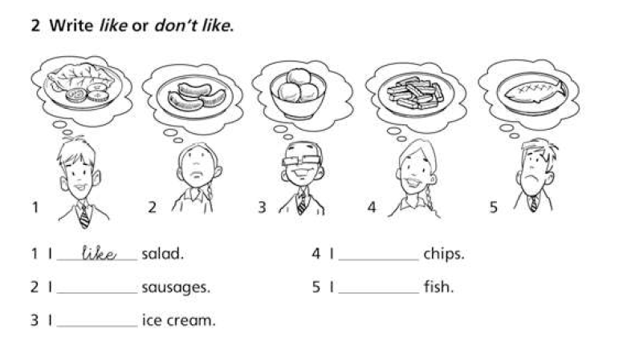

| Campo | Valor |
|--------|--------|
| **Fuente** | Ficha: «2 Write *like* or *don't like*.» |
| **Bloque** | **Vocabulario** (food) + **estructura** (*I like / I don't like*) |
| **Categoría propuesta** | `food` (mismo pack que ej. 01) |
| **Mecánica Aray sugerida** | MCQ por imagen: cara feliz/triste + plato → elegir *like* / *don't like* (sin escribir a mano) |
| **Señal visual** | Sonrisa = like · triste = don't like |
| **Imágenes** | Comida (mismo set AFK) + expresión; no reutilizar dibujos de la ficha |

### Ítems (respuestas de la ficha)

| # | EN | Preferencia |
|---|----|-------------|
| 1 | salad | like |
| 2 | sausages | don't like |
| 3 | ice cream | like |
| 4 | chips | like |
| 5 | fish | don't like |

### Relación con ej. 01

- Mismos lemas food (subconjunto: sin rice, macaroni, juice).
- Misma estructura; variante de UI (cara+plato vs tabla de checks).
- En Aray conviene **una sola mecánica** *like-mcq* con dos presentaciones (tabla / escena).

---

## Ejercicio 03 — Circle: imagen → comida

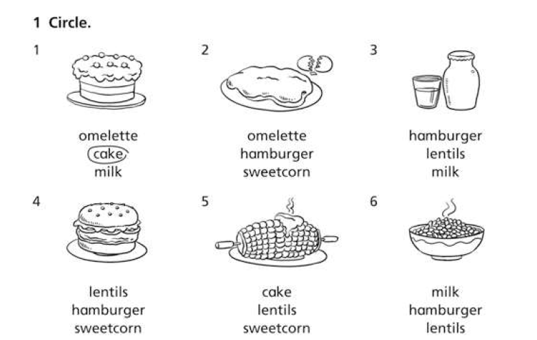

| Campo | Valor |
|--------|--------|
| **Fuente** | Ficha: «1 Circle.» (3 opciones por dibujo) |
| **Bloque** | **Vocabulario** (food / picture) |
| **Categoría propuesta** | `food` |
| **Mecánica Aray sugerida** | **picture** / meaning: imagen → elegir palabra EN (3 opciones); misma familia que ortografía-imagen |
| **Imágenes** | **Necesarias** (1 por lema). Generar estilo AFK, no copiar line-art de la ficha |

### Lemas nuevos (amplían `food`)

| EN | ES | Correcto en ficha |
|----|----|-------------------|
| cake | pastel / tarta | sí (ej. 1) |
| omelette | tortilla francesa | sí (ej. 2) |
| milk | leche | sí (ej. 3) |
| hamburger | hamburguesa | sí (ej. 4) |
| sweetcorn | maíz / mazorca | sí (ej. 5) |
| lentils | lentejas | sí (ej. 6) |

Distractores de la ficha = el mismo set (se reutilizan entre ítems).

### Relación con ej. 01–02

- Sigue `food`, pero **sin** *like/don't like*: es reconocimiento imagen↔palabra.
- Banco food unificado: lemas 01–02 + estos 6.

---

## Ejercicio 04 — Like / don't like + *but*

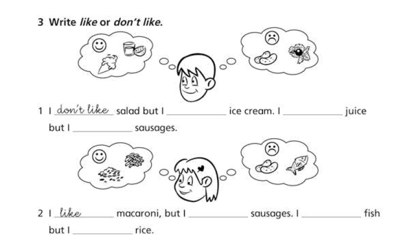

| Campo | Valor |
|--------|--------|
| **Fuente** | Ficha: «3 Write *like* or *don't like*.» (burbujas ☺/☹ por personaje) |
| **Bloque** | **Estructura** (*I like X but I don't like Y*) + vocab food |
| **Categoría propuesta** | `food` |
| **Mecánica Aray sugerida** | Completar huecos MCQ (*like* / *don't like*) según burbujas; o elegir frase correcta |
| **Patrón nuevo** | Conector **but** + contraste like ↔ don't like en la misma frase |

### Ítems (según burbujas)

**Niño (1)** — ☺ ice cream, juice · ☹ sausages, salad  
Frase modelo: *I don't like salad but I like ice cream. I like juice but I don't like sausages.*

**Niña (2)** — ☺ macaroni, rice · ☹ sausages, fish  
Frase modelo: *I like macaroni, but I don't like sausages. I don't like fish but I like rice.*

### Relación con anteriores

- Mismos lemas food (01–02); refuerza preferencias + **but**.
- En Aray: mismo modo *like-mcq* con nivel «contraste» (dos huecos / frase con but).

---

## Ejercicio 05 — Can / can't (deportes) · match

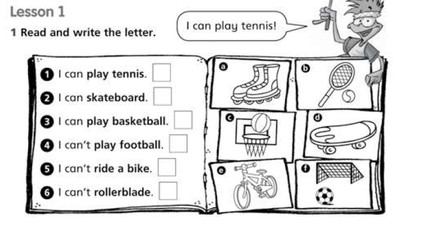

| Campo | Valor |
|--------|--------|
| **Fuente** | Lesson 1 · «1 Read and write the letter.» (frase ↔ dibujo a–f) |
| **Bloque** | **Estructura** (*I can / I can't* + actividad) + vocab deportes |
| **Categoría propuesta** | `abilities` / `sports` (nueva; no food) |
| **Mecánica Aray (acordada)** | **Arrastrar la frase a la imagen** generada AFK (no letra a–f tipo ficha). Tap-tap si no hay DnD. |
| **Imágenes** | 6 escenas/objetos estilo Aray (no line-art del cuaderno, no emojis) |

### Pares (solución de la ficha)

| Frase | Letra ficha | Imagen |
|-------|-------------|--------|
| I can play tennis. | b | raqueta + pelota |
| I can skateboard. | d | monopatín |
| I can play basketball. | c | canasta |
| I can't play football. | f | portería + balón |
| I can't ride a bike. | e | bici |
| I can't rollerblade. | a | patines |

### Lemas / chunks

| EN | ES |
|----|-----|
| play tennis | jugar al tenis |
| skateboard | hacer monopatín |
| play basketball | jugar al baloncesto |
| play football | jugar al fútbol |
| ride a bike | montar en bici |
| rollerblade | patinar (en línea) |
| I can… / I can't… | puedo / no puedo |

### Nota de diseño (originalidad)

- Ficha escolar = escribir letra. **Aray = más jugable**: frases sueltas + imágenes propias → soltar frase sobre la escena correcta.
- Polaridad *can* vs *can't* visible en la frase; la imagen solo muestra la actividad (el “no puedo” lo da el texto).

---

## Ejercicio 06 — Can / can't (deportes) · completar

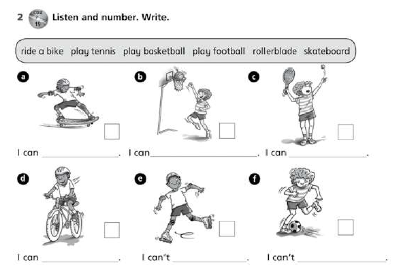

| Campo | Valor |
|--------|--------|
| **Fuente** | «2 Listen and number. Write.» (+ banco de chunks) |
| **Bloque** | **Estructura** (*I can / I can't* + actividad) + vocab deportes |
| **Categoría propuesta** | `abilities` |
| **Mecánica Aray sugerida** | Imagen AFK (éxito vs fallo visible) → elegir chunk del banco *o* completar *I can/can't _____* con MCQ. **Sin audio CD** al inicio (el “listen” de la ficha se sustituye por lectura de la escena). |
| **Imágenes** | Mismas 6 actividades; en *can't* la escena muestra tropiezo/desequilibrio (como en la ficha), no solo el objeto |

### Pares (según dibujos)

| Casilla | Señal | Completar |
|---------|-------|-----------|
| a | can (skateboard estable) | skateboard |
| b | can (canasta) | play basketball |
| c | can (tenis) | play tennis |
| d | can (bici) | ride a bike |
| e | can't (patines tambaleando) | rollerblade |
| f | can't (tropiezo con balón) | play football |

Banco: ride a bike · play tennis · play basketball · play football · rollerblade · skateboard

### Relación con ej. 05

- Mismos chunks `abilities`.
- 05 = arrastrar **frase completa** a imagen; 06 = **rellenar** la actividad (can/can't ya dado o deducible de la escena).

---

## Ejercicio 07 — Match: chunk ↔ deporte

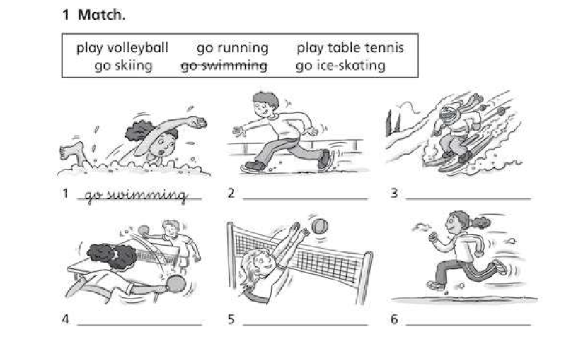

| Campo | Valor |
|--------|--------|
| **Fuente** | «1 Match.» (banco de chunks + 6 dibujos) |
| **Bloque** | **Vocabulario** deportes / actividades (*play* / *go* + sport) |
| **Categoría propuesta** | `abilities` (amplía banco; aquí **sin** can/can't, solo emparejar) |
| **Mecánica Aray** | **Arrastrar el chunk a la imagen** AFK (como pediste en el 05) |
| **Imágenes** | 6 escenas propias estilo Aray |

### Pares

| # ficha | Chunk | ES |
|---------|-------|-----|
| 1 | go swimming | ir a nadar |
| 2 | go ice-skating | patinar sobre hielo |
| 3 | go skiing | esquiar |
| 4 | play table tennis | jugar al ping-pong |
| 5 | play volleyball | jugar al voleibol |
| 6 | go running | ir a correr |

### Lemas nuevos (amplían `abilities`)

play volleyball · go running · play table tennis · go skiing · go swimming · go ice-skating  

Nota gramatical útil para tips: *play* + deporte con pelota/raqueta · *go* + -ing.

---

## Ejercicio 08 — Can she/he…? (tabla)

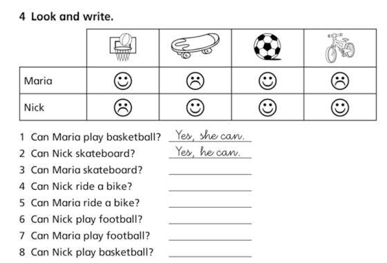

| Campo | Valor |
|--------|--------|
| **Fuente** | «4 Look and write.» (tabla ☺/☹ Maria & Nick) |
| **Bloque** | **Preguntas** *Can + nombre + actividad?* → *Yes, he/she can.* / *No, he/she can't.* |
| **Categoría propuesta** | `abilities` |
| **Mecánica Aray** | Tabla interactiva (o ficha de personaje) + pregunta → MCQ Yes/No con he/she. Más Aray que “escribir a mano”. |
| **Personajes** | Maria, Nick (avatares Aray; no clipart de ficha) |

### Tabla de la ficha

| | basketball | skateboard | football | bike |
|--|:--:|:--:|:--:|:--:|
| **Maria** | can | can't | can | can't |
| **Nick** | can't | can | can | can |

### Preguntas (respuestas)

| # | Pregunta | Respuesta |
|---|----------|-----------|
| 1 | Can Maria play basketball? | Yes, she can. |
| 2 | Can Nick skateboard? | Yes, he can. |
| 3 | Can Maria skateboard? | No, she can't. |
| 4 | Can Nick ride a bike? | Yes, he can. |
| 5 | Can Maria ride a bike? | No, she can't. |
| 6 | Can Nick play football? | Yes, he can. |
| 7 | Can Maria play football? | Yes, she can. |
| 8 | Can Nick play basketball? | No, he can't. |

### Relación

- Reutiliza chunks de ej. 05–06; añade **3.ª persona** (*he/she can/can't*).

---

## Ejercicio 09 — Rutinas diarias · match

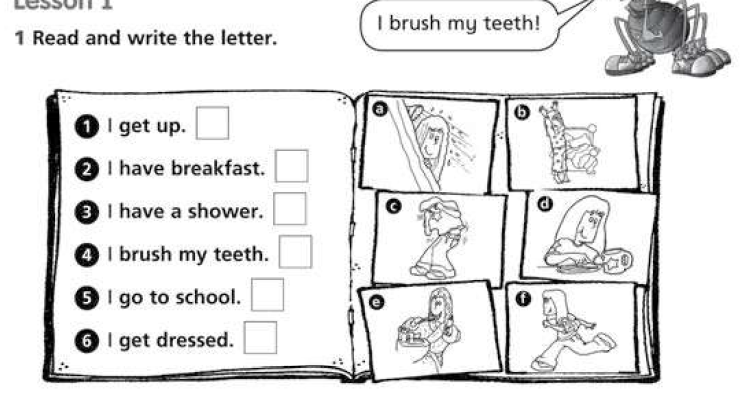

| Campo | Valor |
|--------|--------|
| **Fuente** | Lesson 1 · «1 Read and write the letter.» |
| **Bloque** | **Vocabulario / rutinas** (*I get up*, *have breakfast*…) |
| **Categoría propuesta** | `routines` (**nueva**) |
| **Mecánica Aray** | **Arrastrar la frase a la imagen** AFK (mismo patrón que deportes) |
| **Imágenes** | 6 escenas con el mismo personaje Aray (consistencia de avatar) |

### Pares

| Frase | Letra ficha | Escena |
|-------|-------------|--------|
| I get up. | b | despertar / estirarse en la cama |
| I have breakfast. | d | desayuno en la mesa |
| I have a shower. | a | ducha |
| I brush my teeth. | e | cepillarse los dientes |
| I go to school. | f | mochila / camino al cole |
| I get dressed. | c | vestirse |

### Lemas

| EN | ES |
|----|-----|
| get up | levantarse |
| have breakfast | desayunar |
| have a shower | ducharse |
| brush my teeth | cepillarse los dientes |
| go to school | ir al cole |
| get dressed | vestirse |

---

## Ejercicio 10 — Rutinas · completar

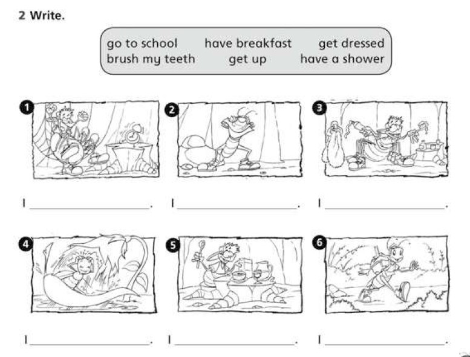

| Campo | Valor |
|--------|--------|
| **Fuente** | «2 Write.» (banco + 6 viñetas) |
| **Bloque** | **Rutinas** (*I* + chunk) |
| **Categoría propuesta** | `routines` |
| **Mecánica Aray** | Imagen AFK → elegir chunk del banco (MCQ / arrastrar al hueco *I ______.*) |
| **Imágenes** | Mismas 6 rutinas; personaje Aray (no el bicho del cuaderno) |

### Orden ficha → chunk

| # | Chunk |
|---|--------|
| 1 | get up |
| 2 | get dressed |
| 3 | brush my teeth |
| 4 | have a shower |
| 5 | have breakfast |
| 6 | go to school |

### Relación con ej. 09

- Mismos 6 chunks. 09 = frase completa → imagen; 10 = imagen → rellenar chunk.

---

## Ejercicio 11 — Ordenar: rutina + hora

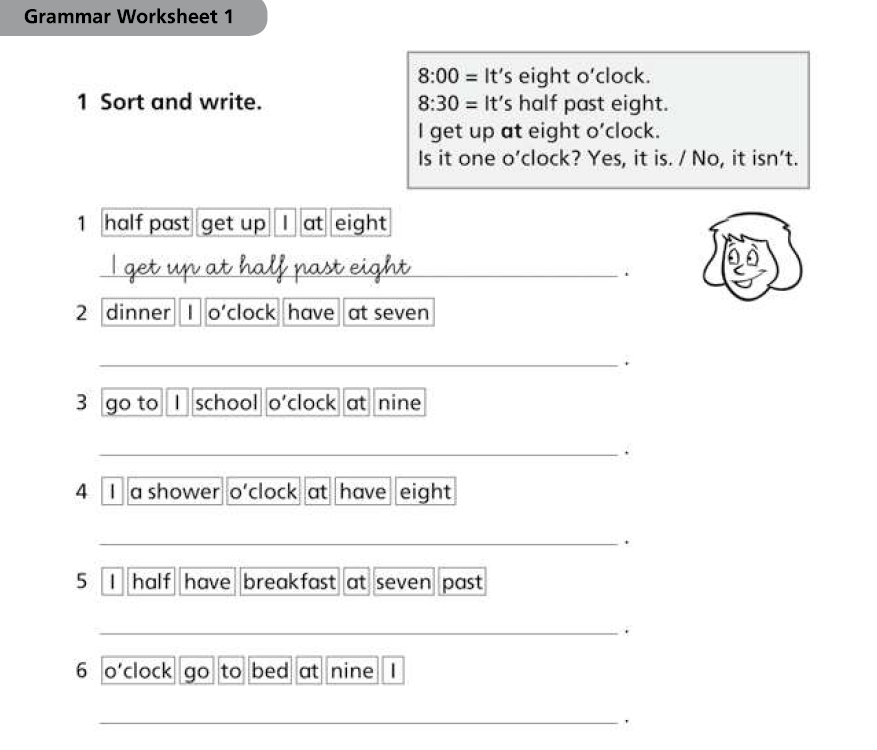

| Campo | Valor |
|--------|--------|
| **Fuente** | Grammar Worksheet 1 · «1 Sort and write.» |
| **Bloque** | **Rutinas + tiempo** (*at eight o'clock* / *half past*) |
| **Categoría propuesta** | `routines` (enlace con mundo **Horas** ya en app) |
| **Mecánica Aray** | **Montar la frase** (ordenar chips) — mismo patrón que Lengua *Monta la frase* |
| **Gramática caja** | It's eight o'clock / half past eight · I get up at… · Is it…? Yes/No |

### Frases (soluciones)

| # | Frase ordenada |
|---|----------------|
| 1 | I get up at half past eight. |
| 2 | I have dinner at seven o'clock. |
| 3 | I go to school at nine o'clock. |
| 4 | I have a shower at eight o'clock. |
| 5 | I have breakfast at half past seven. |
| 6 | I go to bed at nine o'clock. |

### Lemas / chunks nuevos

| EN | ES |
|----|-----|
| have dinner | cenar |
| go to bed | acostarse |
| at … o'clock | a las … en punto |
| half past … | y media |

---

## Ejercicio 12 — What time is it?

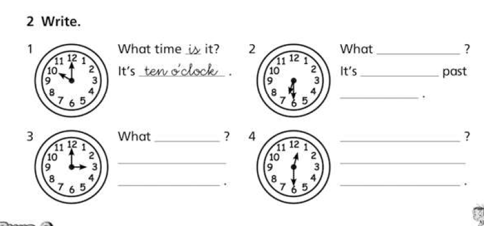

| Campo | Valor |
|--------|--------|
| **Fuente** | «2 Write.» (reloj + diálogo) |
| **Bloque** | **Horas en inglés** (*What time is it? It's … o'clock / half past …*) |
| **Categoría propuesta** | `time` (**nueva**) — o puente a mundo **Horas** (ya existe UI de reloj) |
| **Mecánica Aray** | Reutilizar reloj analógico de Mates/Horas + MCQ / completar en **EN**. No hace falta dibujar relojes nuevos. |
| **Nota** | Solapa fuerte con Horas; en Inglés el valor es el **idioma** (frase), no otra UI de reloj. |

### Ítems

| # | Hora | Diálogo |
|---|------|---------|
| 1 | 10:00 | What time is it? It's ten o'clock. |
| 2 | 6:30 | What time is it? It's half past six. |
| 3 | 3:00 | What time is it? It's three o'clock. |
| 4 | 12:30 | What time is it? It's half past twelve. |

---

## Ejercicio 13 — Rutinas ampliadas · circle

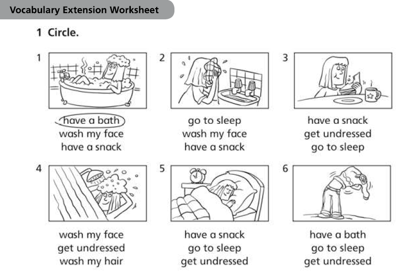

| Campo | Valor |
|--------|--------|
| **Fuente** | Vocabulary Extension · «1 Circle.» |
| **Bloque** | **Rutinas** (higiene / casa / descanso) |
| **Categoría propuesta** | `routines` (amplía banco) |
| **Mecánica Aray** | picture → MCQ 3 chunks (como food ej. 03) |
| **Imágenes** | AFK, mismo personaje que rutinas 09–10 |

### Lemas nuevos

| EN | ES | Correcto ficha |
|----|----|----------------|
| have a bath | bañarse | 1 |
| wash my face | lavarse la cara | 2 |
| have a snack | merendar / picar | 3 |
| wash my hair | lavarse el pelo | 4 |
| go to sleep | dormirse / ir a dormir | 5 |
| get undressed | desvestirse | 6 |

---

## Ejercicio 14 — Rutinas · completar letras

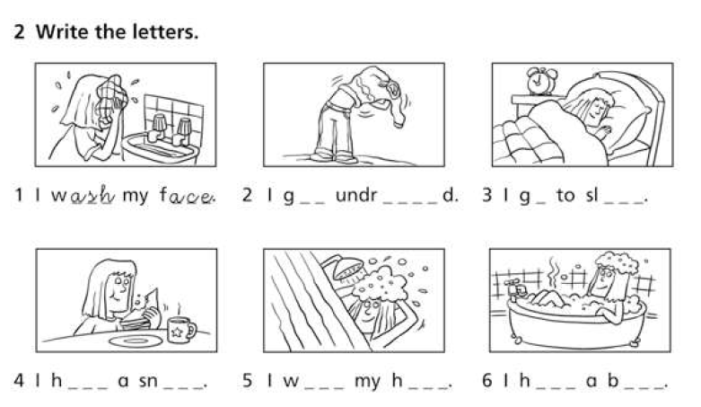

| Campo | Valor |
|--------|--------|
| **Fuente** | «2 Write the letters.» |
| **Bloque** | **Ortografía de chunks** de rutina (mismas frases que ej. 13) |
| **Categoría propuesta** | `routines` |
| **Mecánica Aray** | Imagen + huecos tipo **missing** (elegir letras / completar palabra), no escribir a mano |
| **Imágenes** | Reutilizar set ej. 13 |

### Ítems

| # | Frase completa |
|---|----------------|
| 1 | I wash my face. |
| 2 | I get undressed. |
| 3 | I go to sleep. |
| 4 | I have a snack. |
| 5 | I wash my hair. |
| 6 | I have a bath. |

### Relación

- Mismos 6 chunks que ej. 13; aquí el reto es **escribir/ortografiar**, no solo reconocer.

---

## Ejercicio 15 — Is it …? Yes / No (hora)

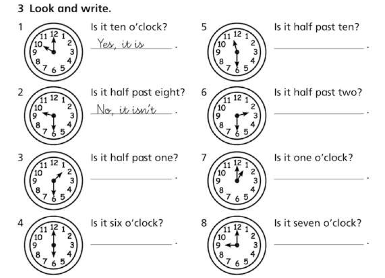

| Campo | Valor |
|--------|--------|
| **Fuente** | «3 Look and write.» |
| **Bloque** | **Horas** — pregunta *Is it … o'clock / half past …?* |
| **Categoría propuesta** | `time` |
| **Mecánica Aray** | Reloj (UI Horas) + MCQ *Yes, it is.* / *No, it isn't.* |
| **Respuestas modelo** | Yes, it is. · No, it isn't. |

### Ítems

| # | Hora real | Pregunta | Respuesta |
|---|-----------|----------|-----------|
| 1 | 10:00 | Is it ten o'clock? | Yes, it is. |
| 2 | 9:30 | Is it half past eight? | No, it isn't. |
| 3 | 1:30 | Is it half past one? | Yes, it is. |
| 4 | 6:00 | Is it six o'clock? | Yes, it is. |
| 5 | 11:30 | Is it half past ten? | No, it isn't. |
| 6 | 2:30 | Is it half past two? | Yes, it is. |
| 7 | 1:00 | Is it one o'clock? | Yes, it is. |
| 8 | 9:00 | Is it seven o'clock? | No, it isn't. |

---

## Ejercicio 16 — Rutina + *at* + hora

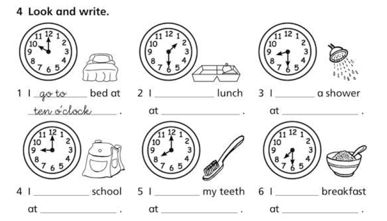

| Campo | Valor |
|--------|--------|
| **Fuente** | «4 Look and write.» (reloj + icono de rutina) |
| **Bloque** | **Rutinas + tiempo** (*I … at … o'clock / half past*) |
| **Categoría propuesta** | `routines` ∩ `time` (mismo patrón que ej. 11, con reloj visible) |
| **Mecánica Aray** | Reloj + icono AFK → completar dos huecos (chunk + hora) o MCQ de frase completa |
| **Lema nuevo** | have lunch (comer / almorzar) |

### Ítems

| # | Hora | Frase |
|---|------|--------|
| 1 | 10:00 | I go to bed at ten o'clock. |
| 2 | 1:30 | I have lunch at half past one. |
| 3 | 9:30 | I have a shower at half past nine. |
| 4 | 9:00 | I go to school at nine o'clock. |
| 5 | 8:00 | I brush my teeth at eight o'clock. |
| 6 | 7:30 | I have breakfast at half past seven. |

---

## Ejercicio 17 — Lugares (campamento) · match

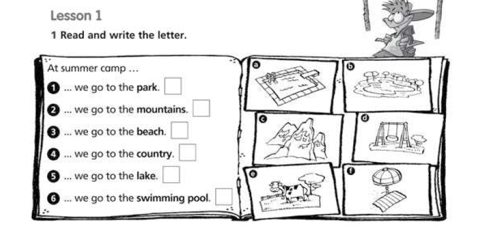

| Campo | Valor |
|--------|--------|
| **Fuente** | Lesson 1 · «1 Read and write the letter.» · *At summer camp…* |
| **Bloque** | **Lugares** (*we go to the* + place) |
| **Categoría propuesta** | `places` (**nueva**) |
| **Mecánica Aray** | **Arrastrar frase/chunk a la imagen** AFK |
| **Frame** | *At summer camp, we go to the _____* |

### Pares

| Frase (lugar) | Letra ficha | Escena |
|---------------|-------------|--------|
| park | d | columpio / parque |
| mountains | c | montañas |
| beach | f | toalla + sombrilla |
| country | e | vaca en el campo |
| lake | b | lago |
| swimming pool | a | piscina |

### Lemas

| EN | ES |
|----|-----|
| park | parque |
| mountains | montañas |
| beach | playa |
| country | campo |
| lake | lago |
| swimming pool | piscina |

---

## Categorías propuestas (mapa)

| ID tentativo | Título ES | Tema | Ítems | Mecánicas sugeridas | Estado |
|--------------|-----------|------|-------|---------------------|--------|
| `food` | Comida | Vocabulario food + preferencias (+ *but*) | ~14 lemas (ej. 01–04) | meaning, translate, like-mcq, picture | borrador |
| `abilities` | Puedo / deportes | *can/can't* + chunks + he/she | ~12 actividades (ej. 05–08) | drag-to-image, fill-activity, can-yn | borrador |
| `routines` | Rutinas | Día a día + higiene + *at* + hora | ~15 chunks (ej. 09–11, 13–14, 16) | drag-to-image, picture, order-sentence, missing, routine+time | borrador |
| `time` | ¿Qué hora es? | *What time…?* + *Is it…?* Yes/No | ej. 12, 15–16 | clock-ui + EN phrases + yn | borrador |
| `places` | Lugares | *go to the* park/beach… | 6 lugares (ej. 17) | drag-to-image, picture | borrador |

## Cómo añadir un lote

1. Guardar fichas en `_inbox/` (capturas en `_inbox/refs/`).
2. Extraer ítems (palabra EN, glosa ES, notas).
3. Asignar **categoría propuesta** (fila nueva o ampliación).
4. No implementar hub/JSON hasta acuerdo explícito.

## Archivo (referencia, no runtime)

Packs frozen antiguos (fuera del hub):

- `ingles-colours-numbers` — Colours / Numbers
- `ingles-school` — Places / People / Objects
- `ingles-family` — Family group / Core / Extended

Ver `feinetas/Ingles/_archivo/` y MD en `feinetas/editorial/INGLES_*.md`.
