# Inglés — borrador de categorías

Documento vivo: se rellena al clasificar lo que llega a `feinetas/Ingles/_inbox/`.
**No define aún packs jugables** en la app (hub vacío a propósito).

## Estado

| Fecha | Nota |
|-------|------|
| 2026-08-03 | Hub vaciado. Bancos Colegio/Familia/Colores en `_archivo/`. Inbox preparado. |
| 2026-08-03 | Primera ficha catalogada: like / don't like + food. |
| 2026-08-03 | Ejercicio 02: write like/don't like (caras + comida). |
| 2026-08-03 | Ejercicio 03: circle food (imagen → palabra). |
| 2026-08-03 | Ejercicio 04: like/don't like + *but* (dos personajes). |
| 2026-08-03 | Ejercicio 05: can/can't + deportes (match frase↔imagen). |
| 2026-08-03 | Ejercicio 06: can/can't deportes (completar actividad). |
| 2026-08-03 | Ejercicio 07: match frase ↔ deporte (más actividades). |
| 2026-08-03 | Ejercicio 08: Can Maria/Nick…? (tabla + Yes/No). |
| 2026-08-03 | Ejercicio 09: rutinas diarias (match frase↔imagen). |
| 2026-08-03 | Ejercicio 10: rutinas (completar I + chunk). |
| 2026-08-03 | Ejercicio 11: ordenar frase (rutina + hora). |
| 2026-08-03 | Ejercicio 12: What time is it? (reloj + frase). |
| 2026-08-03 | Ejercicio 13: rutinas ampliadas (circle imagen→chunk). |
| 2026-08-03 | Ejercicio 14: rutinas (completar letras del chunk). |
| 2026-08-03 | Ejercicio 15: Is it … o'clock? Yes/No (reloj). |
| 2026-08-03 | Ejercicio 16: rutina + at + hora (reloj + icono). |
| 2026-08-03 | Ejercicio 17: lugares (campamento · match). |
| 2026-08-03 | Ejercicio 18: lugares (montar palabra + frase). |
| 2026-08-03 | Ejercicio 19: go to / in the summer (lugares). |
| 2026-08-03 | Ejercicio 20: ordenar frase (go to … in the summer). |
| 2026-08-03 | Ejercicio 21: paisajes (circle imagen→palabra). |
| 2026-08-03 | Ejercicio 22: clima (*It's hot/cold/sunny…*). |
| 2026-08-03 | Ejercicio 23: circle It's / go to / I've got. |
| 2026-08-03 | Ejercicio 24: personajes cuento (match He/She's…). |
| 2026-08-03 | Ejercicio 25: *He's wearing…* (ropa + personajes). |
| 2026-08-03 | Ejercicio 26: circle He's / She's + wearing. |
| 2026-08-03 | Ejercicio 27: write He's/She's wearing + ropa. |
| 2026-08-03 | Ejercicio 28: He's/She's + adjetivos (rich, old…). |
| 2026-08-03 | Ejercicio 29: write He's/She's + adjetivo. |
| 2026-08-03 | Ejercicio 30: There is/are (+ caja de ayuda). |
| 2026-08-03 | Ejercicio 31: completar there's / there aren't / are there… |
| 2026-08-03 | Ejercicio 32: Are there any…? Yes/No short answers. |
| 2026-08-03 | Ejercicio 33: How many…? + There are/aren't. |
| 2026-08-03 | Ejercicio 34: ordenar How many… are there? |
| 2026-08-03 | Ejercicio 35: How many + imagen (There are / aren't). |
| 2026-08-03 | Ejercicio 36: possessive 's + his/her (elige forma). |
| 2026-08-03 | Ejercicio 37: on/in/under + Where is/are. |

## Material en inbox

| Archivo | Notas | Estado |
|---------|-------|--------|
| `refs/01-like-dont-like-food.png` | Circle like / don't like (Danny + comida) | Catalogado |
| `refs/02-write-like-dont-like-food.png` | Write like / don't like (caras + platos) | Catalogado |
| `refs/03-circle-food-picture.png` | Circle: imagen comida → palabra | Catalogado |
| `refs/04-like-but-dont-like-food.png` | Like/don't like + *but* (niño/niña) | Catalogado |
| `refs/05-can-cant-sports-match.png` | Can/can't deportes (frase ↔ imagen) | Catalogado |
| `refs/06-can-cant-sports-write.png` | Can/can't deportes (I can/can't + verbo) | Catalogado |
| `refs/07-match-sports-phrases.png` | Match: chunk deporte ↔ escena | Catalogado |
| `refs/08-can-questions-maria-nick.png` | Can she/he…? Yes/No (tabla Maria/Nick) | Catalogado |
| `refs/09-routines-match.png` | Rutinas: match frase ↔ escena | Catalogado |
| `refs/10-routines-write.png` | Rutinas: I + completar chunk | Catalogado |
| `refs/11-routines-time-sort.png` | Ordenar: rutina + o'clock / half past | Catalogado |
| `refs/12-what-time-is-it.png` | What time is it? (reloj analógico) | Catalogado |
| `refs/13-routines-vocab-circle.png` | Rutinas ampliadas: circle imagen→chunk | Catalogado |
| `refs/14-routines-spell-letters.png` | Rutinas: escribir letras del chunk | Catalogado |
| `refs/15-is-it-time-yn.png` | Is it …? Yes, it is / No, it isn't | Catalogado |
| `refs/16-routines-at-time.png` | I … at … (rutina + reloj) | Catalogado |
| `refs/17-places-camp-match.png` | Lugares: we go to the … (match) | Catalogado |
| `refs/18-places-match-write.png` | Lugares: piezas + completar frase | Catalogado |
| `refs/19-places-go-to-in-summer.png` | I go to the … in the summer | Catalogado |
| `refs/20-places-sort-sentence.png` | Ordenar: I go to … in the summer | Catalogado |
| `refs/21-places-landscape-circle.png` | Paisajes: circle imagen→palabra | Catalogado |
| `refs/22-weather-its.png` | Clima: It's hot/cold/raining… | Catalogado |
| `refs/23-circle-grammar-choice.png` | Circle: It's / go to / I've got | Catalogado |
| `refs/24-story-characters-match.png` | Cuento: He's/She's the … (match) | Catalogado |
| `refs/25-stories-wearing-clothes.png` | He's wearing… (ropa + personajes) | Catalogado |
| `refs/26-hes-shes-wearing-circle.png` | Circle He's/She's + wearing | Catalogado |
| `refs/27-hes-shes-wearing-write.png` | Write He's/She's wearing + item | Catalogado |
| `refs/28-hes-shes-adjectives.png` | He's/She's + handsome/young/old… | Catalogado |
| `refs/29-hes-shes-adjectives-write.png` | Write He's/She's + adj (beautiful…) | Catalogado |
| `refs/30-there-is-are-match.png` | There is/are + match mitades (+ ayuda) | Catalogado |
| `refs/31-there-is-complete.png` | Completar there's / aren't / are there… | Catalogado |
| `refs/32-there-are-questions-yn.png` | Are there any…? + Yes/No short answers | Catalogado |
| `refs/33-how-many-there-are.png` | How many…? + There are/aren't (fill) | Catalogado |
| `refs/34-how-many-order.png` | Ordenar: How many … are there? | Catalogado |
| `refs/35-how-many-picture.png` | How many + imagen → There are / aren't | Catalogado |
| `refs/36-possessive-s-choose.png` | Possessive 's + his/her (elige forma) | Catalogado |
| `refs/37-prepositions-place.png` | on/in/under + Where is/are (habitación) | Catalogado |
| `01.pdf`, `1.pdf` … `8.pdf` | Lotes PDF en disco | Pendiente lectura |

---

## Ejercicio 01 — Like / don't like (comida)

| Campo | Valor |
|--------|--------|
| **Fuente** | Ficha: «1 Circle *like* or *don't like*.» + tabla Danny |
| **Bloque** | **Vocabulario** (food) + **estructura** (*I like / I don't like*) |
| **Categoría propuesta** | `food` (+ subtema preferencias) |
| **Mecánica Aray sugerida** | MCQ: elegir *like* / *don't like* según tabla o imagen; o modo «Danny dice» con checks |
| **Imágenes** | La ficha usa iconos de comida. En Aray: **ilustraciones propias** (estilo juego, no emoji, no clipart de ficha). Generables: rice, sausages, macaroni, juice, ice cream, fish, salad, chips |

### Lemas / ítems

| EN | ES (glosa) | Preferencia Danny (ficha) |
|----|------------|---------------------------|
| rice | arroz | don't like |
| sausages | salchichas | don't like |
| macaroni | macarrones | like |
| juice | zumo | don't like |
| ice cream | helado | like |
| fish | pescado | don't like |
| salad | ensalada | like |
| chips | patatas fritas | like |

### Estructuras / frases modelo

- I like sausages. / I don't like sausages.
- Can I have some chips? (caja de ejemplo; posible ampliación «pedir comida»)

### Notas de diseño

- No copiar los dibujos de la ficha: generar assets AFK (mismo look que ortografía-imagen / portadas).
- El personaje «Danny» puede ser un avatar Aray o Lumo con tabla de gustos, no el clipart escolar.

---

## Ejercicio 02 — Write like / don't like (caras)

| Campo | Valor |
|--------|--------|
| **Fuente** | Ficha: «2 Write *like* or *don't like*.» |
| **Bloque** | **Vocabulario** (food) + **estructura** (*I like / I don't like*) |
| **Categoría propuesta** | `food` (mismo pack que ej. 01) |
| **Mecánica Aray sugerida** | MCQ por imagen: cara feliz/triste + plato → elegir *like* / *don't like* (sin escribir a mano) |
| **Señal visual** | Sonrisa = like · triste = don't like |
| **Imágenes** | Comida (mismo set AFK) + expresión; no reutilizar dibujos de la ficha |

### Ítems (respuestas de la ficha)

| # | EN | Preferencia |
|---|----|-------------|
| 1 | salad | like |
| 2 | sausages | don't like |
| 3 | ice cream | like |
| 4 | chips | like |
| 5 | fish | don't like |

### Relación con ej. 01

- Mismos lemas food (subconjunto: sin rice, macaroni, juice).
- Misma estructura; variante de UI (cara+plato vs tabla de checks).
- En Aray conviene **una sola mecánica** *like-mcq* con dos presentaciones (tabla / escena).

---

## Ejercicio 03 — Circle: imagen → comida

| Campo | Valor |
|--------|--------|
| **Fuente** | Ficha: «1 Circle.» (3 opciones por dibujo) |
| **Bloque** | **Vocabulario** (food / picture) |
| **Categoría propuesta** | `food` |
| **Mecánica Aray sugerida** | **picture** / meaning: imagen → elegir palabra EN (3 opciones); misma familia que ortografía-imagen |
| **Imágenes** | **Necesarias** (1 por lema). Generar estilo AFK, no copiar line-art de la ficha |

### Lemas nuevos (amplían `food`)

| EN | ES | Correcto en ficha |
|----|----|-------------------|
| cake | pastel / tarta | sí (ej. 1) |
| omelette | tortilla francesa | sí (ej. 2) |
| milk | leche | sí (ej. 3) |
| hamburger | hamburguesa | sí (ej. 4) |
| sweetcorn | maíz / mazorca | sí (ej. 5) |
| lentils | lentejas | sí (ej. 6) |

Distractores de la ficha = el mismo set (se reutilizan entre ítems).

### Relación con ej. 01–02

- Sigue `food`, pero **sin** *like/don't like*: es reconocimiento imagen↔palabra.
- Banco food unificado: lemas 01–02 + estos 6.

---

## Ejercicio 04 — Like / don't like + *but*

| Campo | Valor |
|--------|--------|
| **Fuente** | Ficha: «3 Write *like* or *don't like*.» (burbujas ☺/☹ por personaje) |
| **Bloque** | **Estructura** (*I like X but I don't like Y*) + vocab food |
| **Categoría propuesta** | `food` |
| **Mecánica Aray sugerida** | Completar huecos MCQ (*like* / *don't like*) según burbujas; o elegir frase correcta |
| **Patrón nuevo** | Conector **but** + contraste like ↔ don't like en la misma frase |

### Ítems (según burbujas)

**Niño (1)** — ☺ ice cream, juice · ☹ sausages, salad  
Frase modelo: *I don't like salad but I like ice cream. I like juice but I don't like sausages.*

**Niña (2)** — ☺ macaroni, rice · ☹ sausages, fish  
Frase modelo: *I like macaroni, but I don't like sausages. I don't like fish but I like rice.*

### Relación con anteriores

- Mismos lemas food (01–02); refuerza preferencias + **but**.
- En Aray: mismo modo *like-mcq* con nivel «contraste» (dos huecos / frase con but).

---

## Ejercicio 05 — Can / can't (deportes) · match

| Campo | Valor |
|--------|--------|
| **Fuente** | Lesson 1 · «1 Read and write the letter.» (frase ↔ dibujo a–f) |
| **Bloque** | **Estructura** (*I can / I can't* + actividad) + vocab deportes |
| **Categoría propuesta** | `abilities` / `sports` (nueva; no food) |
| **Mecánica Aray (acordada)** | **Arrastrar la frase a la imagen** generada AFK (no letra a–f tipo ficha). Tap-tap si no hay DnD. |
| **Imágenes** | 6 escenas/objetos estilo Aray (no line-art del cuaderno, no emojis) |

### Pares (solución de la ficha)

| Frase | Letra ficha | Imagen |
|-------|-------------|--------|
| I can play tennis. | b | raqueta + pelota |
| I can skateboard. | d | monopatín |
| I can play basketball. | c | canasta |
| I can't play football. | f | portería + balón |
| I can't ride a bike. | e | bici |
| I can't rollerblade. | a | patines |

### Lemas / chunks

| EN | ES |
|----|-----|
| play tennis | jugar al tenis |
| skateboard | hacer monopatín |
| play basketball | jugar al baloncesto |
| play football | jugar al fútbol |
| ride a bike | montar en bici |
| rollerblade | patinar (en línea) |
| I can… / I can't… | puedo / no puedo |

### Nota de diseño (originalidad)

- Ficha escolar = escribir letra. **Aray = más jugable**: frases sueltas + imágenes propias → soltar frase sobre la escena correcta.
- Polaridad *can* vs *can't* visible en la frase; la imagen solo muestra la actividad (el “no puedo” lo da el texto).

---

## Ejercicio 06 — Can / can't (deportes) · completar

| Campo | Valor |
|--------|--------|
| **Fuente** | «2 Listen and number. Write.» (+ banco de chunks) |
| **Bloque** | **Estructura** (*I can / I can't* + actividad) + vocab deportes |
| **Categoría propuesta** | `abilities` |
| **Mecánica Aray sugerida** | Imagen AFK (éxito vs fallo visible) → elegir chunk del banco *o* completar *I can/can't _____* con MCQ. **Sin audio CD** al inicio (el “listen” de la ficha se sustituye por lectura de la escena). |
| **Imágenes** | Mismas 6 actividades; en *can't* la escena muestra tropiezo/desequilibrio (como en la ficha), no solo el objeto |

### Pares (según dibujos)

| Casilla | Señal | Completar |
|---------|-------|-----------|
| a | can (skateboard estable) | skateboard |
| b | can (canasta) | play basketball |
| c | can (tenis) | play tennis |
| d | can (bici) | ride a bike |
| e | can't (patines tambaleando) | rollerblade |
| f | can't (tropiezo con balón) | play football |

Banco: ride a bike · play tennis · play basketball · play football · rollerblade · skateboard

### Relación con ej. 05

- Mismos chunks `abilities`.
- 05 = arrastrar **frase completa** a imagen; 06 = **rellenar** la actividad (can/can't ya dado o deducible de la escena).

---

## Ejercicio 07 — Match: chunk ↔ deporte

| Campo | Valor |
|--------|--------|
| **Fuente** | «1 Match.» (banco de chunks + 6 dibujos) |
| **Bloque** | **Vocabulario** deportes / actividades (*play* / *go* + sport) |
| **Categoría propuesta** | `abilities` (amplía banco; aquí **sin** can/can't, solo emparejar) |
| **Mecánica Aray** | **Arrastrar el chunk a la imagen** AFK (como pediste en el 05) |
| **Imágenes** | 6 escenas propias estilo Aray |

### Pares

| # ficha | Chunk | ES |
|---------|-------|-----|
| 1 | go swimming | ir a nadar |
| 2 | go ice-skating | patinar sobre hielo |
| 3 | go skiing | esquiar |
| 4 | play table tennis | jugar al ping-pong |
| 5 | play volleyball | jugar al voleibol |
| 6 | go running | ir a correr |

### Lemas nuevos (amplían `abilities`)

play volleyball · go running · play table tennis · go skiing · go swimming · go ice-skating  

Nota gramatical útil para tips: *play* + deporte con pelota/raqueta · *go* + -ing.

---

## Ejercicio 08 — Can she/he…? (tabla)

| Campo | Valor |
|--------|--------|
| **Fuente** | «4 Look and write.» (tabla ☺/☹ Maria & Nick) |
| **Bloque** | **Preguntas** *Can + nombre + actividad?* → *Yes, he/she can.* / *No, he/she can't.* |
| **Categoría propuesta** | `abilities` |
| **Mecánica Aray** | Tabla interactiva (o ficha de personaje) + pregunta → MCQ Yes/No con he/she. Más Aray que “escribir a mano”. |
| **Personajes** | Maria, Nick (avatares Aray; no clipart de ficha) |

### Tabla de la ficha

| | basketball | skateboard | football | bike |
|--|:--:|:--:|:--:|:--:|
| **Maria** | can | can't | can | can't |
| **Nick** | can't | can | can | can |

### Preguntas (respuestas)

| # | Pregunta | Respuesta |
|---|----------|-----------|
| 1 | Can Maria play basketball? | Yes, she can. |
| 2 | Can Nick skateboard? | Yes, he can. |
| 3 | Can Maria skateboard? | No, she can't. |
| 4 | Can Nick ride a bike? | Yes, he can. |
| 5 | Can Maria ride a bike? | No, she can't. |
| 6 | Can Nick play football? | Yes, he can. |
| 7 | Can Maria play football? | Yes, she can. |
| 8 | Can Nick play basketball? | No, he can't. |

### Relación

- Reutiliza chunks de ej. 05–06; añade **3.ª persona** (*he/she can/can't*).

---

## Ejercicio 09 — Rutinas diarias · match

| Campo | Valor |
|--------|--------|
| **Fuente** | Lesson 1 · «1 Read and write the letter.» |
| **Bloque** | **Vocabulario / rutinas** (*I get up*, *have breakfast*…) |
| **Categoría propuesta** | `routines` (**nueva**) |
| **Mecánica Aray** | **Arrastrar la frase a la imagen** AFK (mismo patrón que deportes) |
| **Imágenes** | 6 escenas con el mismo personaje Aray (consistencia de avatar) |

### Pares

| Frase | Letra ficha | Escena |
|-------|-------------|--------|
| I get up. | b | despertar / estirarse en la cama |
| I have breakfast. | d | desayuno en la mesa |
| I have a shower. | a | ducha |
| I brush my teeth. | e | cepillarse los dientes |
| I go to school. | f | mochila / camino al cole |
| I get dressed. | c | vestirse |

### Lemas

| EN | ES |
|----|-----|
| get up | levantarse |
| have breakfast | desayunar |
| have a shower | ducharse |
| brush my teeth | cepillarse los dientes |
| go to school | ir al cole |
| get dressed | vestirse |

---

## Ejercicio 10 — Rutinas · completar

| Campo | Valor |
|--------|--------|
| **Fuente** | «2 Write.» (banco + 6 viñetas) |
| **Bloque** | **Rutinas** (*I* + chunk) |
| **Categoría propuesta** | `routines` |
| **Mecánica Aray** | Imagen AFK → elegir chunk del banco (MCQ / arrastrar al hueco *I ______.*) |
| **Imágenes** | Mismas 6 rutinas; personaje Aray (no el bicho del cuaderno) |

### Orden ficha → chunk

| # | Chunk |
|---|--------|
| 1 | get up |
| 2 | get dressed |
| 3 | brush my teeth |
| 4 | have a shower |
| 5 | have breakfast |
| 6 | go to school |

### Relación con ej. 09

- Mismos 6 chunks. 09 = frase completa → imagen; 10 = imagen → rellenar chunk.

---

## Ejercicio 11 — Ordenar: rutina + hora

| Campo | Valor |
|--------|--------|
| **Fuente** | Grammar Worksheet 1 · «1 Sort and write.» |
| **Bloque** | **Rutinas + tiempo** (*at eight o'clock* / *half past*) |
| **Categoría propuesta** | `routines` (enlace con mundo **Horas** ya en app) |
| **Mecánica Aray** | **Montar la frase** (ordenar chips) — mismo patrón que Lengua *Monta la frase* |
| **Gramática caja** | It's eight o'clock / half past eight · I get up at… · Is it…? Yes/No |

### Frases (soluciones)

| # | Frase ordenada |
|---|----------------|
| 1 | I get up at half past eight. |
| 2 | I have dinner at seven o'clock. |
| 3 | I go to school at nine o'clock. |
| 4 | I have a shower at eight o'clock. |
| 5 | I have breakfast at half past seven. |
| 6 | I go to bed at nine o'clock. |

### Lemas / chunks nuevos

| EN | ES |
|----|-----|
| have dinner | cenar |
| go to bed | acostarse |
| at … o'clock | a las … en punto |
| half past … | y media |

---

## Ejercicio 12 — What time is it?

| Campo | Valor |
|--------|--------|
| **Fuente** | «2 Write.» (reloj + diálogo) |
| **Bloque** | **Horas en inglés** (*What time is it? It's … o'clock / half past …*) |
| **Categoría propuesta** | `time` (**nueva**) — o puente a mundo **Horas** (ya existe UI de reloj) |
| **Mecánica Aray** | Reutilizar reloj analógico de Mates/Horas + MCQ / completar en **EN**. No hace falta dibujar relojes nuevos. |
| **Nota** | Solapa fuerte con Horas; en Inglés el valor es el **idioma** (frase), no otra UI de reloj. |

### Ítems

| # | Hora | Diálogo |
|---|------|---------|
| 1 | 10:00 | What time is it? It's ten o'clock. |
| 2 | 6:30 | What time is it? It's half past six. |
| 3 | 3:00 | What time is it? It's three o'clock. |
| 4 | 12:30 | What time is it? It's half past twelve. |

---

## Ejercicio 13 — Rutinas ampliadas · circle

| Campo | Valor |
|--------|--------|
| **Fuente** | Vocabulary Extension · «1 Circle.» |
| **Bloque** | **Rutinas** (higiene / casa / descanso) |
| **Categoría propuesta** | `routines` (amplía banco) |
| **Mecánica Aray** | picture → MCQ 3 chunks (como food ej. 03) |
| **Imágenes** | AFK, mismo personaje que rutinas 09–10 |

### Lemas nuevos

| EN | ES | Correcto ficha |
|----|----|----------------|
| have a bath | bañarse | 1 |
| wash my face | lavarse la cara | 2 |
| have a snack | merendar / picar | 3 |
| wash my hair | lavarse el pelo | 4 |
| go to sleep | dormirse / ir a dormir | 5 |
| get undressed | desvestirse | 6 |

---

## Ejercicio 14 — Rutinas · completar letras

| Campo | Valor |
|--------|--------|
| **Fuente** | «2 Write the letters.» |
| **Bloque** | **Ortografía de chunks** de rutina (mismas frases que ej. 13) |
| **Categoría propuesta** | `routines` |
| **Mecánica Aray** | Imagen + huecos tipo **missing** (elegir letras / completar palabra), no escribir a mano |
| **Imágenes** | Reutilizar set ej. 13 |

### Ítems

| # | Frase completa |
|---|----------------|
| 1 | I wash my face. |
| 2 | I get undressed. |
| 3 | I go to sleep. |
| 4 | I have a snack. |
| 5 | I wash my hair. |
| 6 | I have a bath. |

### Relación

- Mismos 6 chunks que ej. 13; aquí el reto es **escribir/ortografiar**, no solo reconocer.

---

## Ejercicio 15 — Is it …? Yes / No (hora)

| Campo | Valor |
|--------|--------|
| **Fuente** | «3 Look and write.» |
| **Bloque** | **Horas** — pregunta *Is it … o'clock / half past …?* |
| **Categoría propuesta** | `time` |
| **Mecánica Aray** | Reloj (UI Horas) + MCQ *Yes, it is.* / *No, it isn't.* |
| **Respuestas modelo** | Yes, it is. · No, it isn't. |

### Ítems

| # | Hora real | Pregunta | Respuesta |
|---|-----------|----------|-----------|
| 1 | 10:00 | Is it ten o'clock? | Yes, it is. |
| 2 | 9:30 | Is it half past eight? | No, it isn't. |
| 3 | 1:30 | Is it half past one? | Yes, it is. |
| 4 | 6:00 | Is it six o'clock? | Yes, it is. |
| 5 | 11:30 | Is it half past ten? | No, it isn't. |
| 6 | 2:30 | Is it half past two? | Yes, it is. |
| 7 | 1:00 | Is it one o'clock? | Yes, it is. |
| 8 | 9:00 | Is it seven o'clock? | No, it isn't. |

---

## Ejercicio 16 — Rutina + *at* + hora

| Campo | Valor |
|--------|--------|
| **Fuente** | «4 Look and write.» (reloj + icono de rutina) |
| **Bloque** | **Rutinas + tiempo** (*I … at … o'clock / half past*) |
| **Categoría propuesta** | `routines` ∩ `time` (mismo patrón que ej. 11, con reloj visible) |
| **Mecánica Aray** | Reloj + icono AFK → completar dos huecos (chunk + hora) o MCQ de frase completa |
| **Lema nuevo** | have lunch (comer / almorzar) |

### Ítems

| # | Hora | Frase |
|---|------|--------|
| 1 | 10:00 | I go to bed at ten o'clock. |
| 2 | 1:30 | I have lunch at half past one. |
| 3 | 9:30 | I have a shower at half past nine. |
| 4 | 9:00 | I go to school at nine o'clock. |
| 5 | 8:00 | I brush my teeth at eight o'clock. |
| 6 | 7:30 | I have breakfast at half past seven. |

---

## Ejercicio 17 — Lugares (campamento) · match

| Campo | Valor |
|--------|--------|
| **Fuente** | Lesson 1 · «1 Read and write the letter.» · *At summer camp…* |
| **Bloque** | **Lugares** (*we go to the* + place) |
| **Categoría propuesta** | `places` (**nueva**) |
| **Mecánica Aray** | **Arrastrar frase/chunk a la imagen** AFK |
| **Frame** | *At summer camp, we go to the _____* |

### Pares

| Frase (lugar) | Letra ficha | Escena |
|---------------|-------------|--------|
| park | d | columpio / parque |
| mountains | c | montañas |
| beach | f | toalla + sombrilla |
| country | e | vaca en el campo |
| lake | b | lago |
| swimming pool | a | piscina |

### Lemas

| EN | ES |
|----|-----|
| park | parque |
| mountains | montañas |
| beach | playa |
| country | campo |
| lake | lago |
| swimming pool | piscina |

---

## Ejercicio 18 — Lugares · piezas + frase

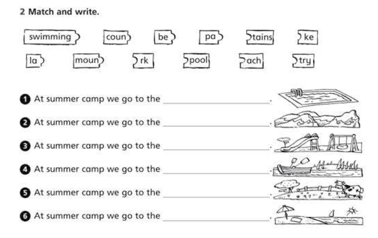

| Campo | Valor |
|--------|--------|
| **Fuente** | «2 Match and write.» (puzzle de sílabas + frase + dibujo) |
| **Bloque** | **Lugares** (mismos 6 que ej. 17) |
| **Categoría propuesta** | `places` |
| **Mecánica Aray** | (1) unir piezas tipo *swimming*+*pool* · (2) imagen → completar *At summer camp we go to the _____* |
| **Imágenes** | Reutilizar set places AFK |

### Frases (según dibujos)

| # | Lugar |
|---|--------|
| 1 | swimming pool |
| 2 | mountains |
| 3 | park |
| 4 | lake |
| 5 | country |
| 6 | beach |

Piezas: swimming/pool · coun/try · be/ach · pa/rk · moun/tains · la/ke

---

## Ejercicio 19 — *go to* / *in the summer*

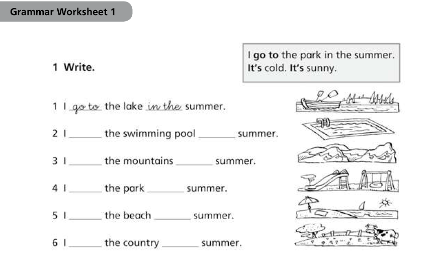

| Campo | Valor |
|--------|--------|
| **Fuente** | Grammar Worksheet 1 · «1 Write.» |
| **Bloque** | **Estructura** *I go to the X in the summer* + lugares |
| **Categoría propuesta** | `places` |
| **Mecánica Aray** | Imagen → completar dos huecos (*go to* · *in the*) o MCQ de frase |
| **Caja ejemplo** | También *It's cold / It's sunny* → semilla de categoría **`weather`** (aún no ejercitada) |

### Ítems (lugar por dibujo)

| # | Frase |
|---|--------|
| 1 | I go to the lake in the summer. |
| 2 | I go to the swimming pool in the summer. |
| 3 | I go to the mountains in the summer. |
| 4 | I go to the park in the summer. |
| 5 | I go to the beach in the summer. |
| 6 | I go to the country in the summer. |

---

## Ejercicio 20 — Ordenar: *go to … in the summer*

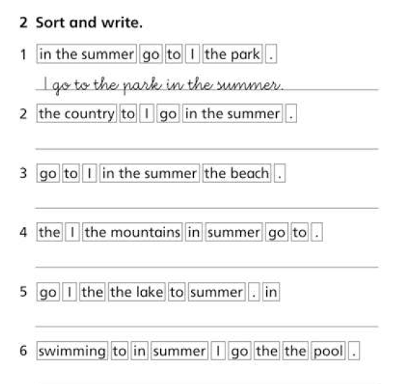

| Campo | Valor |
|--------|--------|
| **Fuente** | «2 Sort and write.» |
| **Bloque** | **Ordenar frase** (lugares + verano) |
| **Categoría propuesta** | `places` |
| **Mecánica Aray** | **Montar la frase** (chips) — como ej. 11 rutinas |

### Frases ordenadas

| # | Frase |
|---|--------|
| 1 | I go to the park in the summer. |
| 2 | I go to the country in the summer. |
| 3 | I go to the beach in the summer. |
| 4 | I go to the mountains in the summer. |
| 5 | I go to the lake in the summer. |
| 6 | I go to the swimming pool in the summer. |

---

## Ejercicio 21 — Paisajes · circle

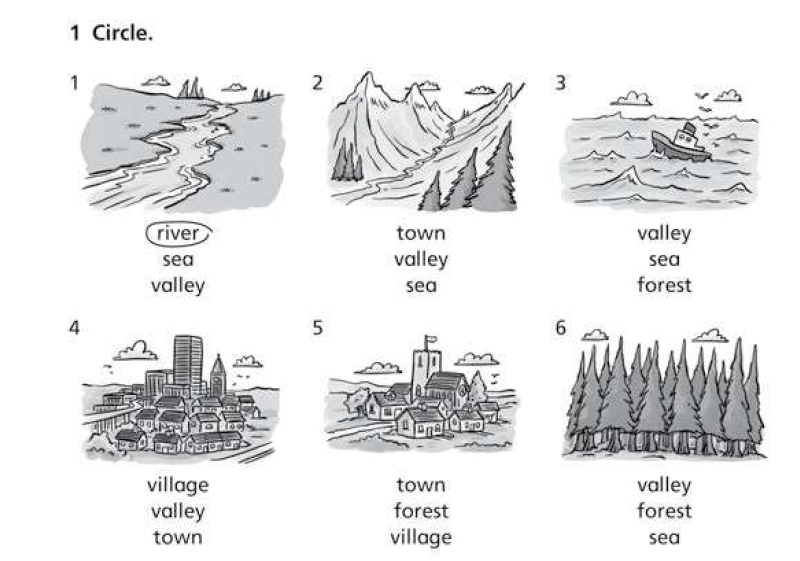

| Campo | Valor |
|--------|--------|
| **Fuente** | «1 Circle.» (imagen + 3 opciones) |
| **Bloque** | **Vocabulario** paisajes / asentamientos |
| **Categoría propuesta** | `places` (amplía banco; no solo campamento) |
| **Mecánica Aray** | picture → MCQ 3 opciones |
| **Imágenes** | AFK paisajes (no line-art ficha) |

### Lemas nuevos

| EN | ES | Correcto ficha |
|----|----|----------------|
| river | río | 1 |
| valley | valle | 2 |
| sea | mar | 3 |
| town | pueblo / ciudad pequeña | 4 |
| village | pueblo / aldea | 5 |
| forest | bosque | 6 |

Distractores del set: river, sea, valley, town, village, forest.

---

## Ejercicio 22 — Clima · *It's …*

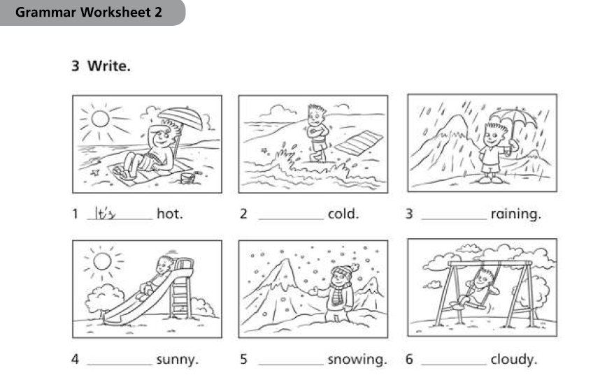

| Campo | Valor |
|--------|--------|
| **Fuente** | Grammar Worksheet 2 · «3 Write.» |
| **Bloque** | **Clima** (*It's hot / cold / raining / sunny / snowing / cloudy*) |
| **Categoría propuesta** | `weather` (deja de ser solo semilla) |
| **Mecánica Aray** | Imagen AFK → completar *It's _____* (MCQ) o arrastrar adjetivo/verbo al hueco |
| **Imágenes** | Escenas de clima estilo Aray (no clipart ficha) |

### Ítems

| # | Frase |
|---|--------|
| 1 | It's hot. |
| 2 | It's cold. |
| 3 | It's raining. |
| 4 | It's sunny. |
| 5 | It's snowing. |
| 6 | It's cloudy. |

### Lemas

| EN | ES |
|----|-----|
| hot | calor / caluroso |
| cold | frío |
| raining | lloviendo |
| sunny | soleado |
| snowing | nevando |
| cloudy | nublado |

---

## Ejercicio 23 — Circle: forma correcta

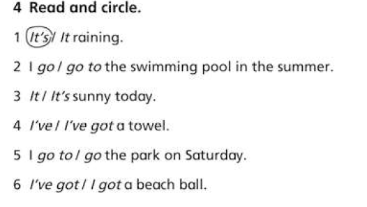

| Campo | Valor |
|--------|--------|
| **Fuente** | «4 Read and circle.» |
| **Bloque** | **Gramática ligera** (contracciones / *go to* / *I've got*) |
| **Categoría propuesta** | `grammar-basics` (**nueva**) — cruza weather + places + posesión |
| **Mecánica Aray** | MCQ 2 opciones (como antónimos/sílabas: elegir la forma buena) |

### Ítems (respuesta correcta)

| # | Frase |
|---|--------|
| 1 | It's raining. |
| 2 | I go to the swimming pool in the summer. |
| 3 | It's sunny today. |
| 4 | I've got a towel. |
| 5 | I go to the park on Saturday. |
| 6 | I've got a beach ball. |

### Lemas / chunks nuevos

| EN | ES |
|----|-----|
| I've got | tengo |
| towel | toalla |
| beach ball | pelota de playa |
| today | hoy |
| on Saturday | el sábado |

---

## Ejercicio 24 — Personajes de cuento · match

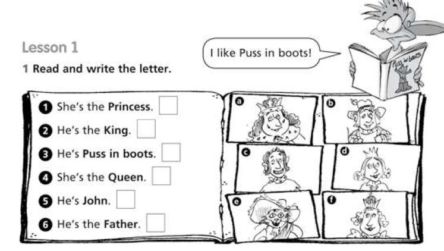

| Campo | Valor |
|--------|--------|
| **Fuente** | Lesson 1 · «1 Read and write the letter.» (*Puss in boots*) |
| **Bloque** | **Personajes** + *He's / She's the…* |
| **Categoría propuesta** | `stories` (**nueva**) |
| **Mecánica Aray** | **Arrastrar frase a retrato** AFK (mismo patrón match) |
| **Imágenes** | Retratos propios estilo Aray (no dibujos del cuaderno) |

### Pares (por tipología de la ficha)

| Frase | Letra típica | Personaje |
|-------|--------------|-----------|
| She's the Princess. | d | princesa |
| He's the King. | a | rey |
| He's Puss in boots. | e | el gato con botas |
| She's the Queen. | f | reina |
| He's John. | b o c | John |
| He's the Father. | b o c | el padre |

### Lemas

| EN | ES |
|----|-----|
| Princess | princesa |
| King | rey |
| Queen | reina |
| Puss in boots | El gato con botas |
| John | John |
| Father | padre |
| He's / She's | Él es / Ella es |

---

## Ejercicio 25 — *He's/She's wearing…*

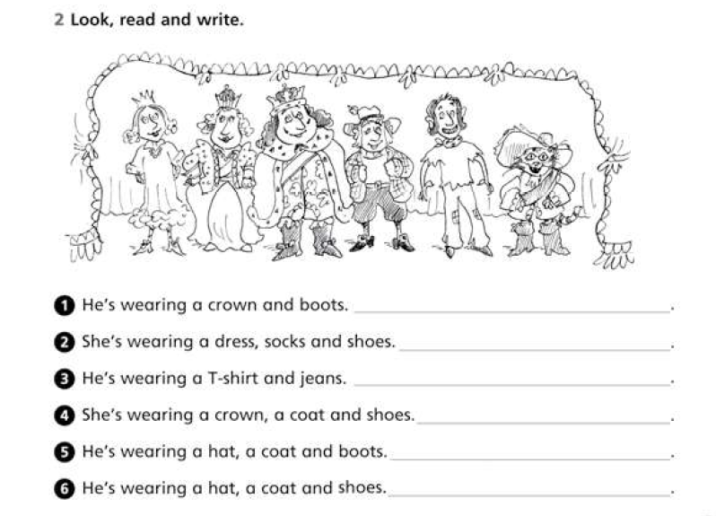

| Campo | Valor |
|--------|--------|
| **Fuente** | «2 Look, read and write.» (escenario con 6 personajes) |
| **Bloque** | **Ropa** + *He's/She's wearing…* + personajes del cuento |
| **Categoría propuesta** | `stories` ∩ **`clothes`** (`clothes` como vocabulario; frases sobre el cast) |
| **Mecánica Aray** | Escena/retrato → elegir quién encaja con la descripción *wearing…* (MCQ o tap) |

### Pares (descripción → personaje)

| Descripción | Personaje |
|-------------|-----------|
| He's wearing a crown and boots. | King |
| She's wearing a dress, socks and shoes. | Princess |
| He's wearing a T-shirt and jeans. | John |
| She's wearing a crown, a coat and shoes. | Queen |
| He's wearing a hat, a coat and boots. | Puss in boots |
| He's wearing a hat, a coat and shoes. | Father / John (aventurero) |

### Lemas ropa

| EN | ES |
|----|-----|
| crown | corona |
| boots | botas |
| dress | vestido |
| socks | calcetines |
| shoes | zapatos |
| coat | abrigo / capa |
| hat | sombrero |
| T-shirt | camiseta |
| jeans | vaqueros |
| wearing | lleva puesto |

---

## Ejercicio 26 — Circle *He's / She's*

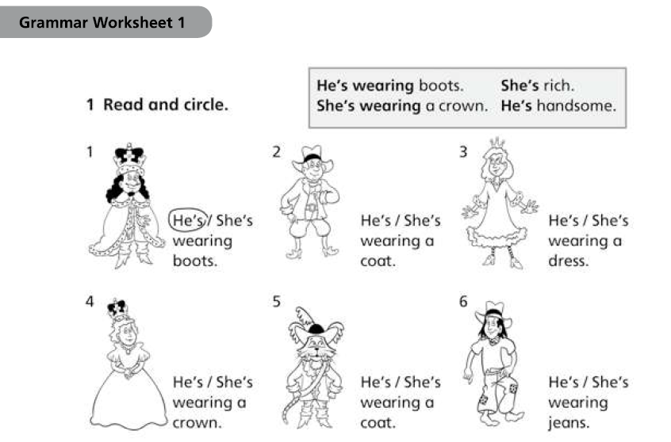

| Campo | Valor |
|--------|--------|
| **Fuente** | Grammar Worksheet 1 · «1 Read and circle.» |
| **Bloque** | **Pronombre** *He's / She's* + *wearing* + ropa |
| **Categoría propuesta** | `clothes` / `grammar-basics` (he/she) + personajes `stories` |
| **Mecánica Aray** | Imagen → MCQ *He's* / *She's* |
| **Caja ejemplo** | Also *She's rich* / *He's handsome* → adjetivos (semilla) |

### Ítems (correcto)

| # | Frase |
|---|--------|
| 1 | He's wearing boots. |
| 2 | He's wearing a coat. |
| 3 | She's wearing a dress. |
| 4 | She's wearing a crown. |
| 5 | He's wearing a coat. (Puss) |
| 6 | He's wearing jeans. |

---

## Ejercicio 27 — Write *He's/She's wearing*

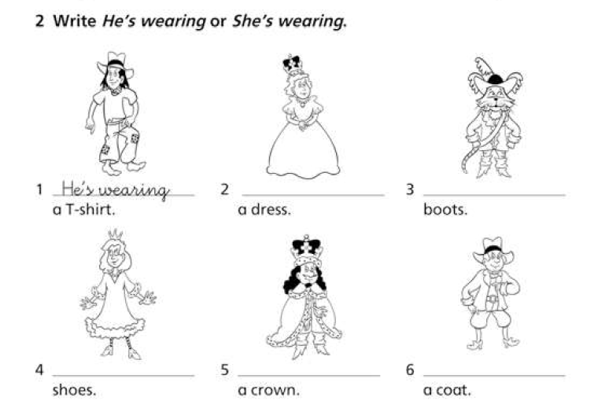

| Campo | Valor |
|--------|--------|
| **Fuente** | «2 Write *He's wearing* or *She's wearing*.» |
| **Bloque** | Misma gramática que ej. 26; completar el chunk entero delante del ítem de ropa |
| **Categoría propuesta** | `clothes` + `stories` |
| **Mecánica Aray** | Imagen → MCQ *He's wearing* / *She's wearing* (el objeto ya viene dado) |

### Ítems

| # | Frase completa |
|---|----------------|
| 1 | He's wearing a T-shirt. |
| 2 | She's wearing a dress. |
| 3 | He's wearing boots. |
| 4 | She's wearing shoes. |
| 5 | He's wearing a crown. |
| 6 | He's wearing a coat. |

---

## Ejercicio 28 — *He's/She's* + adjetivo

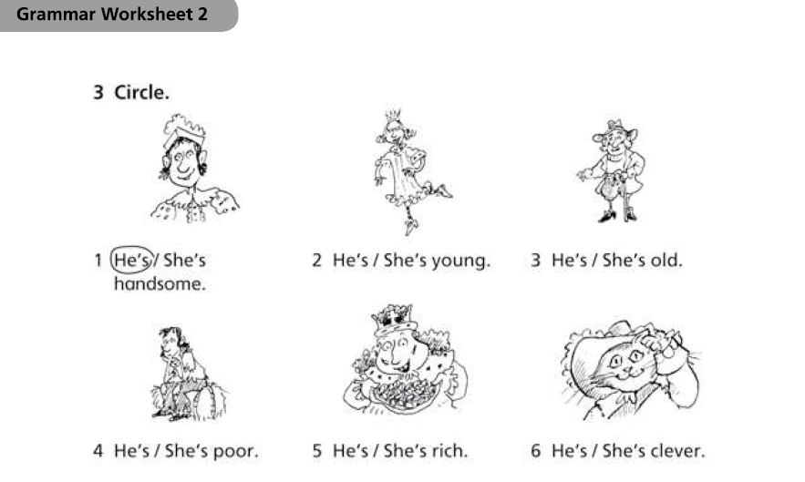

| Campo | Valor |
|--------|--------|
| **Fuente** | Grammar Worksheet 2 · «3 Circle.» |
| **Bloque** | **Adjetivos** de persona + *He's / She's* |
| **Categoría propuesta** | `adjectives` (**nueva**) · sigue el cast de `stories` |
| **Mecánica Aray** | Imagen → MCQ *He's* / *She's* (adjetivo dado) |

### Ítems

| # | Frase |
|---|--------|
| 1 | He's handsome. |
| 2 | She's young. |
| 3 | He's old. |
| 4 | He's poor. |
| 5 | He's rich. |
| 6 | He's clever. |

### Lemas

| EN | ES |
|----|-----|
| handsome | guapo |
| young | joven |
| old | viejo / mayor |
| poor | pobre |
| rich | rico |
| clever | listo / inteligente |

---

## Ejercicio 29 — Write *He's / She's* + adj

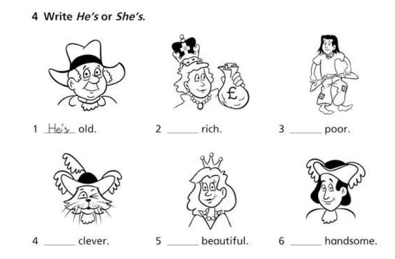

| Campo | Valor |
|--------|--------|
| **Fuente** | «4 Write *He's* or *She's*.» |
| **Bloque** | Misma familia que ej. 28; completar *He's/She's* delante del adjetivo |
| **Categoría propuesta** | `adjectives` |
| **Mecánica Aray** | Imagen → MCQ *He's* / *She's* |
| **Lema nuevo** | beautiful |

### Ítems

| # | Frase |
|---|--------|
| 1 | He's old. |
| 2 | She's rich. |
| 3 | He's poor. |
| 4 | He's clever. |
| 5 | She's beautiful. |
| 6 | He's handsome. |

---

## Ejercicio 30 — There is / There are

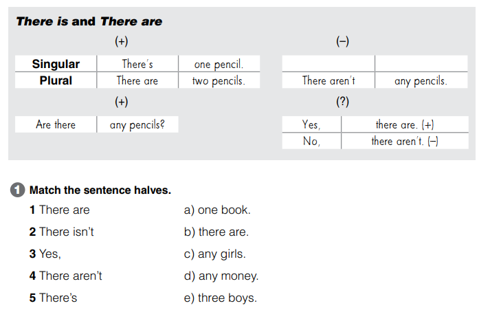

| Campo | Valor |
|--------|--------|
| **Fuente** | Grammar · «There is and There are» + «1 Match the sentence halves.» |
| **Bloque** | **Gramática** existencia (*There's / There are / isn't / aren't / Are there…?*) |
| **Categoría propuesta** | `there-is` (**nueva**) |
| **Mecánica Aray** | Emparejar mitades de frase (como Empareja) |
| **Ayuda (como Lengua)** | **Sí — obligatorio.** Tip muted siempre visible bajo el prompt (patrón Clasifica / Monta frase / MCQ `help`·`tip`). No botón «?». Resumen: There's = 1 · There are = 2+ · There aren't any · Yes/No, there are/aren't. |

### Tabla de ayuda (contenido del tip)

| | Singular | Plural |
|--|----------|--------|
| + | There's one pencil. | There are two pencils. |
| − | There isn't… | There aren't any pencils. |
| ? | — | Are there any pencils? → Yes, there are. / No, there aren't. |

### Match (mitades)

| Inicio | Final |
|--------|--------|
| There are | three boys. |
| There isn't | any money. |
| Yes, | there are. |
| There aren't | any girls. |
| There's | one book. |

### Nota de producto

En Lengua el tip va como texto muted (`clasifica-hint`, `monta-frase-hint`, `palabras-mcq-why__tip`). **Inglés igual** al montar modos: campo `help` / `tip` por ronda.

---

## Ejercicio 31 — Completar There is / are

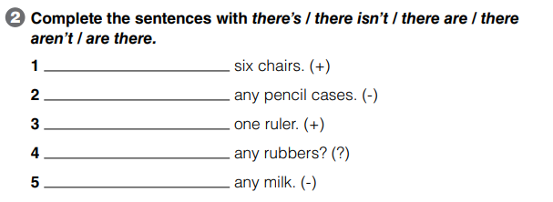

| Campo | Valor |
|--------|--------|
| **Fuente** | «2 Complete the sentences with *there's / there isn't / there are / there aren't / are there.*» |
| **Bloque** | **Gramática** existencia (relleno con pista +/−/?) |
| **Categoría propuesta** | `there-is` |
| **Mecánica Aray** | Fill / chips: elegir forma según número (+/−/?) · tip ayuda (como ej. 30) |
| **Ayuda** | Mismo tip muted que ej. 30 |

### Ítems (+ clave)

| # | Pista | Completar | Forma |
|---|-------|-----------|-------|
| 1 | six chairs (+) | There are | plural + |
| 2 | any pencil cases (−) | There aren't | plural − |
| 3 | one ruler (+) | There's | singular + |
| 4 | any rubbers? (?) | Are there | plural ? |
| 5 | any milk (−) | There isn't | singular/uncountable − |

### Nota

Mecánica distinta al match del ej. 30 (aquí **elegir forma**), misma categoría y mismo tip de ayuda.

---

## Ejercicio 32 — Are there any…? (preguntas + Yes/No)

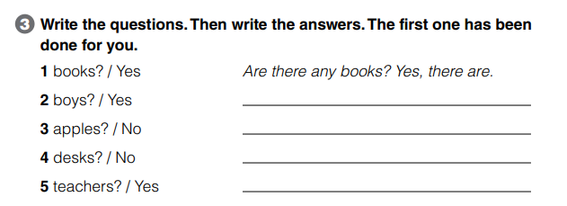

| Campo | Valor |
|--------|--------|
| **Fuente** | «3 Write the questions. Then write the answers. The first one has been done for you.» |
| **Bloque** | **Gramática** existencia (interrogativa + short answer) |
| **Categoría propuesta** | `there-is` |
| **Mecánica Aray** | Prompt noun + Yes/No → escribir/elegir pregunta + respuesta corta · tip ayuda |
| **Ayuda** | Mismo tip muted (Are there…? → Yes, there are. / No, there aren't.) |

### Ítems (+ clave)

| # | Prompt | Pregunta | Respuesta |
|---|--------|----------|-----------|
| 1 | books? / Yes | Are there any books? | Yes, there are. *(ejemplo)* |
| 2 | boys? / Yes | Are there any boys? | Yes, there are. |
| 3 | apples? / No | Are there any apples? | No, there aren't. |
| 4 | desks? / No | Are there any desks? | No, there aren't. |
| 5 | teachers? / Yes | Are there any teachers? | Yes, there are. |

---

## Ejercicio 33 — How many…? / There are

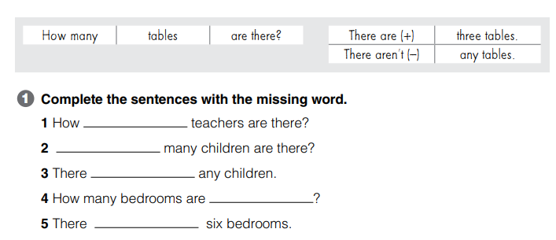

| Campo | Valor |
|--------|--------|
| **Fuente** | Caja «How many tables are there?» + «1 Complete the sentences with the missing word.» |
| **Bloque** | **Gramática** cantidad (*How many… are there?*) + *There are / aren't* |
| **Categoría propuesta** | `there-is` (amplía con *How many*) |
| **Mecánica Aray** | Fill palabra faltante · tip ayuda ampliado |
| **Ayuda** | Tip muted: How many + N + are there? · There are + número · There aren't any… |

### Tabla de ayuda (extra)

| | |
|--|--|
| ? | How many tables are there? |
| + | There are three tables. |
| − | There aren't any tables. |

### Ítems (+ clave)

| # | Hueco | Respuesta |
|---|-------|-----------|
| 1 | How ______ teachers are there? | many |
| 2 | ______ many children are there? | How |
| 3 | There ______ any children. | aren't |
| 4 | How many bedrooms are ______? | there |
| 5 | There ______ six bedrooms. | are |

---

## Ejercicio 34 — Ordenar How many…?

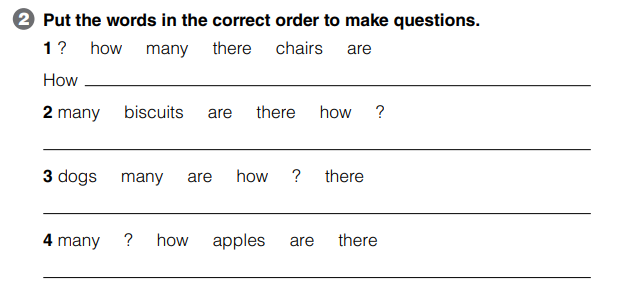

| Campo | Valor |
|--------|--------|
| **Fuente** | «2 Put the words in the correct order to make questions.» |
| **Bloque** | **Gramática** *How many* + orden de palabras |
| **Categoría propuesta** | `there-is` |
| **Mecánica Aray** | Order-sentence / montar frase (como rutinas) · tip ayuda |
| **Ayuda** | Tip: How many + N + are there? |

### Ítems (+ clave)

| # | Piezas | Frase |
|---|--------|-------|
| 1 | ? how many there chairs are *(empieza How)* | How many chairs are there? |
| 2 | many biscuits are there how ? | How many biscuits are there? |
| 3 | dogs many are how ? there | How many dogs are there? |
| 4 | many ? how apples are there | How many apples are there? |

---

## Ejercicio 35 — How many + imagen

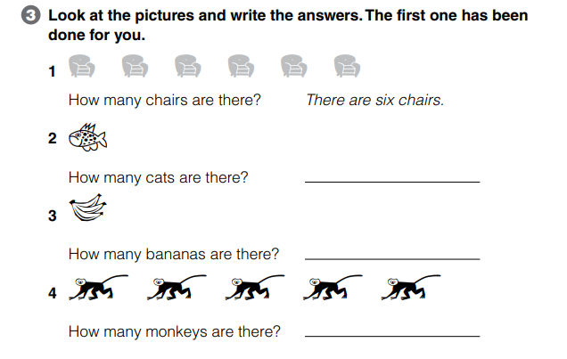

| Campo | Valor |
|--------|--------|
| **Fuente** | «3 Look at the pictures and write the answers. The first one has been done for you.» |
| **Bloque** | **Gramática** *How many* + respuesta con imagen |
| **Categoría propuesta** | `there-is` |
| **Mecánica Aray** | Picture → write/choose *There are N…* / *There aren't any…* · tip ayuda |
| **Ayuda** | Tip: There are + número · There aren't any (si no hay) |
| **Nota asset** | Estilo Aray (no clipart del cuaderno); contar objetos en escena |

### Ítems (+ clave)

| # | Escena | Pregunta | Respuesta |
|---|--------|----------|-----------|
| 1 | 6 sillas | How many chairs are there? | There are six chairs. *(ejemplo)* |
| 2 | 1 pez *(no hay gatos)* | How many cats are there? | There aren't any cats. |
| 3 | 3 plátanos | How many bananas are there? | There are three bananas. |
| 4 | 5 monos | How many monkeys are there? | There are five monkeys. |

### Nota didáctica

El ítem 2 es trampa deliberada (pregunta *cats*, imagen *fish*) → fuerza *There aren't any*.

---

## Ejercicio 36 — Possessive 's (+ his / her)

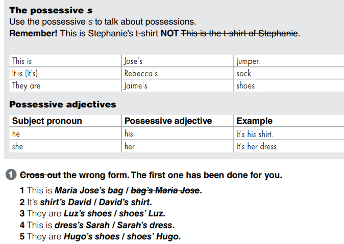

| Campo | Valor |
|--------|--------|
| **Fuente** | Cajas «The possessive s» + «Possessive adjectives» + «1 Cross out the wrong form.» |
| **Bloque** | **Gramática** posesión (*Name's* + *his/her*) |
| **Categoría propuesta** | `possessives` (**nueva**) |
| **Mecánica Aray** | 2-option MCQ (tachar / elegir forma correcta) · tip ayuda |
| **Ayuda (como Lengua)** | Tip muted: Stephanie's t-shirt (no *the t-shirt of…*) · he→his · she→her |

### Tabla de ayuda

| | |
|--|--|
| 's | This is Jose's jumper. / It's Rebecca's sock. / They are Jaime's shoes. |
| his | he → his · It's his shirt. |
| her | she → her · It's her dress. |

### Ítems (+ clave)

| # | Opciones | Correcta |
|---|----------|----------|
| 1 | Maria Jose's bag / bag's Maria Jose | Maria Jose's bag *(ejemplo)* |
| 2 | shirt's David / David's shirt | David's shirt |
| 3 | Luz's shoes / shoes' Luz | Luz's shoes |
| 4 | dress's Sarah / Sarah's dress | Sarah's dress |
| 5 | Hugo's shoes / shoes' Hugo | Hugo's shoes |

---

## Ejercicio 37 — Preposiciones de lugar (on / in / under)

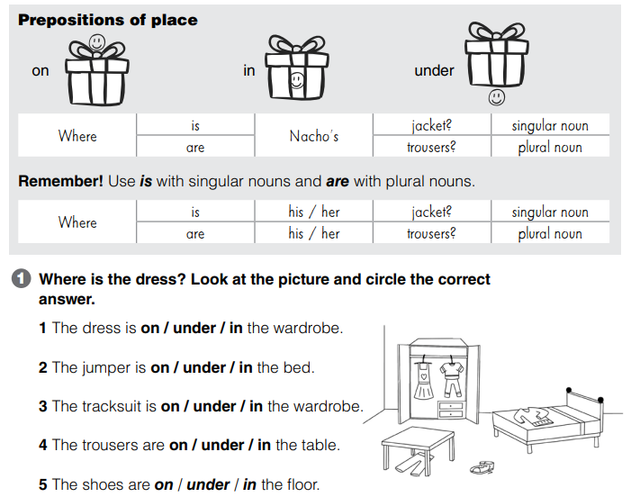

| Campo | Valor |
|--------|--------|
| **Fuente** | Caja «Prepositions of place» + «Where is/are…?» + «1 Where is the dress? … circle the correct answer.» |
| **Bloque** | **Gramática** lugar (*on/in/under*) + *is/are* singular·plural · puente a *possessives* |
| **Categoría propuesta** | `prepositions` (**nueva**) |
| **Mecánica Aray** | Escena habitación (estilo Aray) → circle *on/in/under* · tip ayuda |
| **Ayuda** | Tip: on / in / under (iconos) · is + singular · are + plural · Where is Nacho's jacket? / Where are his trousers? |

### Tabla de ayuda

| Prep | Idea |
|------|------|
| on | encima |
| in | dentro |
| under | debajo |

| | Singular | Plural |
|--|----------|--------|
| Where | is … jacket? | are … trousers? |
| his/her | Where is his/her jacket? | Where are his/her trousers? |

### Ítems (+ clave)

| # | Frase | Prep |
|---|-------|------|
| 1 | The dress is … the wardrobe. | in |
| 2 | The jumper is … the bed. | on |
| 3 | The tracksuit is … the wardrobe. | in |
| 4 | The trousers are … the table. | under |
| 5 | The shoes are … the floor. | on |

### Vocab escena

wardrobe, bed, table, dress, jumper, tracksuit, trousers, shoes.

---

## Categorías propuestas (mapa)

| ID tentativo | Título ES | Tema | Ítems | Mecánicas sugeridas | Estado |
|--------------|-----------|------|-------|---------------------|--------|
| `food` | Comida | Vocabulario food + preferencias (+ *but*) | ~14 lemas (ej. 01–04) | meaning, translate, like-mcq, picture | borrador |
| `abilities` | Puedo / deportes | *can/can't* + chunks + he/she | ~12 actividades (ej. 05–08) | drag-to-image, fill-activity, can-yn | borrador |
| `routines` | Rutinas | Día a día + higiene + *at* + hora | ~15 chunks (ej. 09–11, 13–14, 16) | drag-to-image, picture, order-sentence, missing, routine+time | borrador |
| `time` | ¿Qué hora es? | *What time…?* + *Is it…?* Yes/No | ej. 12, 15–16 | clock-ui + EN phrases + yn | borrador |
| `places` | Lugares | campamento + paisajes | ~12 lemas (ej. 17–21) | drag-to-image, picture, join-parts, order-sentence | borrador |
| `weather` | Tiempo (clima) | *It's hot/cold/sunny…* | 6 (ej. 22) | picture, fill *It's …* | borrador |
| `grammar-basics` | Formas | It's / go to / I've got / He's·She's | ej. 23, 26–29 | 2-option MCQ | borrador |
| `stories` | Cuentos | Personajes + *wearing* + adjetivos | ej. 24–29 | drag-to-portrait, who-wearing, he/she | borrador |
| `clothes` | Ropa | crown, boots, dress… | ~9 lemas (ej. 25–27) | picture, wearing-match, he/she | borrador |
| `adjectives` | Adjetivos | handsome, young, old, poor, rich, clever, beautiful | 7 (ej. 28–29) | he/she + adj MCQ | borrador |
| `there-is` | There is / are | Existencia + *How many* (+ tip) | ej. 30–35 | match, fill, Q+YN, order, picture count + **help tip** | borrador |
| `possessives` | Posesión | *'s* + *his/her* (+ tip) | ej. 36 | 2-option MCQ + **help tip** | borrador |
| `prepositions` | Preposiciones | *on/in/under* + Where is/are | ej. 37 | picture circle prep + **help tip** | borrador |

## Cómo añadir un lote

1. Guardar fichas en `_inbox/` (capturas en `_inbox/refs/`).
2. Extraer ítems (palabra EN, glosa ES, notas).
3. Asignar **categoría propuesta** (fila nueva o ampliación).
4. No implementar hub/JSON hasta acuerdo explícito.

## Archivo (referencia, no runtime)

Packs frozen antiguos (fuera del hub):

- `ingles-colours-numbers` — Colours / Numbers
- `ingles-school` — Places / People / Objects
- `ingles-family` — Family group / Core / Extended

Ver `feinetas/Ingles/_archivo/` y MD en `feinetas/editorial/INGLES_*.md`.
