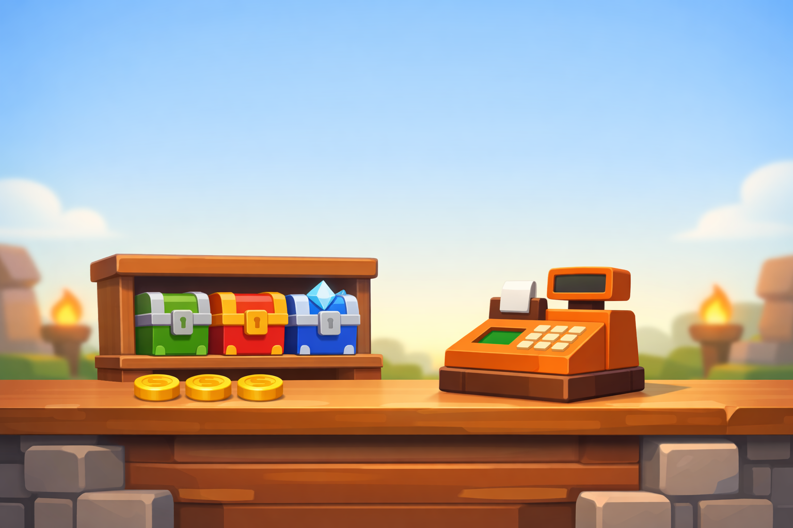

# Fitxa 3 · Doble i triple

**Àrea:** Matemàtiques · **Idioma:** català · **3r primària**
**BEX:** MAT-008 · **Dificultat:** ⭐⭐

---

**Nom:** _______________________  **Data:** _______________  **Fitxa 3**

---

---

## Taula del doble i el triple

Completa la taula. El **doble** és sumar el nombre dues vegades. El **triple** és sumar-lo tres vegades.

| Nombre | Doble | Triple |
|:------:|:-----:|:------:|
| **4** | ______ | ______ |
| **6** | ______ | ______ |
| **9** | ______ | ______ |

---

## Monedes a la botiga

A la botiga del joc, un cofre costa **6** monedes.

1. Quantes monedes costen **2** cofres? (és el doble de 6) ______ monedes

2. Quantes monedes costen **3** cofres? (és el triple de 6) ______ monedes

3. Aray té **20** monedes. Vol comprar **3** cofres. En té prou? Explica amb una frase curta.

   _________________________________________________________________

---

**Recorda:** El doble de 6 és 6 + 6. El triple de 6 és 6 + 6 + 6.
