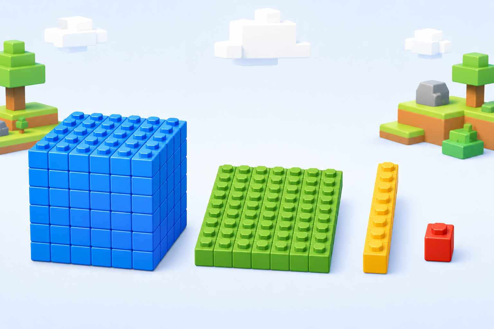

# Fitxa 4 · Valor posicional

**Àrea:** Matemàtiques · **Idioma:** català · **3r primària**
**BEX:** MAT-003 · **Dificultat:** ⭐⭐

---

**Nom:** _______________________  **Data:** _______________  **Fitxa 4**

---

---

## Descomposició d'un nombre

Descompon cada nombre en **unitats de millar (UM) + centenes (C) + desenes (D) + unitats (U)**.

| Nombre | Descomposició |
|:------:|:-------------|
| **3.472** | ______ UM + ______ C + ______ D + ______ U |
| **5.806** | ______ UM + ______ C + ______ D + ______ U |
| **2.095** | ______ UM + ______ C + ______ D + ______ U |

---

## Què val cada bloc?

1. Al nombre **4.318**, quantes **centenes** hi ha? ______

2. Al nombre **4.318**, quantes **unitats** hi ha? ______

3. Escriu amb xifres el nombre que té **2** milers, **0** centenes, **7** desenes i **4** unitats: ______

---

**Recorda:** Cada xifra val el que indica la seva posició: UM, C, D o U.
