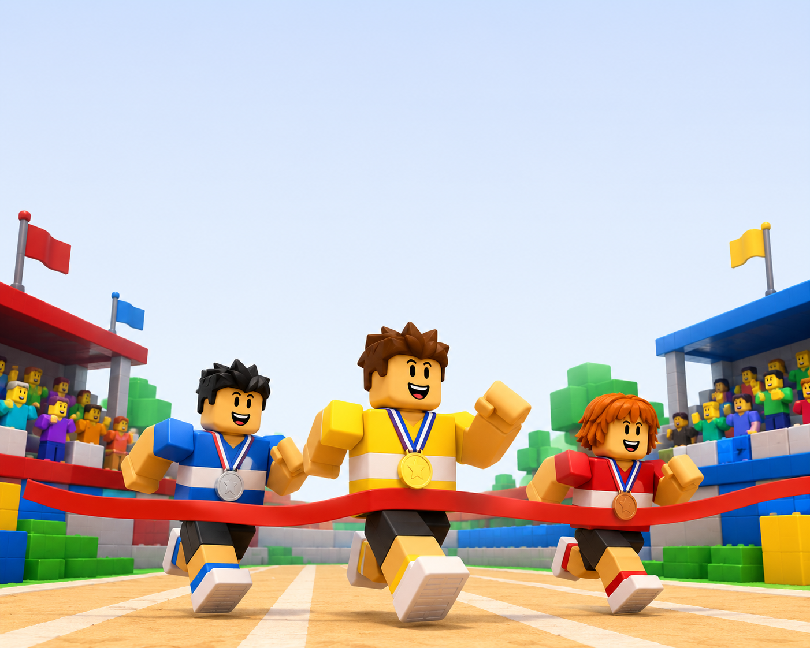

# Fitxa 6 · Ordinals

**Àrea:** Matemàtiques · **Idioma:** català · **3r primària**
**BEX:** MAT-002 · **Dificultat:** ⭐⭐

---

**Nom:** _______________________  **Data:** _______________  **Fitxa 6**

---

---

## Carrera de l'arena

A l'**Arena de Cuchillos** hi ha una cursa entre tres jugadors. L'ordre d'arribada és:

1. **Eric** (primer)
2. **Sara** (segon)
3. **Axel** (tercer)

Respon amb la paraula ordinal (**primer**, **segon**, **tercer**, **quart**…):

| Pregunta | Resposta |
|:---------|:---------|
| Qui ha arribat en **primer** lloc? | _______________________ |
| Qui ha arribat en **segon** lloc? | _______________________ |
| Qui ha arribat en **tercer** lloc? | _______________________ |
| En quin lloc ha arribat l'**Axel**? | _______________________ |

---

## La fila d'entrada

Quatre jugadors esperen per entrar a l'arena. De dreta a esquerra: **Maria** (1a), **Joan** (2n), **Laura** (3a), **Pau** (4t).

1. Qui és el **tercer** de la fila? _______________________

2. Qui és el **primer** de la fila? _______________________

---

## El rellotge del vestíbul

Aray mira el rellotge de la sala abans de jugar. La **petita** agulla apunta al **9** i la **gran** apunta al **12**.

1. Quina hora és? ______ en punt

2. Si el partit comença una hora després, a quina hora comença? ______ en punt

---

**Recorda:** Els ordinals indiquen la posició: 1r, 2n, 3r, 4t… No confonguis «tercer» amb el nombre 3.
