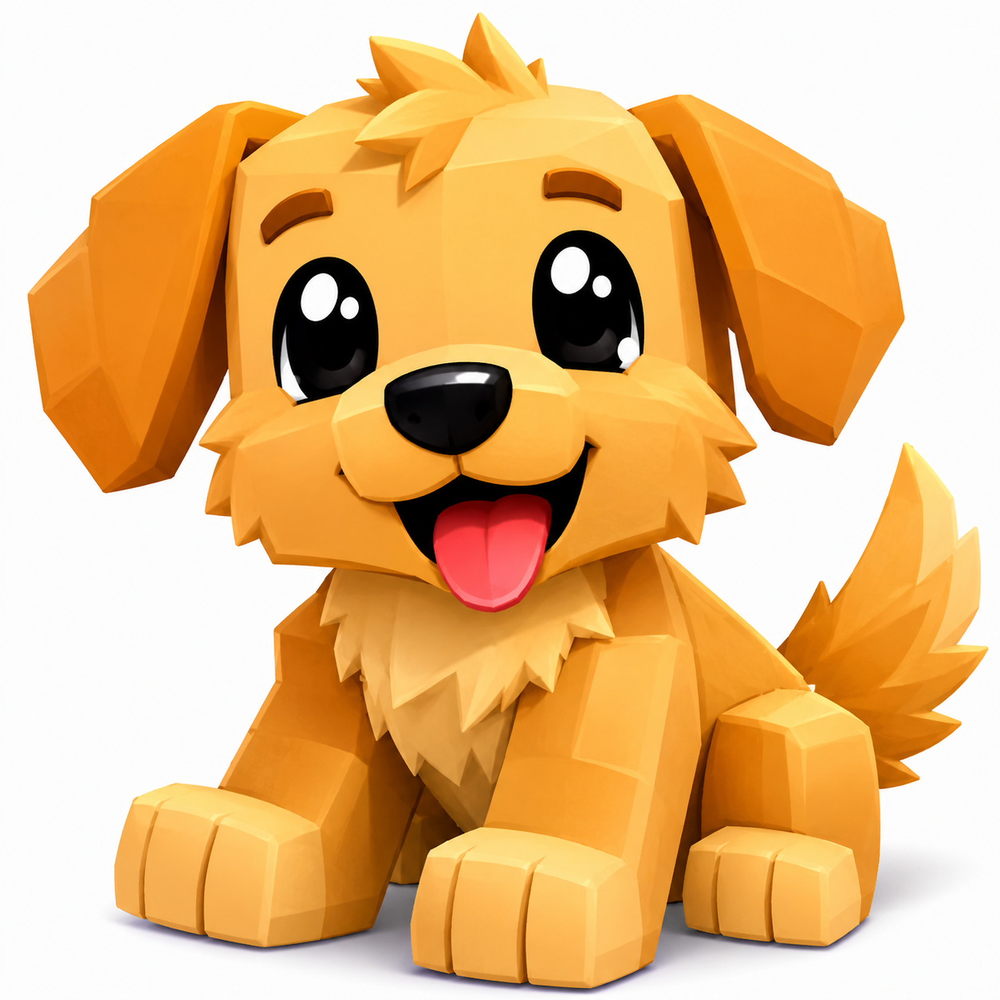

# Fitxa 8 · Comprensión y adjetivos

**Àrea:** Llengua castellana · **Idioma:** castellà · **3r primària**
**BEX:** LES-008 · **Dificultat:** ⭐⭐

---

**Nom:** _______________________  **Data:** _______________  **Fitxa 8**

---

## Lee el texto

**El cachorro de bloques**

En un mundo de Roblox lleno de cubos de colores, Aray encontró un cachorro pequeño hecho de bloques dorados. Tenía orejas puntiagudas, una cola corta y ojos brillantes que parecían dos estrellas. El animalito corría rápido entre los árboles cuadrados del bosque pixelado. Cuando Aray le acarició la cabeza, el cachorro movió la cola con alegría y soltó un ladrido suave. «Te llamaré Pixel», dijo Aray, y el cachorro dorado lo siguió hasta la entrada del campamento.

---

## Responde

1. ¿De qué material parece hecho el cachorro?  
   _______________________________________________

2. ¿Cómo son las orejas del cachorro?  
   _______________________________________________

3. ¿Qué nombre le puso Aray?  
   _______________________________________________

4. ¿Adónde lo siguió el cachorro?  
   _______________________________________________

---

## Rodea los adjetivos

**Vuelve a leer el texto. Rodea con un círculo todos los adjetivos (palabras que describen cómo es algo o alguien).**

---

**Recorda:** El adjetivo describe al sustantivo (pequeño, dorado, rápido…) · Lee despacio palabra por palabra · No rodees los nombres de personas o animales.
