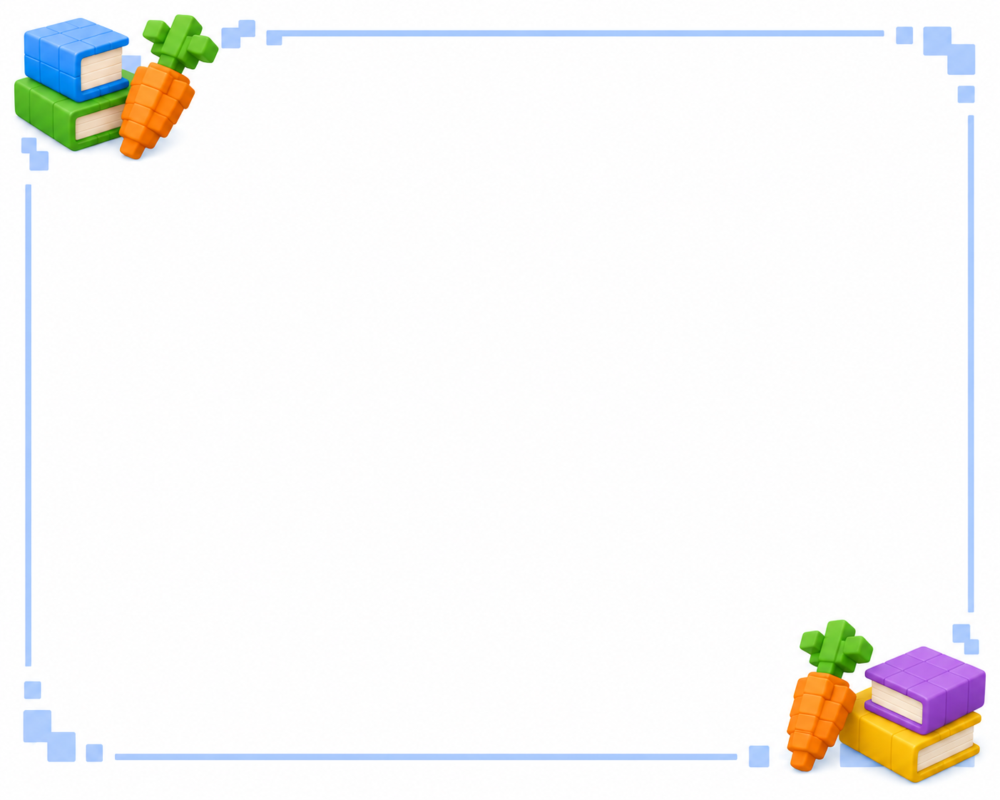

# Fitxa 03 · La r i la rr

**Àrea:** Llengua catalana · **Idioma:** català · **3r primària**  
**BEX:** CAT-008 · **Dificultat:** ⭐⭐

---

**Nom:** _______________________  **Data:** _______________  **Fitxa 03**

> *(Decoració opcional a la cantonada.)*

---

## Completa amb **r** o **rr**

1. Ha__ia un esqui__ol al bosc del joc.  
2. Fe__ co__e pel camí de l'arena.  
3. La ma__xa del cofre era ve__ella.  
4. El pe__ot va pe__seguir la pilota.  
5. La ca__e__a del mapa era llarga.  
6. El jugado__ va guanya__ la medalla.  
7. Va__em cap al campament abans de la pluja.  
8. El ti__e va cau__e a terra.

---

**Recorda:** Entre dues vocals sovint cal **rr** (pe**rr**ot, ca**rr**era). Escolta el so abans d'escriure.

---
