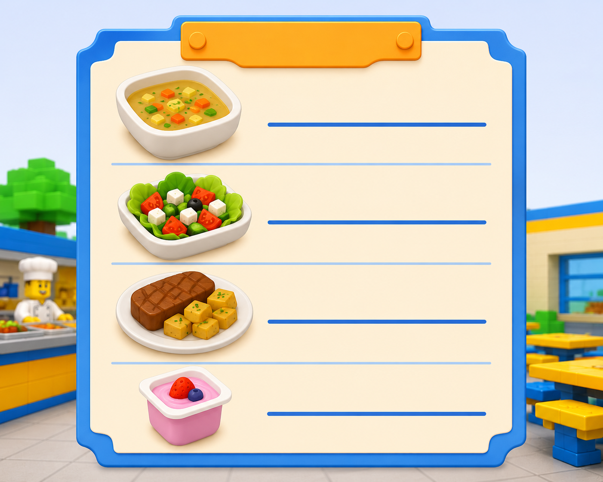

# Fitxa 05 · Gènere dels substantius

**Àrea:** Llengua catalana · **Idioma:** català · **3r primària**  
**BEX:** CAT-004 · **Dificultat:** ⭐⭐

---

**Nom:** _______________________  **Data:** _______________  **Fitxa 05**

---

> *(Si encara no hi ha la imatge, es pot imprimir sense ella.)*

---

## A) Escriu: **masc.** o **fem.**

| Paraula | Gènere |
|---------|--------|
| consomé | _______________ |
| ensalada | _______________ |
| carn | _______________ |
| iogurt | _______________ |
| pa | _______________ |
| sopa | _______________ |

---

## B) Escriu el femení

1. jugador → _______________  
2. guanyador → _______________  
3. pobre → _______________  

---

**Recorda:** Molts substantius en **-a** són femenins (ensalada, sopa). Però no tots: «el mapa», «el problema».

---
