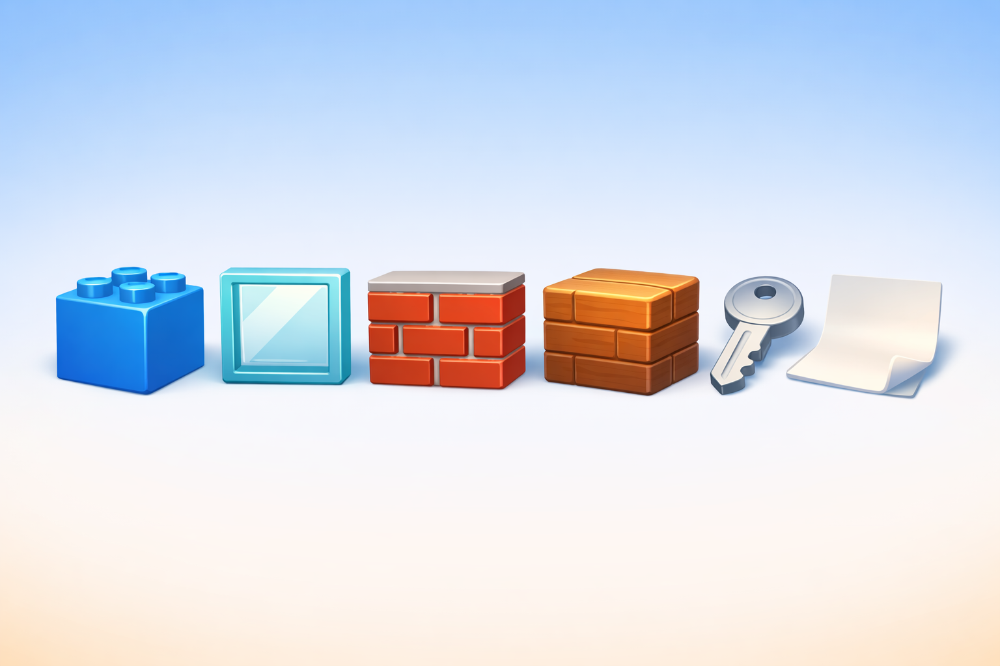

# Fitxa 01 · Materials

**Àrea:** Coneixement del medi · **Idioma:** català · **3r primària**  
**BEX:** MED-008 · **Dificultat:** ⭐⭐

---

**Nom:** _______________________  **Data:** _______________  **Fitxa 01**

---

> *(Si encara no hi ha la imatge, es pot imprimir sense ella.)*

---

## A) De què està fet?

Completa amb les paraules del quadre:

> vidre · maó · fusta · metall · paper

| Objecte de l'arena | Material |
|--------------------|----------|
| 1. Finestra | ___ |
| 2. Paret gruixuda | ___ |
| 3. Cadira del control | ___ |
| 4. Clau daurada | ___ |
| 5. Cartell del mapa | ___ |

---

## B) Propietats dels materials

Relaciona cada material amb la seva propietat principal. Escriu la lletra.

| Material | Propietat |
|----------|-----------|
| Vidre | A) Opac i molt dur |
| Maó | B) Transparent |
| Paper | C) Es pot doblegar amb facilitat |

Vidre ___ · Maó ___ · Paper ___

---

**Recorda:** Mira l'objecte abans de respondre · Un material pot tenir més d'una propietat, però tria la principal.
