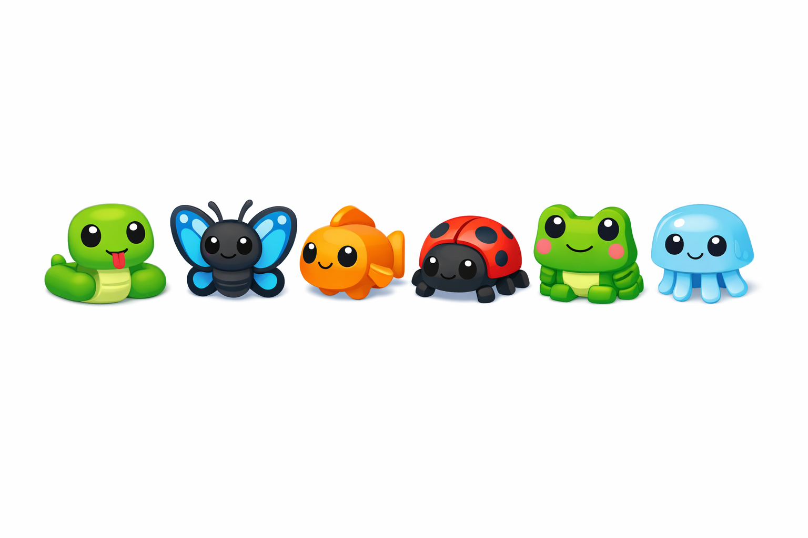

# Fitxa 03 · Vertebrats i invertebrats

**Àrea:** Coneixement del medi · **Idioma:** català · **3r primària**  
**BEX:** MED-009 · **Dificultat:** ⭐⭐

---

**Nom:** _______________________  **Data:** _______________  **Fitxa 03**

---

> *(Si encara no hi ha la imatge, es pot imprimir sense ella.)*

---

## Classifica els animals

Escriu **V** si és vertebrat o **I** si és invertebrat.

| Animal | V / I |
|--------|-------|
| 1. Serp | ___ |
| 2. Papallona | ___ |
| 3. Peix | ___ |
| 4. Escarabat | ___ |
| 5. Granota | ___ |
| 6. Medusa | ___ |

---

## Pregunta curta

Cita un animal **invertebrat** de la taula i explica per què ho és (una frase).

_______________________________________________

_______________________________________________

---

**Recorda:** Els vertebrats tenen **columna vertebral** (esquelet intern amb ossos).
