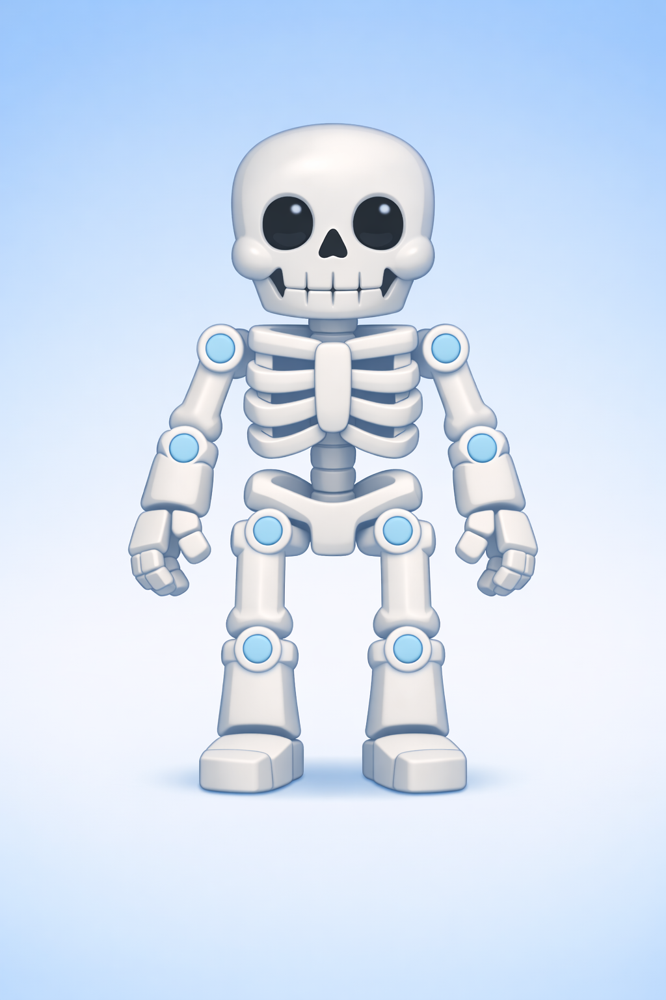

# Fitxa 04 · L'aparell locomotor

**Àrea:** Coneixement del medi · **Idioma:** català · **3r primària**  
**BEX:** MED-002 · **Dificultat:** ⭐⭐

---

**Nom:** _______________________  **Data:** _______________  **Fitxa 04**

---

> *(Si encara no hi ha la imatge, es pot imprimir sense ella.)*

---

## A) Marca amb una X

Quines paraules pertanyen a l'**aparell locomotor**?

- [ ] ossos  
- [ ] músculs  
- [ ] articulacions  
- [ ] estómac  
- [ ] orelles  
- [ ] columna vertebral  

---

## B) Verdader o fals

Escriu **V** o **F**.

| Afirmació | V / F |
|-----------|-------|
| 1. Els músculs permeten moure el cos. | ___ |
| 2. L'estómac és un os del braç. | ___ |
| 3. Les articulacions uneixen els ossos. | ___ |
| 4. Els ossos donen suport al cos. | ___ |

---

**Recorda:** L'aparell locomotor està format per **ossos**, **músculs**, **articulacions** i **columna vertebral**.
