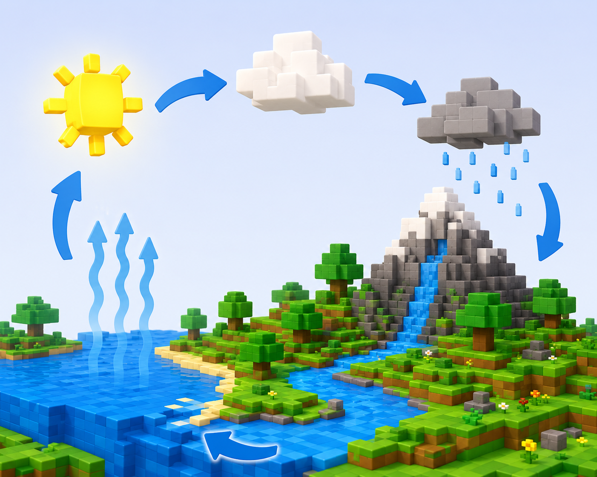

# Fitxa 08 · El cicle de l'aigua

**Àrea:** Coneixement del medi · **Idioma:** català · **3r primària**  
**BEX:** MED-010 · **Dificultat:** ⭐⭐

---

**Nom:** _______________________  **Data:** _______________  **Fitxa 08**

---

> *(Si encara no hi ha la imatge, es pot imprimir sense ella.)*

---

## A) Ordena les etapes

Escriu del **1** al **4**.

| | Etapa |
|---|-------|
| ___ | La aigua cau en forma de pluja o neu |
| ___ | La aigua de rius i mars s'evapora pel sol |
| ___ | L'aigua recollida forma rius i llacs |
| ___ | El vapor forma núvols |

---

## B) Relaciona paraula i etapa

| Paraula | Etapa |
|---------|-------|
| Evaporació | A) Formació de núvols |
| Precipitació | B) L'aigua torna al mar o al riu |
| Condensació | C) El sol escalfa l'aigua |
| Acumulació | D) Pluja o neu |

Evaporació ___ · Precipitació ___ · Condensació ___ · Acumulació ___

---

**Recorda:** El sol escalfa l'aigua → es forma vapor → núvols → pluja → torna als rius i mars.
