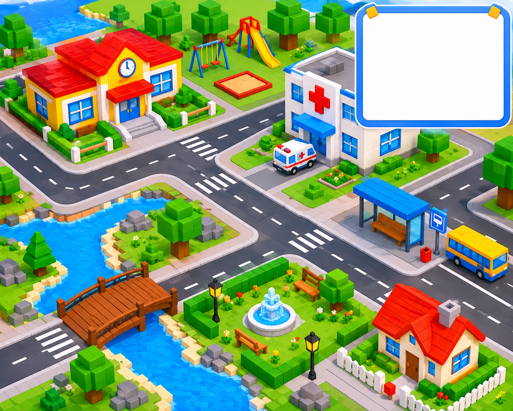

# Fitxa 10 · Mapa i símbols

**Àrea:** Coneixement del medi · **Idioma:** català · **3r primària**  
**BEX:** MED-007 · **Dificultat:** ⭐⭐⭐

---

**Nom:** _______________________  **Data:** _______________  **Fitxa 10**

---

> *(Si encara no hi ha la imatge, es pot imprimir sense ella.)*

---

## A) Completa la llegenda

Relaciona cada símbol amb el seu significat. Escriu la lletra.

| Símbol al mapa | Significat |
|----------------|------------|
| 1. Creu vermella | A) Parc |
| 2. Autobús | B) Hospital |
| 3. Arbre verd | C) Parada d'autobús |
| 4. Edifici amb campana | D) Escola |

1. ___ · 2. ___ · 3. ___ · 4. ___

---

## B) Ruta pel mapa

Respon amb una paraula o una frase curta.

1. Si surts de l'**escola** i vols anar a l'**hospital**, quin edifici passes primer?

   _______________________________________________

2. On esperaries un autobús per sortir del poble?

   _______________________________________________

3. Quin lloc del mapa és millor per jugar a l'aire lliure?

   _______________________________________________

---

**Recorda:** Mira la llegenda abans de respondre · Els mapes fan servir **símbols** per representar llocs.
