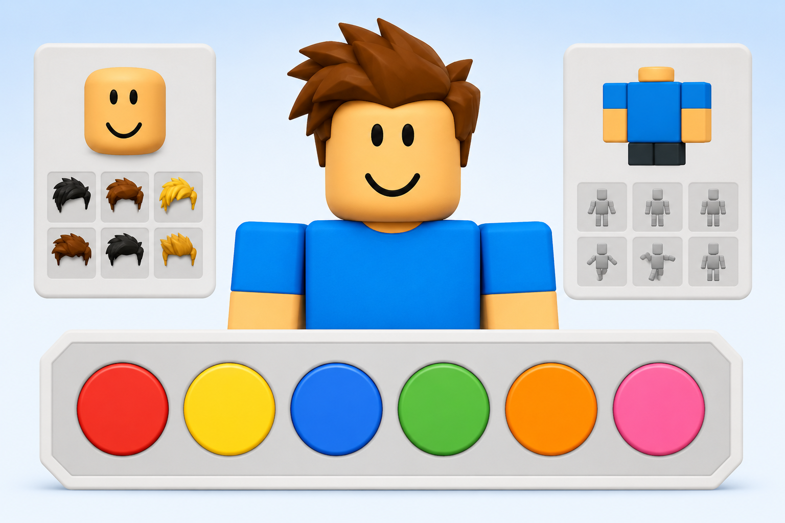

# Worksheet 01 · Colours

**Àrea:** Llengua estrangera · **Idioma:** anglès · **3r primària**  
**BEX:** EN-007 · **Difficulty:** ⭐

---


**Name:** _______________________  **Date:** _______________  **Worksheet 01**

---



> *(If the image is not ready yet, you can print without it.)*

---

## A) Match the colour with the word

Write the letter.

| | Colour blob | | Word |
|---|-------------|---|------|
| 1 | 🔴 | — | | A) blue |
| 2 | 🟡 | — | | B) pink |
| 3 | 🔵 | — | | C) red |
| 4 | 🟢 | — | | D) yellow |
| 5 | 🟠 | — | | E) green |
| 6 | 🩷 | — | | F) orange |

1. ___ · 2. ___ · 3. ___ · 4. ___ · 5. ___ · 6. ___

---

## B) Wordsearch · Find 6 colours

Circle the words in the grid. Words can go **across** or **down**.

```
O R A N G E
Y B L U E R
E D G P I N
G R E E N K
P I N K Y G
G R E Y X X
```

Colours to find: **RED** · **BLUE** · **GREEN** · **PINK** · **GREY** · **ORANGE**

---

**Remember:** Read the word carefully before you write · Colour names in English do not change (no plural *s*).
