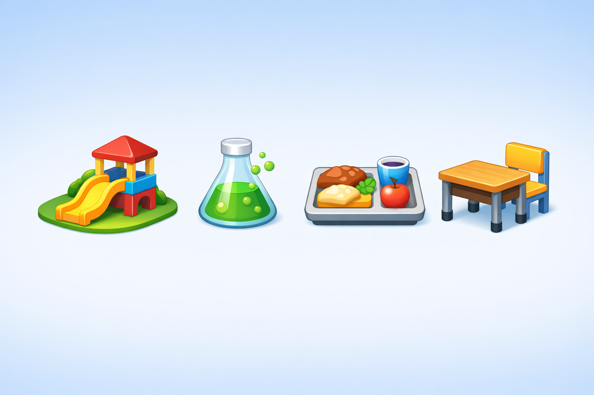

# Worksheet 03 · School places

**Àrea:** Llengua estrangera · **Idioma:** anglès · **3r primària**  
**BEX:** EN-003 · **Difficulty:** ⭐⭐

---

**Name:** _______________________  **Date:** _______________  **Worksheet 03**

---

> *(If the image is not ready yet, you can print without it.)*

---

## Match the sentence with the place

Write the letter.

| | Sentence | | Place |
|---|----------|---|-------|
| 1 | We eat lunch here. | — | | A) playground |
| 2 | We run and play here. | — | | B) canteen |
| 3 | We read books in this room. | — | | C) classroom |
| 4 | We do experiments with water. | — | | D) lab |

1. ___ · 2. ___ · 3. ___ · 4. ___

---

## Write the place

5. Where do you sit at a desk and listen to the teacher? _______________

6. Where do children play football outside? _______________

---

**Remember:** Read the **whole sentence** before you choose · Think: what do people **do** in each place?
