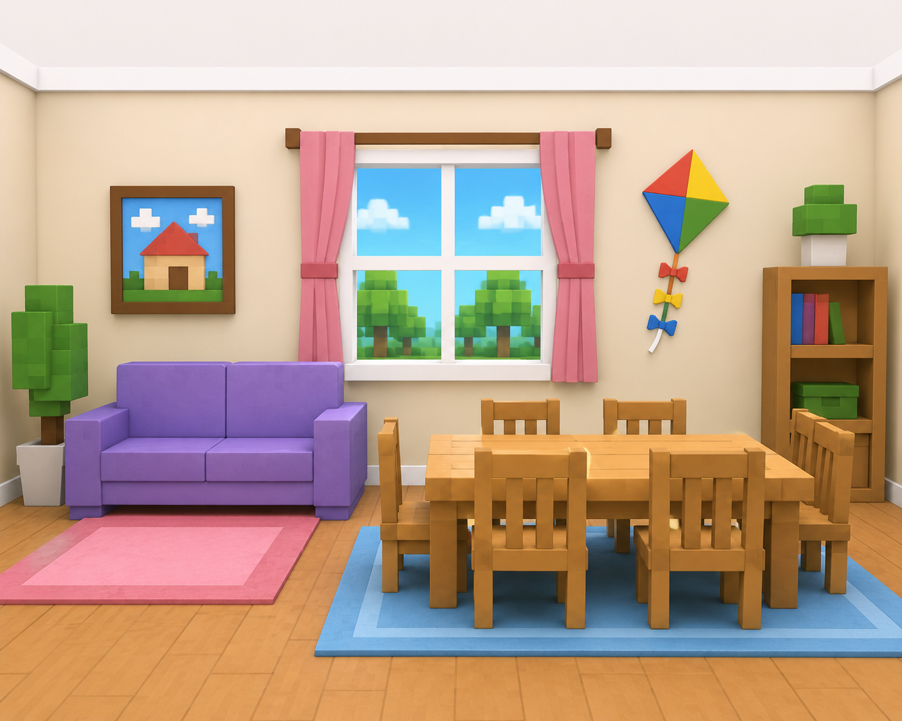

# Worksheet 07 · Read and draw

**Àrea:** Llengua estrangera · **Idioma:** anglès · **3r primària**  
**BEX:** EN-004 · **Difficulty:** ⭐⭐⭐

---


**Name:** _______________________  **Date:** _______________  **Worksheet 07**

---



> *(If the image is not ready yet, you can print without it.)*

---

## Read the description

> This is a game living room.  
> There is a **sofa** next to the **window**.  
> There is a **table** in the middle of the room.  
> There are **six chairs** around the table.  
> There is a **kite** on the wall.  
> The sofa is **blue**. The table is **brown**.

---

## Draw and colour

In the box below, draw the room with all the objects. Colour the sofa blue and the table brown.

```
┌─────────────────────────────────────────────────────────┐
│                                                         │
│                                                         │
│                                                         │
│                                                         │
│                                                         │
│                                                         │
│                                                         │
│                                                         │
│                                                         │
│                                                         │
└─────────────────────────────────────────────────────────┘
```

---

## Check your drawing

Tick (✓) when you have drawn each thing:

- [ ] sofa  
- [ ] window  
- [ ] table  
- [ ] six chairs  
- [ ] kite on the wall  

---

**Remember:** Read the text **twice** before you draw · **There is** = one thing · **There are** = more than one.
