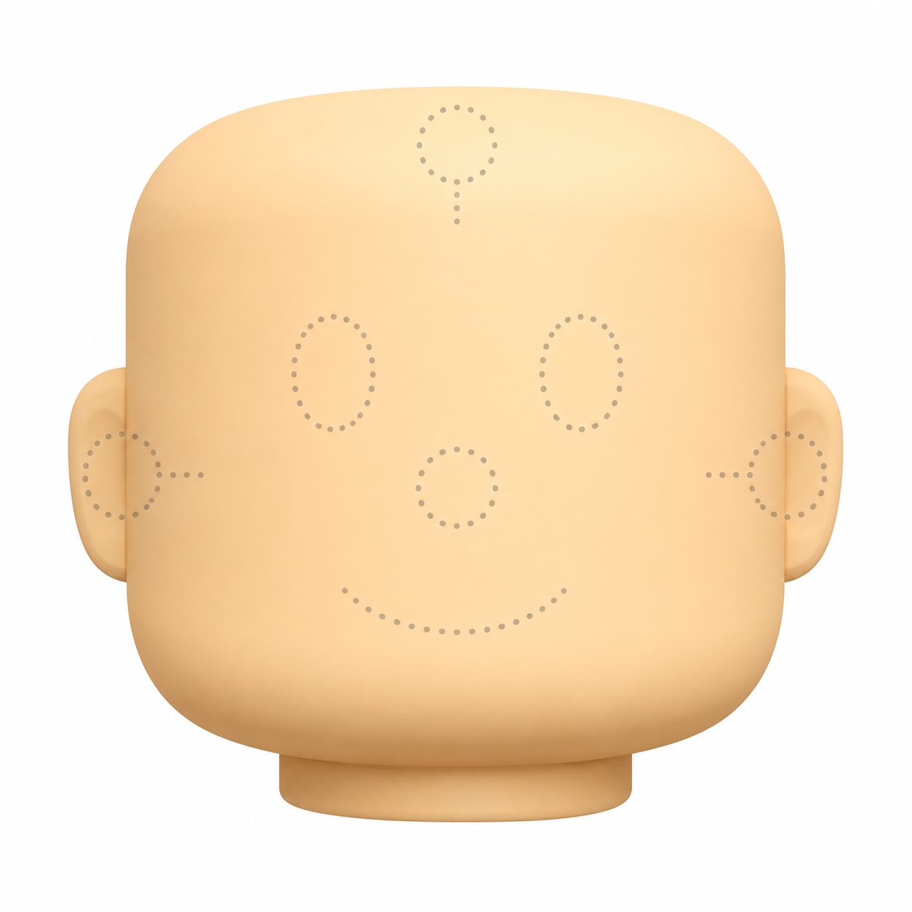

# Worksheet 09 · Body · Face

**Àrea:** Llengua estrangera · **Idioma:** anglès · **3r primària**  
**BEX:** EN-009 · **Difficulty:** ⭐

---

**Name:** _______________________  **Date:** _______________  **Worksheet 09**

---

> *(If the image is not ready yet, you can print without it.)*

---

## Label the face

Write the English word on each line. Use the word bank.

> eyes · nose · mouth · ears · hair · teeth

| Number on face | Word |
|----------------|------|
| 1 | _______________ |
| 2 | _______________ |
| 3 | _______________ |
| 4 | _______________ |
| 5 | _______________ |
| 6 | _______________ |

---

## Write two sentences

1. We see with our _______________.  
2. We smell with our _______________.

---

**Remember:** **Eyes** and **ears** are usually plural (two) · Point to your own face while you label.
