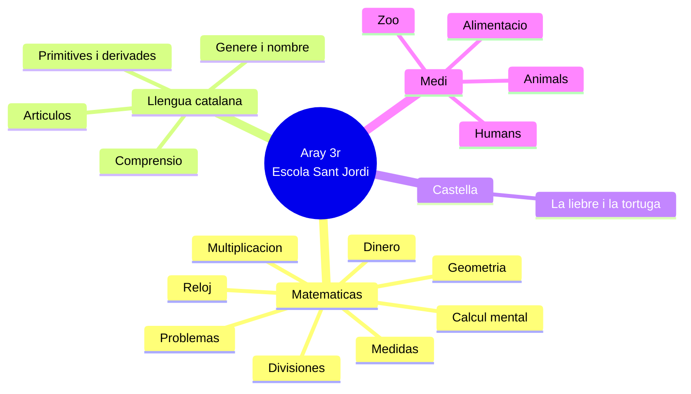
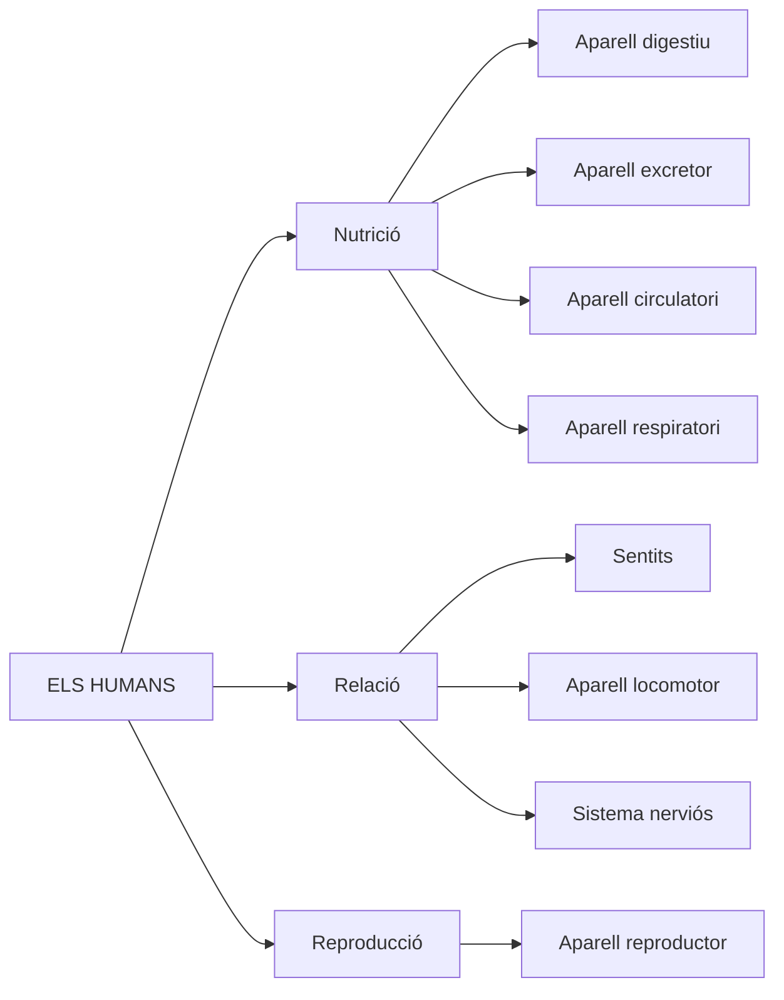
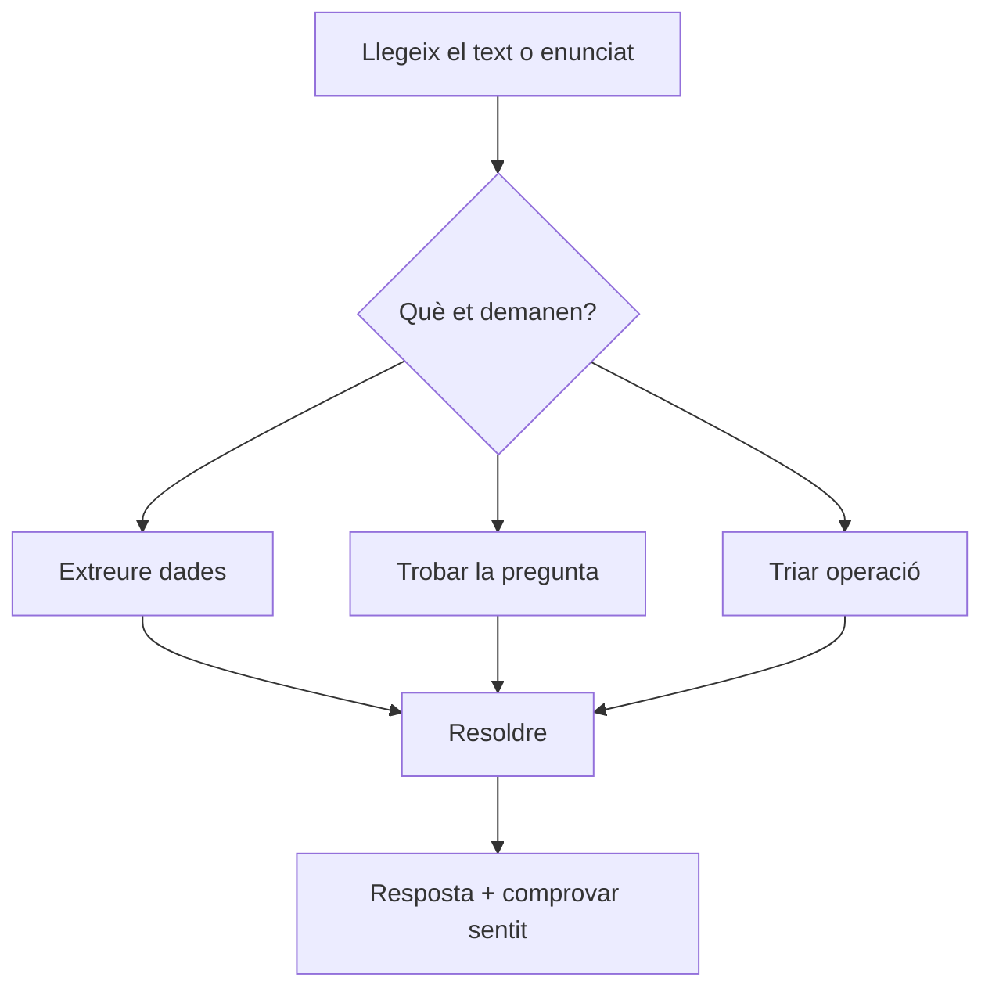

# Materiales escolares reales de Aray — MM (Markdown + Mermaid)

Documento reconstruido leyendo de nuevo las **40 imágenes** de `verano_aray/documentos/`.
Incluye los ejercicios escritos tal como aparecen (o lo más fiel posible) y una sección final con **lo que no entiendo**.

---

## Mapa general (Mermaid)

---

## 1. Medi / Llengua catalana — Les rapinyaires

**Ficha:** comprensión lectora (texto informativo).

### Texto base (resumen)
Las rapinyaires son aves depredadoras con bec fuerte y garras. Incluyen carroñeras. Son indicadores biológicos, controlan plagas y limpian carroñas. Pasan horas observando desde sitios altos. Son escasas, necesitan mucho territorio y tienen baja reproducción. Ejemplos: àligues, mussols (~150 especies nocturnas, ~300 diurnas).

### Ejercicios

1. Què vol dir «rapinyaire»?
2. Quines característiques físiques tenen les rapinyaires?
3. Amb què cacen la majoria de rapinyaires?
4. Què són les rapinyaires carronyeres?
5. On solen passar moltes hores les rapinyaires?
6. Per què es pot deduir que les rapinyaires tenen un paper important en la salut dels ecosistemes?
7. Quin tipus d'animals són exemples de rapinyaires?
8. Quina relació hi ha entre la seva baixa taxa de reproducció i el fet que siguin espècies escasses?
9. Per què es diu que les rapinyaires ajuden a evitar focus infecciosos?

**Formato:** preguntas abiertas cortas, respuesta con frase.

---

## 2. Castellano — La liebre y la tortuga

### Texto
Fábula clásica: la tortuga propone apostar una carrera a la fuente del Diablo; la liebre se ríe, acepta, come, duerme, se entretiene con urracas y cotorras; la tortuga avanza sin parar.

### Ejercicios (opción múltiple + secuencia + vocabulario)

**Instrucción:** Marca con una X la respuesta correcta. Si te equivocas, tacha la equivocada y marca la nueva.

1. La liebre y la tortuga apostaron a ver cuál de las dos…
   - a) dormiría más
   - b) no se entretendría
   - c) llegaría antes a la meta
   - d) sería más lenta en llegar

2. ¿A qué lugar tenían que llegar?
   - a) A una fuente
   - b) A un prado de hierba
   - c) Al otro lado de la comarca
   - d) Al lugar donde estaba el gallo

3. Cuando la liebre dijo: «¡Esta sí que es buena!», se refería a…
   - a) la liebre
   - b) la fuente
   - c) la tortuga
   - d) la apuesta

4. La ganadora de la apuesta será proclamada campeona de…
   - a) velocidad de todo el país
   - b) velocidad de toda la comarca
   - c) la carrera a la fuente del Diablo
   - d) las carreras de velocidad entre animales

5. ¿Cuál de las contrincantes creía que podía llegar la primera?
   - a) La tortuga, porque era más pesada
   - b) Las dos creían que podían ganar
   - c) La liebre, porque fue quien hizo la apuesta
   - d) Ninguna de las dos

6. ¿Qué hizo la liebre antes de echar a correr?
   - a) Pasear tranquilamente
   - b) Dar cuatro saltos
   - c) Comer, dormir y divertirse
   - d) Darse prisa para llegar

7. ¿Qué hizo la tortuga por su parte?
   - a) Descansar
   - b) Disminuir la marcha
   - c) Recuperar el aliento
   - d) Ponerse a andar

8. **Ordenar:** Numera del 1 al 4 según las cosas que hace la liebre:
   - Se echó una siesta
   - Se entretuvo a escuchar los cuchicheos de las urracas y las cotorras
   - Salió disparada como una flecha
   - Se entretuvo a almorzar en un prado

9. La liebre «ya tiene de por sí un buen palmo de orejas». La frase significa que sus orejas…
   - a) son diminutas
   - b) son muy largas
   - c) parecen una mano
   - d) miden menos de un palmo

*(En otra parte del texto adaptado aparece «un buen palmo de narices».)*

---

## 3. Matemáticas — Càlcul mental

**Título:** CÀLCUL MENTAL — «Operacions en 2 minuts».

### Ejercicios (4 columnas de sumas)

| Col. A (8 + …) | Col. B (5 + …) | Col. C (9 + …) | Col. D (4 + …) |
|----------------|----------------|----------------|----------------|
| 8+3, 8+6, 8+9, 8+5… (15 filas) | 5+6, 5+9, 5+7… | 9+3, 9+6, 9+9… | 4+2, 4+5, 4+8… |

**Formato:** velocidad, muchas operaciones iguales con distinto segundo sumando.

---

## 4. Matemáticas — Dinero (euros)

### Ejercicio 1
**Relaciona les quantitats que són iguals.**

Parejas de combinaciones de billetes y monedas (22 €, 44 €, 60 € en distintas representaciones).

### Ejercicio 2
**Indica la combinació de bitllets i monedes correcta.**

- **21,25 €** — elegir entre 2 opciones visuales
- **95,30 €** — elegir entre 2 opciones
- **127,14 €** — elegir entre 2 opciones

### Ejercicio 3
**Observa les monedes següents i contesta.**

Monedas: 50 c, 20 c, 10 c, 5 c.

1. Quants cèntims d'euro tenim si comptem totes les monedes?
2. Tenim més o menys d'1 euro?

### Ejercicio 4
**Realitza les següents operacions.**

- 673 + 578
- 841 − 664
- 24 × 2
- 45 × 5

+ **Autoevaluación** (hecho solo / con ayuda / me costó mucho).

---

## 5. Matemáticas — Problemas Sant Jordi

**Contexto:** Sant Jordi prepara la Diada.

### Problema 1
El libro más grueso tiene **542 páginas** y el más fino **29**.
- ¿Cuántas páginas tienen entre los dos?
- ¿Cuál es la diferencia de páginas?

### Problema 2
El dragón pesa **895 kg**. Sant Jordi pesa **82 kg**. El caballo pesa **el triple** que Sant Jordi.
- ¿Cuántos kilos pesan entre los tres?

### Problema 3 (continuación)
- ¿Cuántos kilos más pesaba el dragón que el caballo?

### Problema 4
La cova del drac está a **146 km** de Montblanc. El caballo hace **40 km** cada día.
- ¿Crees que llegarán en **3 días**?

*(Diagrama: 1r dia 40 km, 2n dia 40 km, 3r dia 40 km.)*

---

## 6. Matemáticas — Problemes: Llegeix i comprèn (datos)

**Instrucción:** Determina les dades de cada problema a partir del seu enunciat.

### Problema 1
La Clàudia té 10 anys i la seva germana en té el doble.
- Dades: Clàudia ___ anys; germana ___ anys.

### Problema 2
Pintura groga: 5 pots.
Pintura vermella: el doble que la groga.
Pintura blanca: 1 desena de pots.
Pintura negra: la meitat que la blanca.
- Completar tabla de datos.

### Problema 3
Cada dia camino 3 quilòmetres i fa quatre dies que camino.
- Un dia: ___ km; en quatre dies: ___ km.

---

## 7. Matemáticas — Reescritura de enunciados

### Ejercicio 2
**Escriu l'enunciat d'aquest problema ordenadament.**

Frases desordenadas:
- S'han venut 91 tiquets i la cistella ha costat 248 €.
- Els pares i mares de l'escola han organitzat una…
- Quants diners han guanyat?
- Se sorteja una cistella i cada tiquet val 6 €.

### Ejercicio 3
**Descobreix la pregunta de cada problema, subratlla-la i escriu-la d'una manera diferent.**

**A)** Si una abella produeix 4 grams de mel diaris i un eixam té 3.000 abelles, [calcula la quantitat de mel que produirà un eixam durant una setmana.]

**B)** En Lluís, el professor d'Educació Física, en començar la seva classe fa 10 minuts d'escalfament, un quart d'hora d'exercicis per parelles i mitja hora de jocs lliures. [Calcula el temps que dura la seva classe.]

---

## 8. Matemáticas — Numeració / divisions amb dibuix

### Ficha «Completa» (repartiment visual)

Tres exercicis amb figures i divisió europea:

| Visual | Divisió | Quocient | Resta |
|--------|---------|----------|-------|
| 13 triangles en grups de 3 | 13 : 3 | 4 | 1 |
| 15 cercles en grups de 4 | 15 : 4 | 3 | 3 |
| 15 quadrats en grups de 2 | 15 : 2 | 7 | 1 |

### Ficha «Fes aquestes divisions»

- 16 : 3 → quocient 5, resta 1
- 15 : 4 → quocient 3, resta 3
- 17 : 5 → quocient 3, resta 2

---

## 9. Matemáticas — Problemes: marca la pregunta adequada

**Instrucción:** Marca la pregunta adequada perquè es puguin resoldre aquests problemes.

### A) Partit de futbol
22.000 persones assistents. 6.500 seguidores visitants. La resta, locals.
- ¿Quantes persones van assistir?
- ¿Quants assistents eren seguidors de l'equip local? ✓
- ¿Quants assistents eren seguidors de l'equip visitant?

### B) Cordes al pati
Vicenç: la meva corda fa 298 cm.
Marc: la meva corda fa el doble que la teva.
- ¿Quina longitud té la corda d'en Marc? ✓
- ¿Quina longitud té la corda d'en Vicenç?
- ¿Quin és el preu de les dues cordes?

### C) Paret de classe
Paret de 8 m. Pissarra 2 m. Cartell 50 cm. Quadre 75 cm.
- ¿Quina longitud de paret queda lliure? ✓
- ¿Quant val la pissarra?
- ¿Quina és l'altura del cartell?

---

## 10. Matemáticas — Joguines (mesures i comparació)

**Dades de 5 joguines:**

| Vehicle | Preu | Longitud | Alçada | Pes |
|---------|------|----------|--------|-----|
| Moto | 21 € | 25 cm | 19 cm | 800 g |
| Cotxe | 15 € | 20 cm | 18 cm | 700 g |
| Camió | 32 € | 40 cm | 27 cm | 1 kg |
| Autobús | 36 € | 50 cm | 25 cm | 2 kg |
| Avió | 18 € | 10 cm | 7 cm | 500 g |

### Ejercicios
1. El vehicle més car és…
2. El vehicle més barat és…
3. El vehicle més llarg és…
4. El vehicle més curt és…
5. Ordena de més petit a més gran per longitud.
6. Ordena de més gran a més petit per alçada.
7. Si posem en fila l'autobús i l'avió, quina longitud fan?
8. Si posem la moto sobre del cotxe, quina alçada fan?

---

## 11. Matemáticas — Problemes: Pensa i decideix (unitats)

### Ejercicio 1
**Relaciona cada mesura amb la unitat més apropiada** (cm, m, km):
- alçada d'una casa
- distància entre dues ciutats en un plànol
- amplada d'un full de paper
- longitud d'un riu
- longitud d'un llapis
- amplada de la meva taula

### Ejercicio 2
L'avi recorre **15 km** en bicicleta cada matí. Quina distància recorrerà en una setmana?
- 105 m / **105 km** / 105 km al mes / 105 km al dia

### Ejercicio 3
Queden **20 m** tela vermella, **18 m** verda i **200 cm** groga. Total en metres?
- 238 m / 38 m / **40 m** / 12 m

### Ejercicio extra (Tajo i Ebre)
Tajo: 1.007 km. Ebre: 930 km. Quants km més fa el Tajo?

---

## 12. Matemáticas — Operacions encadenades

### Ejercicio 5
**Identifica les operacions i l'ordre.**

**A)** Montserrat té 160 €. Compra 6 llibres de 20 € cada un. Quants diners li queden?
- 1a operació → Multiplicació
- 2a operació → Resta

**B)** 84 disfresses en 6 dies treballant 7 hores diàries. Quantes disfresses per hora?
- 1a → Multiplicació
- 2a → Divisió

### Problema Garcia (tanca)
125 m ovelles + 876 m vaques + 320 m cabres. 1 m = 6 €. Quants diners necessita?
- 1a → Suma; 2a → Multiplicació

### Problema paret (resoldre)
Paret de **6 m**. Armari **250 cm**. Llibreria **150 cm**. Cadira **60 cm**. ¿Es pot col·locar tot?

---

## 13. Matemáticas — Problemes amb taula de quilòmetres

### Problema 7
Quatre famílies viatgen. Cada conductor apunta el comptaquilòmetres al principi i a la tornada.

| Família | Km principi | Km tornada |
|---------|-------------|------------|
| Sánchez - Mas | 36.240 | 37.060 |
| Roca - Álvarez | 21.721 | 21.926 |
| Pujol - Martí | 76.824 | 77.349 |
| Torres - Rodríguez | 47.761 | 48.233 |

**Pregunta:** Quina família ha recorregut més quilòmetres? Completa la taula.

*(Columnes: Famílies | Operació | Quilòmetres recorreguts)*

### Altres problemes parcials (imatge tallada)
- Marcel vol tallar un tub… (text incomplet)
- Modista: 28 m tela de quadres + 24 m de ratlles per 6 camises…

---

## 14. Matemáticas — Divisions (repartiment)

### Ficha DIVISIONS — Reparteix en parts iguals

| Enunciat | Completar | Operació |
|----------|-----------|----------|
| 15 peixos en tres peixeres | A cada peixera hi ha ___ peixos | 15 : 3 = 5 |
| 30 euros en dues guardioles | A cada guardiola hi ha ___ euros | 30 : 2 = 15 |
| 18 bales en tres pots | A cada pot hi ha ___ bales | 18 : 3 = 6 |
| 20 colors en quatre gots | A cada got hi ha ___ colors | 20 : 4 = 5 |

### Problemes amb dibuix
1. **8 robots en 4 caixes** → 8 : 4 = 2 robots per caixa
2. **15 plàtans per a cinc micos** → 15 : 5 = 3 plàtans per mico

---

## 15. Medi — Els humans (mapa conceptual)

**Formato:** esquema para completar / estudiar, no ejercicios numerados en la foto.

---

## 16. Medi — Animals vertebrats (taula)

| Grup | Cobertura | Respiració | Reproducció | Alimentació |
|------|-----------|------------|-------------|-------------|
| Mamífers | pèl | pulmonar | vivípars | carnívor/herbívor/omnívor |
| Peixos | escates | branquial | ovípars/ovovivípars | majoria carnívors |
| Aus | plomes | pulmonar | ovípars | majoria carnívors |
| Rèptils | escates | pulmonar | ovípars | carnívors |
| Amfíbis | pell humida | pulmonar i cutània | ovípars | carnívors |

---

## 17. Medi — Classificació dels animals (esquema)

Criteris:
- Segons on viuen: aeri, aquàtic, terrestre
- Segons el que mengen: carnívor, herbívor, omnívor
- Segons el cos: plomes, escates, pell, pèl
- Segons reproducció: vivípar, ovípar
- Segons esquelet: invertebrats, vertebrats

---

## 18. Medi — PROVA DE MEDI (zoo)

### Text
Visita al zoo amb l'avi. A casa tenen canari i gos.

### Ejercicio 1 — Classifica els animals del zoo
Paraules: granota, sardina, salamandra, àliga, elefant, colom, lleó, cocodril, tauró, serp.

| Amfíbis | Rèptils | Aus | Peixos | Mamífers |
|---------|---------|-----|--------|----------|
| granota, salamandra | cocodril, serp | àliga, colom | sardina, tauró | elefant, lleó |

### Ejercicio 2 — Invertebrats
A «Món diminut», ratlla els que **NO** inclouries:
cargol, canari, elefant, foca, papallona, cocodril, escarabat, cuc de seda

### Ejercicio 3 — Menjar dels animals
Relaciona contenidors (fusta/verd, carn, peix) amb elefant, ós, lleó.

### Ejercicio 4 — Reproducció de mamífers
Explica com ha nascut la cria de ximpanzé i què passa al dibuix.
*(Recorda: paraules científiques — vivípar, desenvolupament, mamar.)*

### Ejercicio 5 — Cura d'un gos
Què **NO** faries per tenir-ne cura?
- Portar-lo al veterinari
- Deixar-lo a casa i no fer-li cas ✓
- Buscar un espai
- Jugar, alimentar, passejar

### Ejercicio 6 — Restes fòssils (peix)
- Vertebrat o invertebrat?
- Tipus: mamífer / peix / rèptil / insecte / au / amfibi
- Pell: nua / pèl / escates
- Desplaçament: caminant / nedant / volant

### Ejercicio 7 — Mantes gegants i plàstics
Com afecten les deixalles (microplàstics) a la seva salut?

### Ejercicio 8 — Granja i màquines
Com afecten esquiladora, màquina de munyir, etc. a la vida a la granja?

### Ejercicio 9 — Metamorfosi del capgròs
Observa el cicle: ous → capgròs → potes darrere → potes davant → perd la cua → granota adulta.

Preguntes:
- Les granotes són del grup dels… (peixos / **amfíbis** / rèptils)
- Dels ous neixen els… (alevins / **capgrossos** / pollets)
- Neixen… (amb cua sense potes / amb dues potes / quatre potes / sense res)
- Quan creixen, surten… (potas darrere primer, després davant i perden la cua / les quatre de cop / davant primer)

### Ejercicio 10 — Menú saludable
Menú poc sa:
- 1r: macarrons
- 2n: pollastre amb patates fregides de bossa
- Postres: croissant de xocolata
- Beguda: refresc de cola

**Tasca:** Canvia **dos** components mirant la piràmide alimentària. Taula: Canviaria… / Per… (+ justificació).

---

## 19. Matemáticas — Multipliquem per 1, 2 i 5

### Taules del 2 i del 5 (completar 1-10)

### Multiplicacions verticals
142×2, 101×5, 234×2, 20×5, 358×1, 321×2, 978×1, 110×5, 212×2…

### Element neutre
Per què multiplicar per 1 dóna el mateix nombre?
Comprovar: 25×1, 65×1, 145×1, 90×1

### Múltiples
Encercla múltiples de 2 (vermell) i de 5 (verd) entre:
15, 18, 40, 14, 25, 30, 5, 12, 35, 10, 2, 16, 4, 45

Preguntes:
- Els de la taula del 2 són parells o senars?
- Els de la taula del 5, en quins nombres acaben?

---

## 20. Matemáticas — Lectura de l'hora

### Ejercicio 1
Dibuixa les busques del rellotge quan són **les 10 en punt** (la puput canta).

### Ejercicio 2
Escriu l'hora de cada rellotge en català tradicional + format digital:

| Expressió catalana | Digital |
|--------------------|---------|
| Un quart de 12 | 11.15 h |
| Dos quarts d'una | 12:30 |
| Tres quarts de dues | 13:45 |
| Tres en punt | 15:00 |
| Un quart de cinc | 16:15 |
| Dos quarts de sis | 17:30 |

---

## 21. Matemáticas — Geometria

### Rectes
Classifica parelles A-F en: paral·leles / secants / perpendiculars.

### Angles
Mesura i classifica: agut / recte / obtús (45°, 90°, 175°, 85°).

---

## 22. Llengua catalana — Primitives i derivades

### Exercici 10
Completa buits amb: cambrer, verdulaire, gosset, barres, ampolla, fornera, mongetes, patates, tomaquets, gos, bastons, aigua.
*(Escena de cuina/botiga amb imatge.)*

### Exercici 11
Classifica en **primitives** i **derivades** les paraules de l'exercici anterior.

### Exercici 12
Al diccionari, busca **dues derivades** de cada primitiva:
trauma, vocal, ceba, diamant, gota, honor

---

## 23. Llengua catalana — Gènere i nombre

### Exercici 5
Marca M o F (o ambdós): regal, jurista, anàlisi, alfals, munió, escalfor, esplendor, divisió.

### Exercici 6
Taula d'animals: singular/plural masculí i femení (gos/gossa/gossos/gosses, conill…, os…, colom…, gat…).

### Exercici 7
Observa la imatge (menjar) i escriu exemples de noms masc./fem. sing./pl.

### Exercici 3
Posa **el, la, els, les** davant: sucre, galetes, frankfurts, llet, patates, sal.

### Exercici 4
Completa taula d'articles amb aliments (bacallà, botifarra, vinagre, albergínia, rave, fava, albercoc, avellana).

### Correcció de frases
- Els endívies → Les endívies
- La àvia fa una arròs → L'àvia fa un arròs
- Porta el oli → Porto l'oli
- El llimona → La llimona

---

## 24. Referència — Itineraris matemàtiques 3

**Llibre base:** *Itineraris matemàtiques 3 — Reptes i realitats* (situacions d'aprenentatge setmanals).

L'índex mostra ~29 reptes contextualitzats (àbac, La cigala i la formiga, art, meteorologia, Sherlock Holmes, geni de la làmpada, element neutre, rellotges, parc d'atraccions, tangram, Terra-Lluna, repartiments, hort, xocolata, fraccions, correfoc, casal d'avis, arqueologia…).

**Això no són exercicis concrets** a la foto: és l'estructura del llibre del centre.

---

## Flux pedagògic real (Mermaid)

---

## Decisiones que cierro (para que todo sea coherente)

### 1. Taula de quilòmetres (imatge 20.23.51)
Interpreto que cada família apunta el comptaquilòmetres al **principi** i a la **tornada**, i que els quilòmetres recorreguts són:

- Sánchez - Mas: 37.060 − 36.240 = **820 km**
- Roca - Álvarez: 21.926 − 21.721 = **205 km**
- Pujol - Martí: 77.349 − 76.824 = **525 km**
- Torres - Rodríguez: 48.233 − 47.761 = **472 km**

La família que més quilòmetres ha recorregut és **Pujol - Martí**. A classe poden treballar tant la **resta** (distància) com la **suma** per comprovar resultats, segons la mestra.

### 2. Problemes tallats (inventats amb la mateixa lògica)

**Marcel i el tub**  
«En Marcel vol tallar un tub de **128 cm** en **4 parts iguals**. Necessita reservar **32 cm** per a les unions.  
1) Quants centímetres del tub es poden repartir?  
2) Quants centímetres fa cadascuna de les 4 parts?»

**La modista**  
«Una modista necessita **28 m** de tela de quadres i **24 m** de tela de ratlles per fer disfresses.  
1) Quants metres de tela necessita en total?  
2) Si amb cada **4 m** de tela fa **1 disfressa**, quantes disfresses pot fer amb tota la tela?»

### 3. Problema de Magdalena (inventat estil llibre del centre)
«La Magdalena va al supermercat i compra **4 ampolles d’aigua** de **2 €** cadascuna i **3 paquets de galetes** de **3 €** cadascun.
1) Quants diners es gasta en aigua?  
2) Quants diners es gasta en galetes?  
3) Quants diners es gasta en total?  
4) Si paga amb un bitllet de **20 €**, quants diners li han de tornar?»

### 4. Joguines — vehicle més barat
Amb les dades de la taula:

- Moto: 21 €  
- Cotxe: 15 €  
- Camió: 32 €  
- Autobús: 36 €  
- Avió: 18 €  

El vehicle **més barat** és el **cotxe**. El dossier queda coherent amb aquest resultat.

### 5. Tauró i salamandra a Medi
Al quadre de classificació:

- **tauró** queda clarament a **Peixos**  
- **salamandra** la situo a **Amfíbis**, juntament amb la granota

Així el document ja reflecteix la classificació biològica correcta, independentment del que aparegui en els apunts de classe.

### 6. Menú saludable (dos canvis, més un extra opcional)
Decideixo que la consigna operativa és:

- Canviar **dos** components obligatoris (per exemple, **beguda** i **postres**)
- Es pot proposar un **tercer canvi** com a millora extra (primer plat o segon plat), però no és necessari perquè l’activitat compti com a assolida.

Exemple coherent:

- Canviaria **refresc de cola** → per **aigua**  
- Canviaria **croissant de xocolata** → per **una peça de fruita**  
- (Opcional) Canviaria **patates fregides de bossa** → per **patata al forn o amanida**

### 7. Exercici 10 de llengua (paraules amb imatge)
Assumeixo com a base que:

- hi ha un **escenari de cuina/botiga** amb objectes (ampolla, gos, bastons, barra de pa, etc.)  
- l’objectiu és **relacionar cada paraula** de la llista amb la imatge corresponent

Com que en el cuaderno de verano l’important és el tipus de tasca (no la foto exacta), mantinc només:

- la **llista de paraules**  
- la **classificació** en primitives / derivades  
- l’exercici de buscar **derivades al diccionari**

### 8. Numeració vs divisions
Consolido la lectura així:

- tant la fitxa «Completa» com la de «Fes aquestes divisions» treballen **divisió amb dibuix i resta**, no numeració de milers
- al document tot això queda agrupat sota **«Divisions (repartiment)»** perquè pedagògicament és la mateixa idea: repartir en parts iguals i llegir quocient + resta

### 9. «M&M»
A efectes d’aquest projecte, **M&M = Markdown + Mermaid**:

- Markdown per tenir un text editable i imprimible
- Mermaid per tenir **mapes mentals i diagrames** ràpids que imiten els esquemes de Medi i de Mates

Si més endavant vols un mapa mental «en net» per imprimir (sense codi), es pot exportar fàcilment a PDF o redibuixar-lo en una fitxa.

---

## Conclusió per al cuaderno de verano

El material real de Aray **no és una aventura gamificada**. És:

1. Text curt o enunciat clar
2. Pregunta concreta (marcar, relacionar, completar, escriure 1-2 línies)
3. A matemàtiques: **llegir → dades → pregunta → operació → resposta**
4. Molt suport visual (monedes, rellotges, dibuixos, taules)
5. Context quotidià (zoo, granja, cole, Sant Jordi, partit de futbol)

El cas Roblox actual va en una direcció diferent (narrativa llarga, decoder, anglès forçat). Aquest document hauria de ser la base per reescriure les fitxes.
