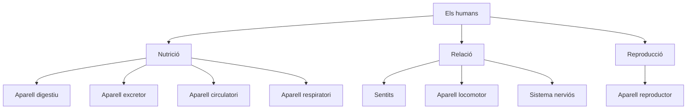

# MDS · Coneixement del medi natural, social i cultural

---

## FITXA ME-01 · Animals vertebrats

**Completa la taula:**

| Grup | Recobriment | Respiració | Reproducció |
|------|-------------|------------|-------------|
| Mamífers | | pulmonar | |
| Peixos | escates | | |
| Aus | | pulmonar | ovípar |
| Rèptils | | | ovípar |
| Amfíbis | pell humida | | |

**Marca la opció correcta:**

1. Un tauró és un…  
   - [ ] a) mamífer  [ ] b) peix  [ ] c) rèptil  

2. Una granota és un…  
   - [ ] a) amfibi  [ ] b) au  [ ] c) peix  

3. Els mamífers solen ser…  
   - [ ] a) ovípars  [ ] b) vivípars  [ ] c) sempre carnívors  

---

## FITXA ME-02 · Classificació dels animals

**Classifica segons el criteri indicat:**

**1. Segons on viuen:** aeri · aquàtic · terrestre  
- ocell: __________  
- tauró: __________  
- llop: __________  

**2. Segons el que mengen:** carnívor · herbívor · omnívor  
- lleó: __________  
- vaca: __________  
- ós (menja de tot): __________  

**3. Segons el cos:** plomes · escates · pell · pèl  
- au: __________  
- serp: __________  
- granota: __________  
- gos: __________  

**4. Segons l'esquelet:**  
- [ ] Vertebrat — cargol  
- [ ] Invertebrat — papallona  
- [ ] Vertebrat — elefant  
- [ ] Invertebrat — escarabat  

---

## FITXA ME-03 · Prova del zoo

### Text

L'Aray va al zoo amb el seu avi. A casa tenen un canari i un gos, però al zoo van veure lleons, elefants, aus i peixos.

**1. Classifica al quadre:**

Paraules: granota, sardina, salamandra, àliga, elefant, colom, lleó, cocodril, tauró, serp.

| Amfíbis | Rèptils | Aus | Peixos | Mamífers |
|---------|---------|-----|--------|----------|
| | | | | |

**2. A «Món diminut» (invertebrats), ratlla els que NO hi posaries:**

cargol · canari · elefant · foca · papallona · cocodril · escarabat · cuc de seda

**3. Relaciona el menjar amb l'animal:**

| Menjar | Animal |
|--------|--------|
| Verd / fusta | elefant |
| Carn | lleó |
| Peix | ós |

---

## FITXA ME-04 · Reproducció dels mamífers

**Observa:** una mare ximpanzé amb la seva cria.

**Explica amb paraules científiques (vivípar, desenvolupament, mamar):**

1. Com neix la cria?  
   _______________________________________________

2. Què passa al dibuix?  
   _______________________________________________

**Marca verdader o fals:**

- [ ] Els mamífers són vivípars.  
- [ ] La cria es desenvolupa dins la mare.  
- [ ] Els mamífers neixen d'un ou dur.  

---

## FITXA ME-05 · Metamorfosi de la granota

**Observa el cicle:** ous → capgròs → potes del darrere → potes del davant → perd la cua → granota adulta.

1. Les granotes són del grup dels…  
   - [ ] a) peixos  [ ] b) amfíbis  [ ] c) rèptils  

2. Dels ous neixen els…  
   - [ ] a) alevins  [ ] b) capgrossos  [ ] c) pollets  

3. Neixen…  
   - [ ] a) amb cua i sense potes  
   - [ ] b) amb quatre potes  
   - [ ] c) sense cua ni potes  

4. Quan creixen…  
   - [ ] a) surten les potes del darrere primer, després les del davant i perden la cua  
   - [ ] b) surten les quatre potes de cop  
   - [ ] c) no canvien mai  

**Numera les etapes del 1 al 5:**

- [ ] Granota adulta  
- [ ] Ous  
- [ ] Capgròs amb cua  
- [ ] Capgròs amb quatre potes  
- [ ] Capgròs amb potes del darrere  

---

## FITXA ME-06 · Els humans (funcions vitals)

**Completa l'esquema:**

**Relaciona:**

| Funció | Exemple d'òrgan o sistema |
|--------|---------------------------|
| Digereix el menjar | |
| Bombeja la sang | |
| Permet moure't | |
| Capta sons i imatges | |
| Permet respirar | |

---

## FITXA ME-07 · Alimentació saludable

**Menú poc sa del nét:**

| Plat | Menjar |
|------|--------|
| 1r | Macarrons |
| 2n | Pollastre amb patates fregides de bossa |
| Postres | Croissant de xocolata |
| Beguda | Refresc de cola |

**Canvia dos components per fer-lo més sa:**

| Canviaria… | Per… | Per què? |
|------------|------|----------|
| | | |
| | | |

**Marca la opció correcta:**

- Una dieta saludable ha d'incloure…  
  - [ ] a) només dolços  
  - [ ] b) fruita, verdura, aigua i equilibri  
  - [ ] c) només refrescos  

---

## FITXA ME-08 · Medi social i medi ambient

**1. Cura d'un gos — què NO faries?**

- [ ] Portar-lo al veterinari  
- [ ] Deixar-lo a casa i no fer-li cas  
- [ ] Buscar-li un espai a casa  
- [ ] Alimentar-lo i passejar-lo  

**2. Granja — com afecten les màquines (esquiladora, munyidora)?**

- [ ] a) Milloren la feina: més ràpida i fàcil  
- [ ] b) No afecten en res  
- [ ] c) Fan la vida més difícil  

**3. Plàstics i oceans — com afecten les mantes gegants?**

- [ ] a) No passa res  
- [ ] b) Empassen microplàstics i perjudiquen la salut  
- [ ] c) Els plàstics els ajuden a nedar  

**4. Restes fòssils d'un peix:**

- Vertebrat o invertebrat? __________  
- Tipus d'animal: __________  
- Com es desplaçava? __________  

---

## FITXA ME-09 · Repàs mixt

**1. Per què les rapinyaires són importants per als ecosistemes?** (1–2 frases)  
_______________________________________________

**2. Diferència entre ovípar i vivípar:**  
_______________________________________________

**3. Cita 2 animals vertebrats i 2 invertebrats:**

| Vertebrats | Invertebrats |
|------------|--------------|
| | |
| | |

**4. Què has après al zoo que no sabies abans?**  
_______________________________________________
